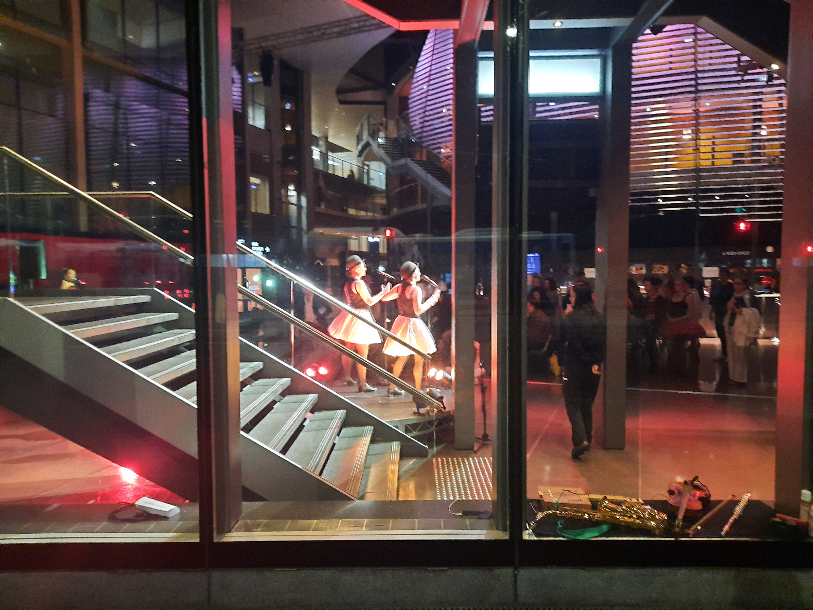
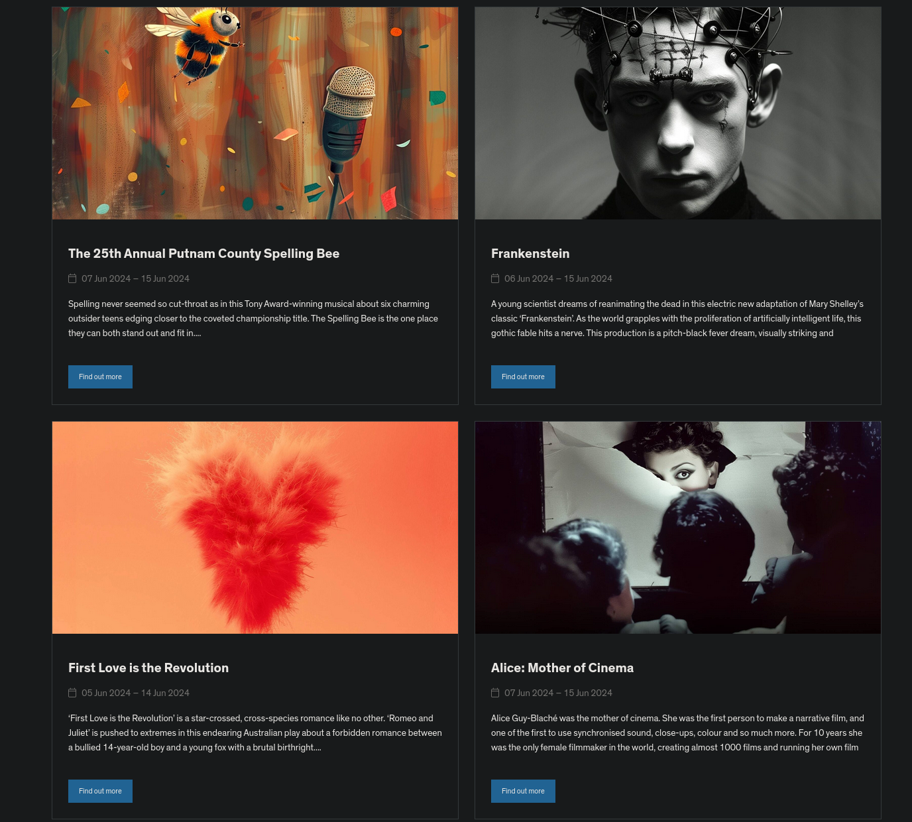
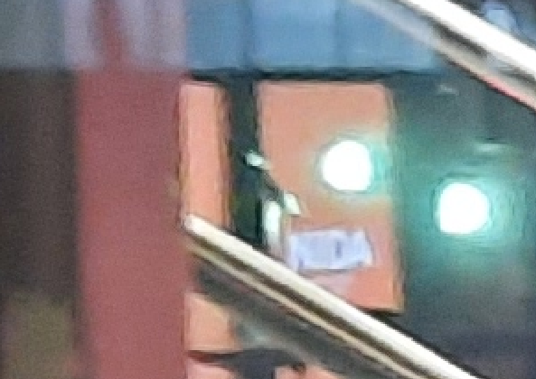
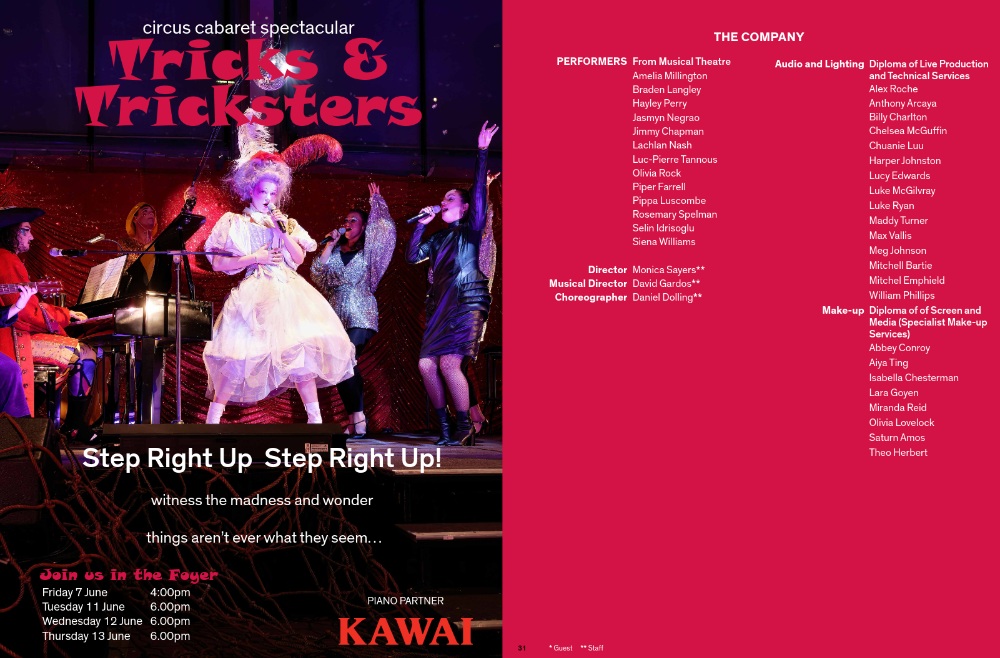

We are given an image of an ongoing musical.



Checking the image with `exiftool` has some key information.
```
ExifTool Version Number         : 12.70
File Name                       : musical.jpg
...
Date/Time Original              : 2024:06:11 18:15:02
Create Date                     : 2024:06:11 18:15:02
...
```

The photo was taken **June 11th 2024**, which helps with narrowing down what musicals might have been running.

Now, near UNSW (as tipped off by a friend) is NIDA, a fairly well known place where drama students learn and student plays/musicals are run.

I look at the [Student Productions running in June](https://www.nida.edu.au/news-and-events/student-productions/june/) and try the listed entries but no dice.



- ~~The 25th Annual Putnam County Spelling Bee~~
- ~~Frankenstein~~
- ~~First Love is the Revolution~~
- ~~Alice: Mother of Cinema~~

I go look elsewhere for events in Sydney around that time till I get a hint from boggle to go check the image again.

I zoom in and spot this:



NIDA, I was right! This time I check the PDF provided for the program and one play is listed in it that isn't on the page.



Flag: `Tricks & Tricksters`