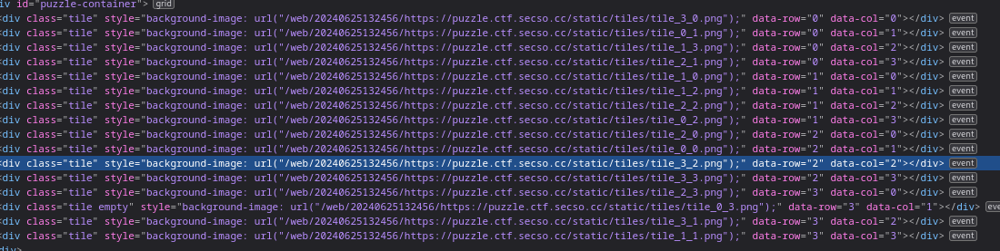

We are provided with a [web slide puzzle](https://web.archive.org/web/20240625132456/https://puzzle.ctf.secso.cc/), but I'm too lazy to actually do the puzzle...

Instead I open inspect element and see the URL's for the images are stored as `tile_x_y.png`.



I decide to make a quick Python script to construct the QR code for me.

```python
import requests
from PIL import Image
from io import BytesIO

def get_tile(col, row):
    print(f'Getting {col},{row}...')
    url = f"https://puzzle.ctf.secso.cc/static/tiles/tile_{col}_{row}.png"
    response = requests.get(url)
    return Image.open(BytesIO(response.content))

# Create a new image to hold all tiles
first_tile = get_tile(0, 0)
tile_width, tile_height = first_tile.size
full_image = Image.new('RGB', (tile_width * 4, tile_height * 4))

# Fetch and paste each tile
for col in range(4):
    for row in range(4):
        tile = get_tile(col, row)
        full_image.paste(tile, (row * tile_width, col * tile_height))

# Save the combined image
full_image.save('combined_tiles.png')
print("Combined image saved as 'combined_tiles.png'")
```


Reading the QR code has the flag.

Flag: `SCONES{5lid3_t0_5lid3}`