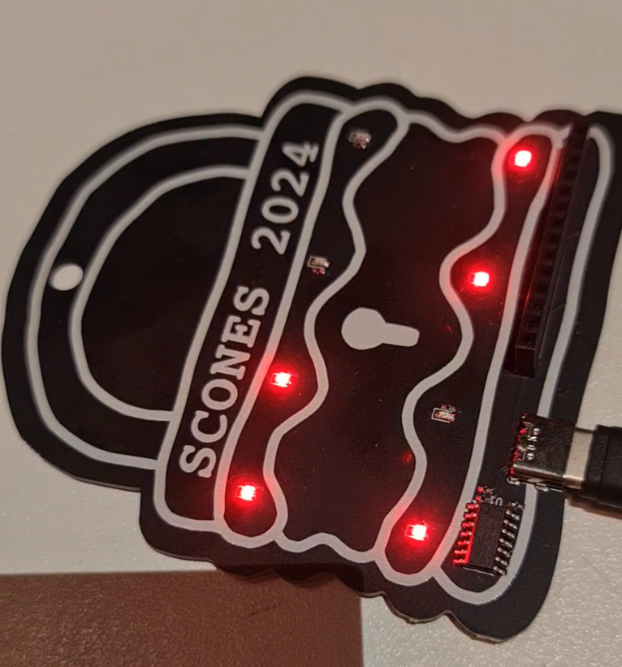

This challenge took me some hints, but we got their in the end.

When powering the badge with a USB-C it would flash a code.

If we take a look at one frame, this is how its parsed.

The bottom right LED is a power LED, so its always parsed as a `0`, the other 7 LEDs change to create ASCII characters in binary. If we read this one it is read as a `01010011` which is an `S`. There is an annotated version below to show reading order (blue arrows) the value of each LED (pink) and the power LED (green).

I didn't end up writing down the flag, but the challenge was just transcribing all them and decoding from binary.