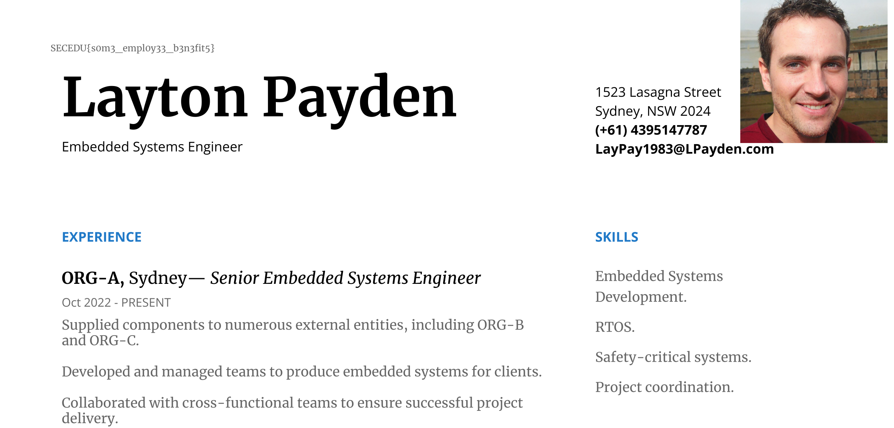

Opening up the PCAP file there are only a couple packets, and they are all part of the one stream. Right-clicking on any of the packets we can follow the TCP stream. 

Immediately we see some data at the top the stream showing a PDF file was sent:

We can extract the data by clicking `Show data as: Raw` and `Save as`, saving the data as a PDF file. 

Opening up the PDF, the flag is in the top left.

Flag: `SECEDU{s0m3_empl0y33_b3n3fit5}`