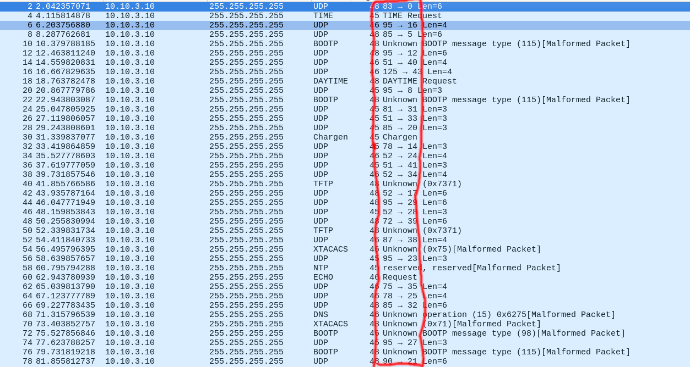

This challenge was made of lots of red herrings.

Opening the PCAP with Wireshark, we can see some intersting combinations of the words `pip`, `squeak` and `buzz`.

Extracting the streams out in order we get this:
```
squeakbuzzbuzz
pippipbuzz
buzzsqueakpipbuzz
squeaksqueakbuzz
squeakbuzzsqueak
squeakpipbuzz
buzzbuzzsqueak
buzzbuzzpip
squeaksqueaksqueak
pipsqueakpip
squeaksqueakbuzz
pipsqueakbuzzpip
pipbuzzpip
pippipbuzz
pippipsqueak
pipsqueaksqueak
buzzsqueakpip
pippipsqueak
buzzpipbuzz
squeaksqueaksqueak
squeaksqueakbuzz
squeakpipsqueak
pippippip
squeakpipsqueak
squeakbuzzsqueak
buzzsqueakpip
buzzbuzzpipsqueak
pipsqueaksqueak
pipbuzzpip
buzzpipbuzz
buzzpippip
buzzpipsqueak
squeaksqueakbuzz
buzzbuzzsqueak
squeakbuzzbuzz
buzzsqueakbuzz
pippipbuzz
squeakpipbuzz
squeaksqueakpip
pippippip
buzzpippip
squeakbuzzsqueak
buzzbuzzsqueak
buzzpipbuzz
```

After many attempts at decoding, we found this was completely useless...

We took a step back and noticed something odd...



The ports keep changing, we decide to pull them out with `tshark`.

These are the destination ports:
```
0  37  16  5  2  12  40  43  13  8  15  31  33  20  19  14  24  41  34  3  17  29  28  39  1  38  10  23  6  7  35  25  32  30  42  4  27  26  21  22  36  11  9  18  0  40  21  43  4  24  3  1  37  10  6  34  25  8  22  18  20  5  36  16  13  14  15  7  30  33  42  9  32  19  12  38  17  23  29  31  27  2  41  11  26  35  28  39  42  26  1  2  5  22  38  29  18  3  40  35  33  17  9  25  19  0  7  6  14  36  41  11  39  16  24  13  28  10  34  15  43  30  4  27  21  31  12  37  23  32  8  20  10  16  31
```
and these are the source ports:
```
83  95  95  85  67  95  51  125  52  95  68  81  51  85  56  78  52  51  52  69  52  95  52  72  69  87  49  95  123  52  75  78  85  53  49  68  95  68  90  90  89  80  80  95  83  51  90  125  68  52  69  69  95  49  123  52  78  95  90  95  85  85  89  95  52  78  68  52  53  51  49  80  85  56  95  87  52  95  95  81  95  67  51  80  68  75  52  72  49  68  69  67  85  90  87  95  95  69  51  75  51  52  80  78  56  83  52  123  78  89  51  80  72  95  52  52  52  49  52  68  125  53  68  95  90  81  95  95  95  85  95  85  49  95  81
```

I take a guess that the destination ports are corresponding to order of the source ports, as the source ports fall within ASCII values.

My teammate quickly made this Python script:
```python
order = [0,37,16,5,2,12,40,43,13,8,15,31,33,20,19,14,24,41,34,3,17,29,28,39,1,38,10,23,6,7,35,25,32,30,42,4,27,26,21,22,36,11,9,18,0,40,21,43,4,24,3,1,37,10,6,34,25,8,22,18,20,5,36,16,13,14,15,7,30,33,42,9,32,19,12,38,17,23,29,31,27,2,41,11,26,35,28,39,42,26,1,2,5,22,38,29,18,3,40,35,33,17,9,25,19,0,7,6,14,36,41,11,39,16,24,13,28,10,34,15,43,30,4,27,21,31,12,37,23,32,8,20,10,16,31]
characters = [83,95,95,85,67,95,51,125,52,95,68,81,51,85,56,78,52,51,52,69,52,95,52,72,69,87,49,95,123,52,75,78,85,53,49,68,95,68,90,90,89,80,80,95,83,51,90,125,68,52,69,69,95,49,123,52,78,95,90,95,85,85,89,95,52,78,68,52,53,51,49,80,85,56,95,87,52,95,95,81,95,67,51,80,68,75,52,72,49,68,69,67,85,90,87,95,95,69,51,75,51,52,80,78,56,83,52,123,78,89,51,80,72,95,52,52,52,49,52,68,125,53,68,95,90,81,95,95,95,85,95,85,49,95,81]

string = ""
i = 0
while len(string) <= len(order):
    for j in range(0, len(order)):
        if order[j] == i:
            string += chr(characters[j])
            i += 1
            print(string)
```

The output of the script:
```
S
SE
...
SECEDU{4_P1P_4ND_4_8UZZ_4ND_4_5QU34KY_WH331}
```

Flag: `SECEDU{4_P1P_4ND_4_8UZZ_4ND_4_5QU34KY_WH331}`