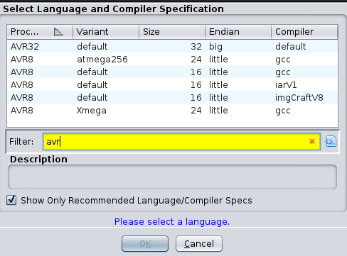
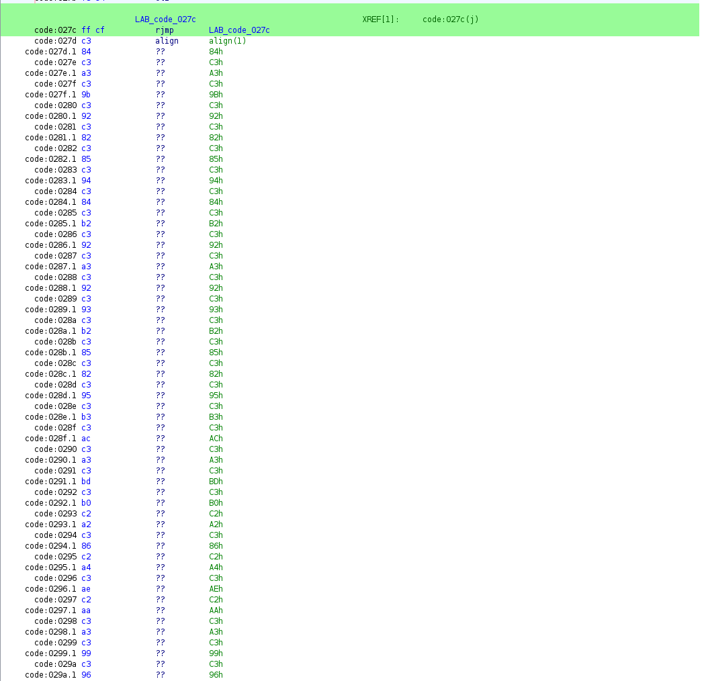
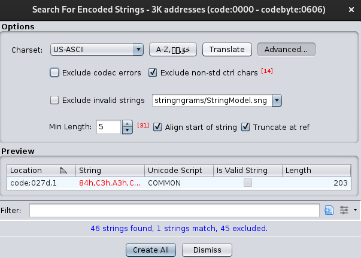
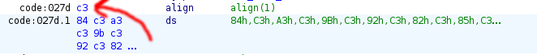
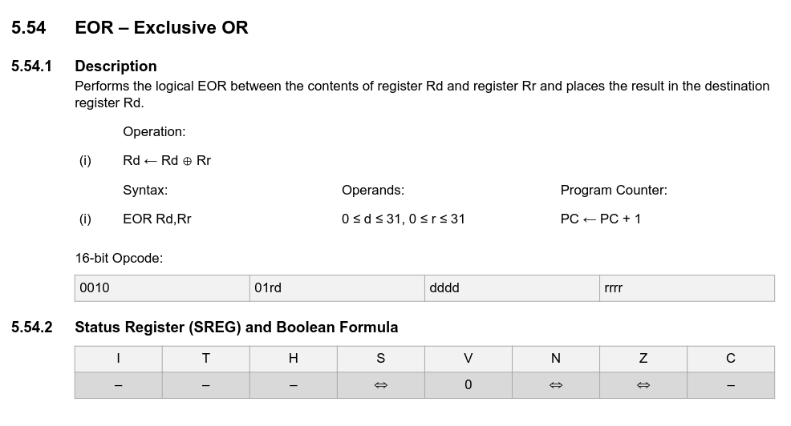
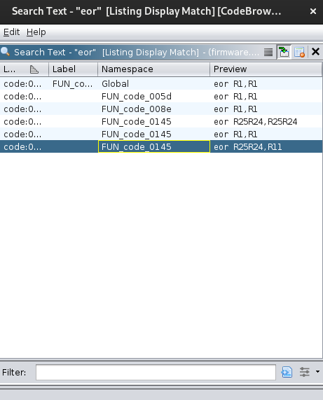
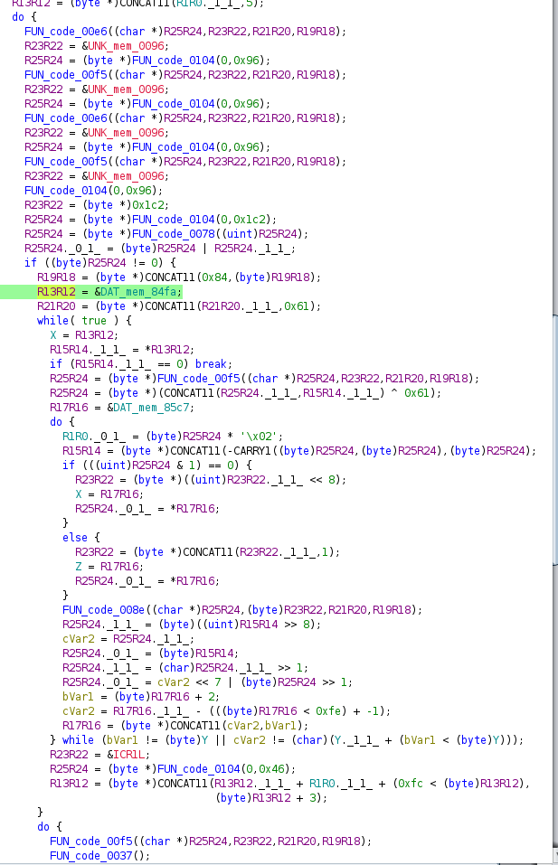

This challenge was the most *brutal* one for the week, a PLC based challenge (which I have next to no experience in, apart from [SCONES 2024](https://seall.dev/posts/scones2024) which had the same author as the hardware challenges there for this challenge).

From previous experience with these kinds of challenges, and some searching, we start with the `firmware.hex` with Ghidra.

I start by making a project, the usual Ghidra setup, then I import the file.

I search 'AVR' as indicated in the challenge prompt, and look at the available languages:



I select `AVR8` and select the size `16 GCC` version, as I did in my [SCONES 2024](https://seall.dev/posts/scones2024) writeup.

I open it up in the CodeBrowser, and for analysis select my options.

Then, I `Select All` options, `Apply`, then `Analyze`.

Once that's complete, we know we are looking for a hard-coded secret, the hints suggest looking at the `0x02d2` offset to start.

We can see a faily trivial looking function:
```c

void FUN_code_027b(void)

{
  do {
                    /* WARNING: Do nothing block with infinite loop */
  } while( true );
}

```

but below is what looks like an interesting string:



I then do a `Search` > `For Encoded Strings...`.

Some are filtered, so I disable the `Exclude codec errors` filter in `Advanced...`

There's only one, at the `0x027d` as suggested in the string, this seems interesting!

I press `Create All` to create the strings.



If you copy the 'Encoded String' its missing a C3 at the start



I copy the full string and manually add the `C3h,` to the start:
```
C3h,84h,C3h,A3h,C3h,9Bh,C3h,92h,C3h,82h,C3h,85h,C3h,94h,C3h,84h,C3h,B2h,C3h,92h,C3h,A3h,C3h,92h,C3h,93h,C3h,B2h,C3h,85h,C3h,82h,C3h,95h,C3h,B3h,C3h,ACh,C3h,A3h,C3h,BDh,C3h,B0h,C2h,A2h,C3h,86h,C2h,A4h,C3h,AEh,C2h,AAh,C3h,A3h,C3h,99h,C3h,96h,C3h,88h,C3h,81h,C3h,BCh,C3h,A5h,C3h,94h,C3h,9Bh,C2h,A4h,C3h,80h,C3h,92h,C3h,A1h,C2h,BCh,C2h,A7h,C2h,B0h,C3h,80h,C3h,BCh,C3h,B3h,C3h,82h,C3h,A5h,C3h,88h,C3h,B9h,C3h,A0h,C2h,AEh,C2h,B8h,C3h,A5h,C3h,B1h,C3h,8Dh,C2h,AEh,C2h,A7h,C3h,BEh,C3h,91h,C3h,B6h,C3h,96h,C3h,80h,C2h,A6h,C2h,B8h,C3h,A3h,C3h,B6h,C3h,99h,C3h,99h,C2h,A4h,C3h,A7h,C3h,9Bh,C2h,A0h,C3h,99h,C2h,B8h,C2h,A2h,C3h,A0h,C3h,8Fh,C2h,A1h,C3h,B9h,C3h,B1h,C2h,A2h,C3h,B3h,C2h,B8h,C2h,A4h,C3h,85h,C3h,80h,C2h,A0h,C3h,93h,C3h,99h,C2h,AEh,C2h,AAh,C3h,A3h,C2h,AFh,C3h,93h,C3h,9Bh,C3h,B4h,C2h,AAh,C3h,86h,C3h,AAh,C3h,9Bh,C3h,99h
```

We know an XOR is being used from the hint, so I look up the [manual](https://ww1.microchip.com/downloads/en/DeviceDoc/AVR-Instruction-Set-Manual-DS40002198A.pdf) for the AVR8's.

Looking for the XOR symbol, I find the `EOR` operation.



I then search the Program Text for any instances of `eor`.



The last result has the `XOR` with `0x61`, which is `97` as we expect in the hint.

This is the code snippet of interest:
```c
X = R13R12;
R15R14._1_1_ = *R13R12;
if (R15R14._1_1_ == 0) break;
R25R24 = (byte *)FUN_code_00f5((char *)R25R24,R23R22,R21R20,R19R18);
R25R24 = (byte *)(CONCAT11(R25R24._1_1_,R15R14._1_1_) ^ 0x61);
R17R16 = &DAT_mem_85c7;
...
R13R12 = (byte *)CONCAT11(R13R12._1_1_ + R1R0._1_1_ + (0xfc < (byte)R13R12),
                    (byte)R13R12 + 3);;
```

It is doing the XOR operation we expect, then adding 3 each time, so only selecting the 0th, 3rd, 6th, etc characters.

I then make a [CyberChef recipe](https://gchq.github.io/CyberChef/#recipe=Find_/_Replace(%7B'option':'Simple%20string','string':'h'%7D,'',true,false,true,false)From_Hex('Auto')Decode_text('UTF-8%20(65001)')XOR(%7B'option':'Hex','string':'97'%7D,'Standard',false)Find_/_Replace(%7B'option':'Regex','string':'(.)(?:.%7B2%7D)'%7D,'$1',true,false,false,false)&input=QzNoLDg0aCxDM2gsQTNoLEMzaCw5QmgsQzNoLDkyaCxDM2gsODJoLEMzaCw4NWgsQzNoLDk0aCxDM2gsODRoLEMzaCxCMmgsQzNoLDkyaCxDM2gsQTNoLEMzaCw5MmgsQzNoLDkzaCxDM2gsQjJoLEMzaCw4NWgsQzNoLDgyaCxDM2gsOTVoLEMzaCxCM2gsQzNoLEFDaCxDM2gsQTNoLEMzaCxCRGgsQzNoLEIwaCxDMmgsQTJoLEMzaCw4NmgsQzJoLEE0aCxDM2gsQUVoLEMyaCxBQWgsQzNoLEEzaCxDM2gsOTloLEMzaCw5NmgsQzNoLDg4aCxDM2gsODFoLEMzaCxCQ2gsQzNoLEE1aCxDM2gsOTRoLEMzaCw5QmgsQzJoLEE0aCxDM2gsODBoLEMzaCw5MmgsQzNoLEExaCxDMmgsQkNoLEMyaCxBN2gsQzJoLEIwaCxDM2gsODBoLEMzaCxCQ2gsQzNoLEIzaCxDM2gsODJoLEMzaCxBNWgsQzNoLDg4aCxDM2gsQjloLEMzaCxBMGgsQzJoLEFFaCxDMmgsQjhoLEMzaCxBNWgsQzNoLEIxaCxDM2gsOERoLEMyaCxBRWgsQzJoLEE3aCxDM2gsQkVoLEMzaCw5MWgsQzNoLEI2aCxDM2gsOTZoLEMzaCw4MGgsQzJoLEE2aCxDMmgsQjhoLEMzaCxBM2gsQzNoLEI2aCxDM2gsOTloLEMzaCw5OWgsQzJoLEE0aCxDM2gsQTdoLEMzaCw5QmgsQzJoLEEwaCxDM2gsOTloLEMyaCxCOGgsQzJoLEEyaCxDM2gsQTBoLEMzaCw4RmgsQzJoLEExaCxDM2gsQjloLEMzaCxCMWgsQzJoLEEyaCxDM2gsQjNoLEMyaCxCOGgsQzJoLEE0aCxDM2gsODVoLEMzaCw4MGgsQzJoLEEwaCxDM2gsOTNoLEMzaCw5OWgsQzJoLEFFaCxDMmgsQUFoLEMzaCxBM2gsQzJoLEFGaCxDM2gsOTNoLEMzaCw5QmgsQzNoLEI0aCxDMmgsQUFoLEMzaCw4NmgsQzNoLEFBaCxDM2gsOUJoLEMzaCw5OWg&oeol=NEL) to do the whole process.

The issue we had was noticing the `UTF-8` as in Cyberchef, the output automatically visually adjusts to detected decoding, but works with the raw output.

Flag: `SECEDU{g3t_r3v'd_9f0a1a375653798c}`

### Further Notes

During the challenge we were also provided some other files that were mostly red herrings, but helped with figuring out the XOR and every 3rd character functions. 

Inside a given `PLC.ino.lst` file, there is some information about a 'secret code'.

```c
void blinkSecretCode() {
  for (int i = 0; portData[i] != '\0'; i+=3) {
    blankLEDs();
    blinkLEDsOnPattern(portData[i]^97);
 410:	41 e6       	ldi	r20, 0x61	; 97
 412:	b4 2e       	mov	r11, r20
}
```

There we can see that `97` hex for the XOR, and its iterating `i` by `3`.

Inside the `PLC.ino.map` we can see `portData` is located at `84fa`:
```
portData            |000084fa|   r  |            OBJECT|000000cd|     |.rodata	/home/tom/Desktop/chal/PLC/PLC.ino:10
```

We can see in Ghidra the `DAT_mem_84fa`:



This helps us see where the data is loaded in the decompiled Ghidra code, which helped us with reverse engineering during the first week, this writeup was adjusted to just use the `firmware.hex` as its possible to solve it with that alone.