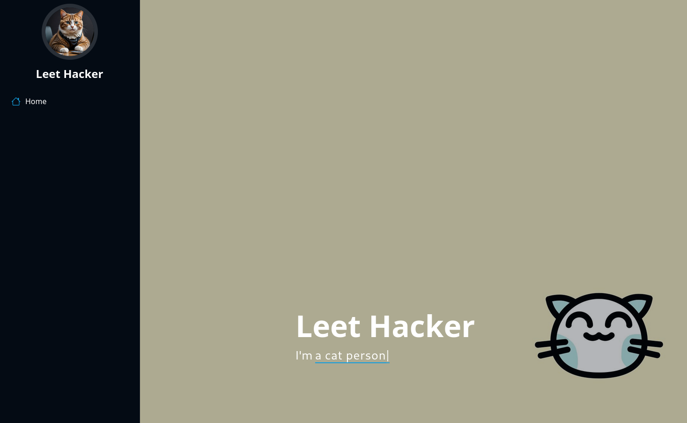
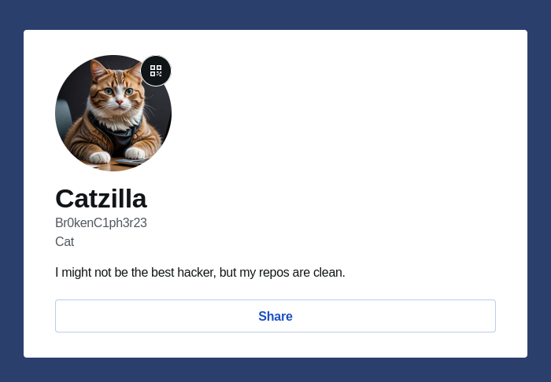

This website has a Gravatar URL for the person's profile picture: `https://2.gravatar.com/avatar/127a564647a8981b658a36e3cc9da08ec5d3f8437c3e4e336e2f43dcb862d7f0?s=9999`

We can visit the persons Gravatar profile from that hash: `https://gravatar.com/127a564647a8981b658a36e3cc9da08ec5d3f8437c3e4e336e2f43dcb862d7f0`.

It redirects to: `https://gravatar.com/casuallydd31f0971a`

We can see their username just below their 'name'.

Flag: `SECEDU{Br0kenC1ph3r23}`