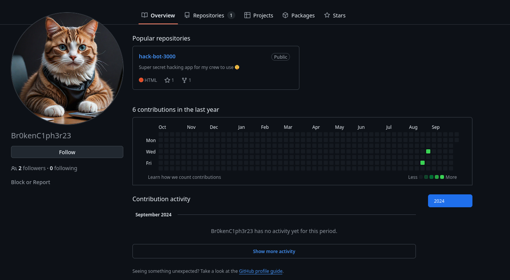
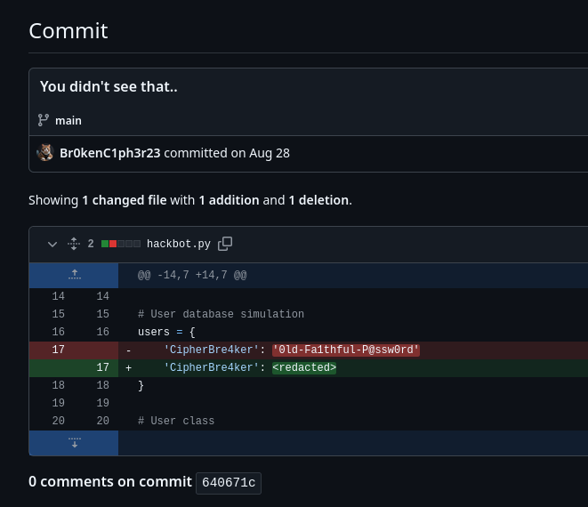

Their Gravatar description is a good hint: `I might not be the best hacker, but my repos are clean.`.

Using the username found from earlier, we can find a GitHub profile.

The one repo on their profile has some usual commits and one weird one, specifically one with the name "You didn't see that.."

Flag: `0ld-Fa1thful-P@ssw0rd`