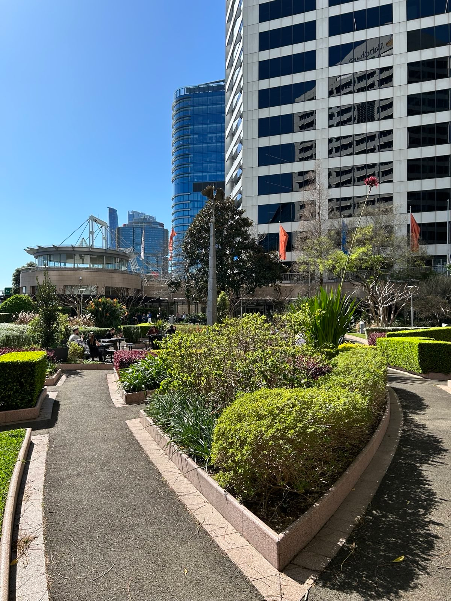
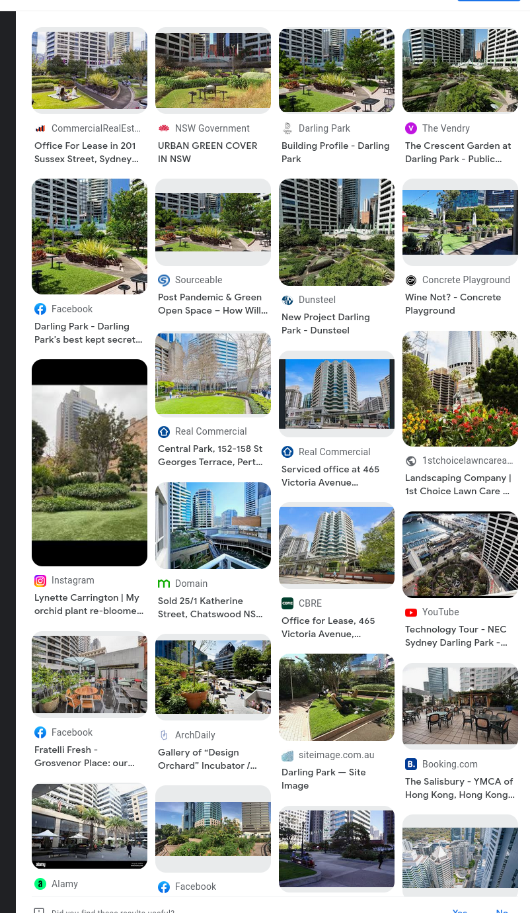
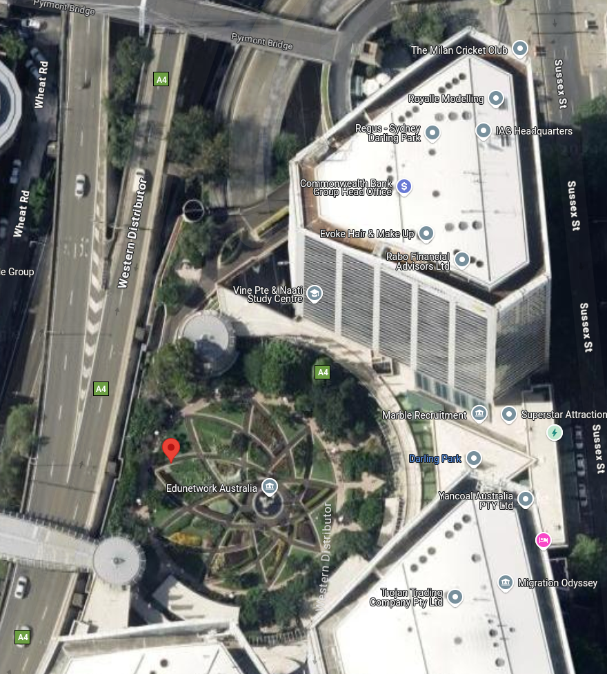

In [`Secret Meeting?`](24-seceduw2-secretmeeting) we are given a link to a picture for the 'Usual Spot': `https://drive.google.com/open?id=1QeozkxSycS_IEFTlh4E6wQeIIpXa0vyr`

The interesting shape of the building in the background prompts me to check Google's Reverse Image search.
 

We see some results for Darling Park, I go into Google Maps to orient the coordinates.

I find around this point to be the correct coordinates, but I had issue orienting properly so I doubt the reliability of this precision.

Flag: `SECEDU{-33.872,151.203}`