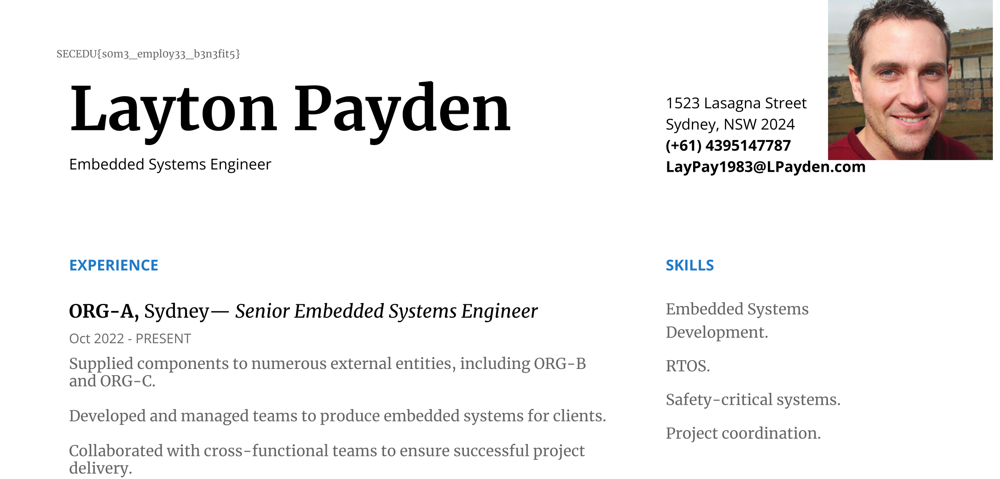

Inside the supplied `vault.zip` we are given these files:
```bash
$ ls                                
private.key.enc  vault.py
```

Reading `vault.py` it contains the following:
```python
from Crypto.Cipher import AES
from hashlib import pbkdf2_hmac
 
in_answer1 = input("What is your pet's name? > ").rstrip()
in_answer2 = input("What is your favourite colour? > ").rstrip()
in_answer3 = input("What is your date of birth? (ddmmyyyy) > ").rstrip()

supersecretpass = in_answer1 + in_answer2 + in_answer3
supersecretpass = supersecretpass.encode("utf-8")

with open("private.key","rb") as f:
  pt = f.read()

iterations = 10000
dk = pbkdf2_hmac('sha256', supersecretpass, b'bad salt' * 2, iterations)
aeskey = bytes(dk[0:32])
aes_nonce = bytes.fromhex("d5172881ea61a82dc0d44361cf4637c8")
cipher = AES.new(aeskey,AES.MODE_EAX,nonce=aes_nonce)
ct = cipher.decrypt(pt)

with open("private.key.enc","wb") as f:
  f.write(ct)

print("Ok, key encrypted to private.key.enc")
```

It's using 3 key parts of information:
- Pet's Name
- Favourite Colour
- DOB

Wait... Don't we have most of this from earlier challenges?
- The cat is called Catzilla
- Their favourite colour is Red
- Their birthday is the 8th of June, but unknown year.

Let's start with a script to try to decrypt it.
```python
from Crypto.Cipher import AES
from hashlib import pbkdf2_hmac
import os

def attempt_decrypt(password):
    password = password.encode("utf-8")
    iterations = 10000
    dk = pbkdf2_hmac('sha256', password, b'bad salt' * 2, iterations)
    aeskey = bytes(dk[0:32])
    aes_nonce = bytes.fromhex("d5172881ea61a82dc0d44361cf4637c8")
    cipher = AES.new(aeskey, AES.MODE_EAX, nonce=aes_nonce)
    
    try:
        with open("private.key.enc", "rb") as f:
            ct = f.read()
        pt = cipher.decrypt(ct)
        return pt
    except Exception as e:
        return None

wordlist_file = input("Enter the path to your wordlist file: ")
with open(wordlist_file, 'r') as f:
    passwords = [line.strip() for line in f]

os.makedirs("attempts", exist_ok=True)

for password in passwords:
    result = attempt_decrypt(password)
    if result is not None:
        decrypted_filename = f"private-{password}.key"
        decrypted_filepath = os.path.join("attempts", decrypted_filename)
        with open(decrypted_filepath, "wb") as f:
            f.write(result)
        print(f"Decrypted content saved to '{decrypted_filepath}'")
```

I then start on a script for the wordlist generation:
```python
import itertools
cat_name = "Catzilla"
colour = "Red"
day = "08"
month = "06"
years = range(1900, 2025)
combinations = []

for year in years:
    password = f"{cat_name}{colour}{day}{month}{year}"
    combinations.append(password)

with open("wordlist.txt", "w") as f:
    for combo in combinations:
        f.write(combo + "\n")

print(f"Generated {len(combinations)} passwords and saved them to wordlist.txt")
```

I start by creating the wordlist, then get to attempts:
```bash
$ python3 wordlist.py
Generated 125 passwords and saved them to wordlist.txt
$ python3.9 decrypt.py
Enter the path to your wordlist file: wordlist.txt
Decrypted content saved to 'attempts/private-CatzillaRed08061900.key'
...
Decrypted content saved to 'attempts/private-CatzillaRed08062024.key'
```

In our first attempt we just try a `DDMMYYYY` format, as Australia typically uses it.

We have a few keys, let's run `file` on them to see what we get. Here are the interesting entries:
```
private-CatzillaRed08061911.key: OpenPGP Secret Key
private-CatzillaRed08061931.key: OpenPGP Secret Key
private-CatzillaRed08061961.key: OpenPGP Secret Key
private-CatzillaRed08061981.key: OpenPGP Public Key
private-CatzillaRed08061983.key: OpenSSH private key (with password)
private-CatzillaRed08062024.key: DOS executable (COM), start instruction 0xeb064753 27df05d3
```

Ignoring the public key as we know its private, and the executable as we know its a key, we have 4 options left.

```
private-CatzillaRed08061911.key: OpenPGP Secret Key
private-CatzillaRed08061931.key: OpenPGP Secret Key
private-CatzillaRed08061961.key: OpenPGP Secret Key
private-CatzillaRed08061983.key: OpenSSH private key (with password)
```

Reading each of them, the only properly valid key is `private-CatzillaRed08061983.key` with correct data.

Flag: `SECEDU{CatzillaRed08061983}`

> Post-CTF Note:  I saw that in the earlier PDF, the users DOB year is displayed in the PDF from Week 1's challenge(s) [`Not quite all`](24-seceduw1-notquiteall)/[`Are you sure that's all?`](24-seceduw1-areyousurethatsall) in the email address:
