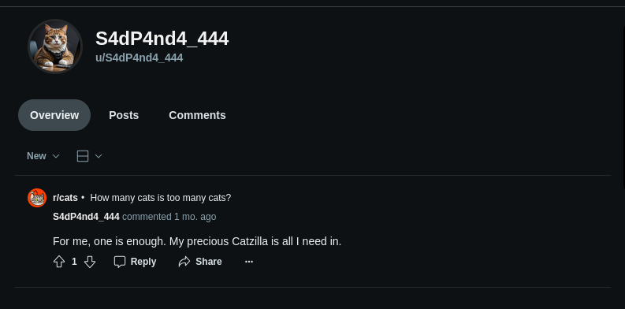
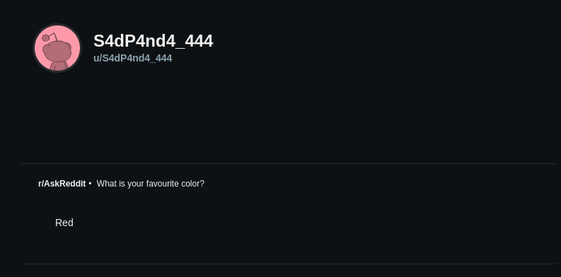

Looking at the previous information, we can see the mention of a Reddit comment under `u/S4dP4nd4_444`.

Visiting `https://www.reddit.com/user/S4dP4nd4_444/` we see a single comment on a Reddit post about their cat, Catzilla!

Checking the web archive, there is an archive on the [23rd of August](https://web.archive.org/web/20240823080219/https://www.reddit.com/user/S4dP4nd4_444/?rdt=63276)!

Visiting the comment we can see when it's published.

Flag: `SECEDU{08:02:19_08_23,_2024}`