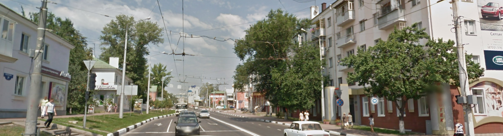
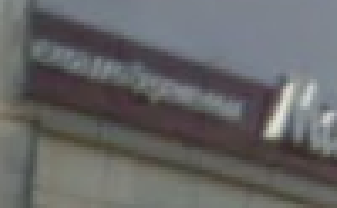

We are supplied this photo:

I immediately notice two things:

The partial phone number and car dealership ad on the right.
- `(4722) 376`
- `Genser`

The Cyrillic on the left

I start dorking for this dealership, I search for `"genser" "4722"` and get a hit: `@genserjlr` on Instagram!

Looks like a match!

I do some more dorking for some other results of the dealership as the website is very not alive...

I find an address on this [random car dealership site](http://avtoavto.ru/dealerinfo.mhtml?Producer_ID=53&Dealer_ID=2568) for an address in `Belgorod`!

Flag: `SECEDU{Belgorod}`