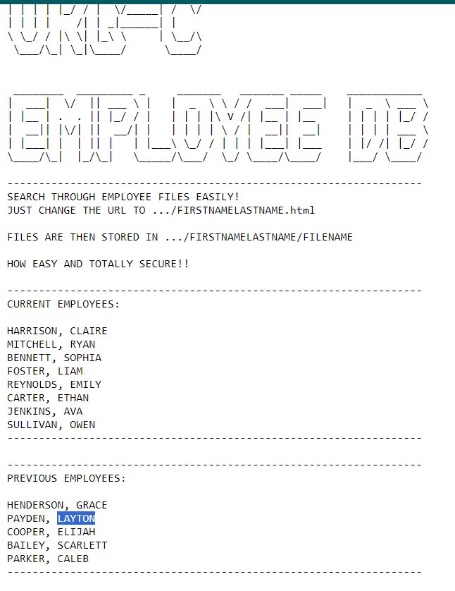
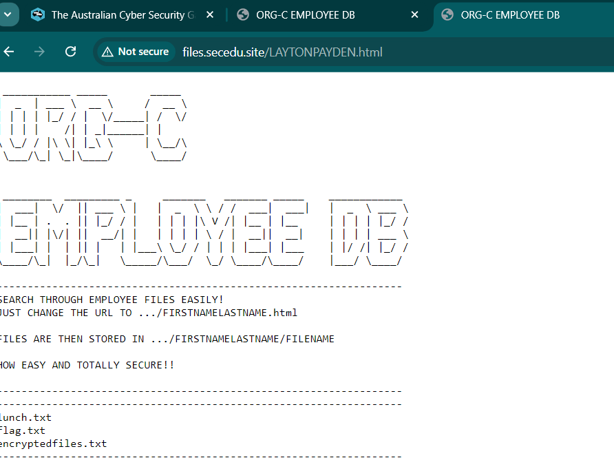
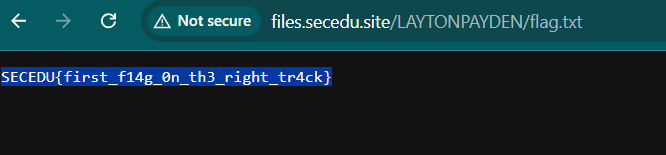

Looking at the root of the website we can see the following:

The instructions tell us to view a users files at `/<FIRST-NAME><LAST-NAME>.html`

Let's check out our good pal `Layton` from the past few weeks:

Inside his directory, we see a `Flag.txt`, `Lunch.txt` and `encryptedfiles.txt`.

Checking out flag we are given the solve:

Flag: `SECEDU{first_f14g_0n_th3_right_tr4ck}`