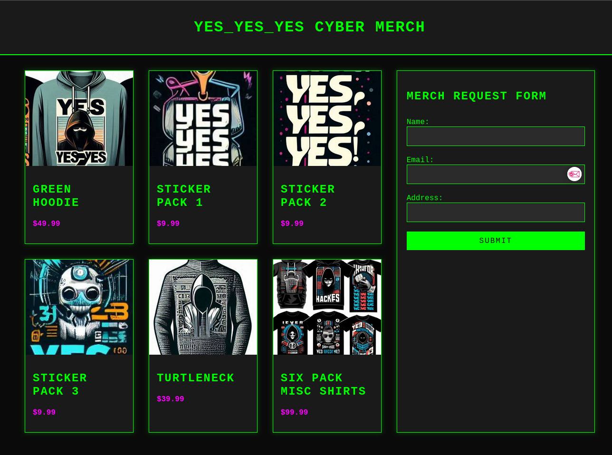

We are first presented with what looks like a store page to buy merchandise:


The only interactive portion of the site is the merch request form, that sends a `POST` request.

We can view that using either a MITM Proxy or just the Network Tab.

When submitting the default request, it replies with an error: `You must be a member to request free merch`

Looking at the `POST` has the following payload:
```
-----------------------------429214736125992314531083334719
Content-Disposition: form-data; name="name"

a
-----------------------------429214736125992314531083334719
Content-Disposition: form-data; name="email"

a@a.a
-----------------------------429214736125992314531083334719
Content-Disposition: form-data; name="address"

a
-----------------------------429214736125992314531083334719
Content-Disposition: form-data; name="role"

viewer
-----------------------------429214736125992314531083334719--
```

There is a `role` attribute to the form. Changing this to `member` and sending the request should reveal the flag.

The server responds with: `Congratulations! Not only do you get a free Hoodie, you also get a flag: SECEDU{yes_yes_yes_we_want_free_merch}`

Flag: `SECEDU{yes_yes_yes_we_want_free_merch}`