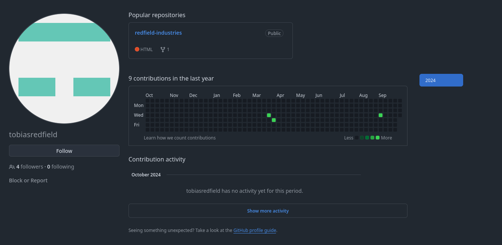

The website is very empty, with nothing but a Twitter link to `https://twitter.com/` and some generic PR slop...


This website is a GitHub Pages site, the format is `<username>.github.io` for a GitHub account so lets investigate: `https://github.com/tobiasredfield`.



There is one repo `redfield-industries`, with 8 commits but one catching my eye as that empty Twitter URL might not have been so empty:


The commit was also by another user `elanamarwood`, let's keep that in mind as a potential link to `tobiasredfield`.

Inside the commit is the follow previous HTML:
```html
<li><a href="https://twitter.com/tobias_redfield" target="_blank">Twitter</a></li> <!-- remember to change this when Tobias sorts out the Redfield twitter but for now use his personal -->
```

A new Twitter Account! Let's check it out...


Checking the replies tab we find a reply from Tobias to Elana Marwood (the other person committing on the repo!) with an image containing the flag:


Flag: `SECEDU{TW1TT3R_L3AKS}`