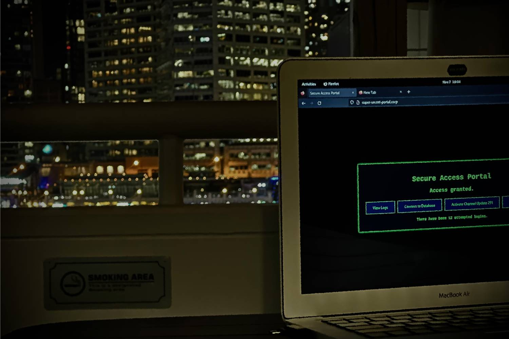
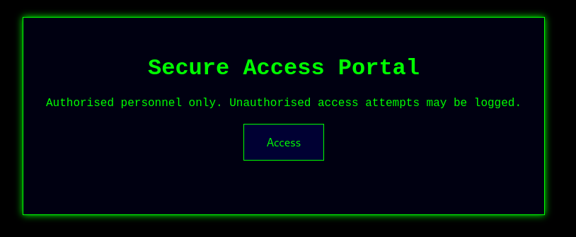

Given an attached `IMG_8080.jpg` which displays the following:


The website is an Access Portal:


I submit to access and get a 43% match with this data:
```json
{
  "userAgent": "...",
  "screenResolution": "2560x1600",
  "colorDepth": 24,
  "installedFonts": [
    "Arial",
    "Times New Roman",
    "Padauk"
  ],
  "timezone": "Australia/Sydney",
  "language": "en-US",
  "origin": "http://chals.secedu.site:5015",
  "doNotTrack": "1",
  "cookieEnabled": true,
  "hardwareConcurrency": 16,
  "deviceMemory": "unknown"
}
```

After some guessing on the values of the `hardwareConcurrency` and `colorDepth`, I find a new peak of 61%
```json
{"matchScore":0.61,"message":"Access denied. You're on the right track.","success":false}
```

Looking in the picture, we can see a URL in the bar, let's change the origin to `http://super-secret-portal.corp`. Now hitting 70%!

I check the `script.js` on the webpage for more information but its obfuscated... Let's [deobfuscate it](https://obf-io.deobfuscate.io/)!

```js
const _0x52cdf3 = function () {
  let _0x3cbee3 = true;
  return function (_0x53f4ea, _0x6950d4) {
    const _0x1986aa = _0x3cbee3 ? function () {
      if (_0x6950d4) {
        const _0x491c46 = _0x6950d4.apply(_0x53f4ea, arguments);
        _0x6950d4 = null;
        return _0x491c46;
      }
    } : function () {};
    _0x3cbee3 = false;
    return _0x1986aa;
  };
}();
const _0x3f0efb = _0x52cdf3(this, function () {
  return _0x3f0efb.toString().search('(((.+)+)+)+$').toString().constructor(_0x3f0efb).search('(((.+)+)+)+$');
});
_0x3f0efb();
function generateFingerprint() {
  return {
    'userAgent': navigator.userAgent,
    'screenResolution': screen.width + 'x' + screen.height,
    'colorDepth': screen.colorDepth,
    'installedFonts': detectFonts(),
    'timezone': Intl.DateTimeFormat().resolvedOptions().timeZone,
    'language': navigator.language,
    'origin': document.location.origin,
    'doNotTrack': navigator.doNotTrack || "unspecified",
    'cookieEnabled': navigator.cookieEnabled,
    'hardwareConcurrency': navigator.hardwareConcurrency || "unknown",
    'deviceMemory': navigator.deviceMemory || 'unknown'
  };
}
function detectFonts() {
  const _0x2f5b4d = ["monospace", "sans-serif", 'serif'];
  const _0x256b30 = ['Arial', "Times New Roman", 'Helvetica', "Suruma", "Noto Sans Cuneiform", "Noto Sans Gurmukhi", "Keraleeyam", "Lohit Odia", "Padauk", "Noto Sans Kannada", "Webdings"];
  const _0x1e40f7 = _0x256b30.filter(_0x35484f => {
    for (let _0x188155 of _0x2f5b4d) {
      let _0x5dd2ea = document.createElement("canvas");
      let _0x16ae16 = _0x5dd2ea.getContext('2d');
      _0x16ae16.font = "12px " + _0x188155;
      let _0x49a2e6 = _0x16ae16.measureText("abcdefghijklmnopqrstuvwxyz").width;
      _0x16ae16.font = "12px '" + _0x35484f + "', " + _0x188155;
      let _0x595a9e = _0x16ae16.measureText("abcdefghijklmnopqrstuvwxyz").width;
      if (_0x595a9e !== _0x49a2e6) {
        return true;
      }
    }
    return false;
  });
  return _0x1e40f7;
}
function sendFingerprint() {
  const _0x4f239b = {
    'userAgent': navigator.userAgent,
    'screenResolution': screen.width + 'x' + screen.height,
    'colorDepth': screen.colorDepth,
    'installedFonts': detectFonts(),
    'timezone': Intl.DateTimeFormat().resolvedOptions().timeZone,
    'language': navigator.language,
    'origin': document.location.origin,
    'doNotTrack': navigator.doNotTrack || "unspecified",
    'cookieEnabled': navigator.cookieEnabled,
    'hardwareConcurrency': navigator.hardwareConcurrency || "unknown",
    'deviceMemory': navigator.deviceMemory || 'unknown'
  };
  fetch("/auth", {
    'method': "POST",
    'headers': {
      'Content-Type': "application/json"
    },
    'body': JSON.stringify(_0x4f239b)
  }).then(_0x401e4d => {
    const _0x5c372f = _0x401e4d.status;
    return _0x401e4d.json().then(_0x594662 => ({
      'statusCode': _0x5c372f,
      'data': _0x594662
    }));
  }).then(({
    statusCode: _0x162756,
    data: _0x1d8814
  }) => {
    let _0x15fa34 = "Match Score: " + (_0x1d8814.matchScore * 0x64).toFixed(0x2) + '%<br>' + _0x1d8814.message;
    if (_0x1d8814.success) {
      _0x15fa34 += "<br>Flag: " + _0x1d8814.flag;
    }
    const _0x2248b2 = document.getElementById('message');
    _0x2248b2.innerHTML = _0x15fa34;
    _0x2248b2.classList.remove("flash");
    setTimeout(() => {
      _0x2248b2.classList.add("flash");
    }, 0x32);
    if (_0x162756 === 0xc8) {
      _0x2248b2.style.color = "green";
    } else {
      _0x2248b2.style.color = "red";
    }
  })["catch"](_0x16be1b => {
    console.error("Error:", _0x16be1b);
    document.getElementById("message").textContent = "An error occurred. Please try again.";
  });
}
document.addEventListener("DOMContentLoaded", _0x165ee2 => {
  const _0x2aad3a = document.getElementById('accessBtn');
  if (_0x2aad3a) {
    _0x2aad3a.addEventListener('click', sendFingerprint);
  }
});
```

I find that `doNotTrack` being set to `unspecified` gives us a new highest of 80%!

Adding `Helvetica` to the installed fonts gets us to 82%!

Looking at the model of the laptop in the photo it looks like a [MacBook Air 2017](https://support.apple.com/en-us/111924) which has a screen resolution of `1440x900`, this gets us to 91%

This part was annoying, the User Agent. We can collect the following pieces of information from the screenshot.
- The top bar of the Mac indicates its likely running Linux with some kind of GNOME desktop environment
- The browser is Firefox

I end up finding a [great source of specific user agents](https://user-agents.net/download?browser_type=browser&browser=firefox&platform=linux) and we try this list after many others...

And we get the correct User-Agent after some time: `Mozilla/5.0 (X11; Linux x86_64; rv:106.0) Gecko/20100101 Firefox/106.0`!

Final Payload:
```json
{
  "userAgent": "Mozilla/5.0 (X11; Linux x86_64; rv:106.0) Gecko/20100101 Firefox/106.0",
  "screenResolution": "1440x900",
  "colorDepth": 32,
  "installedFonts": [
    "Arial",
    "Times New Roman",
    "Padauk",
    "Helvetica"
  ],
  "timezone": "Australia/Sydney",
  "language": "en-US",
  "origin": "http://super-secret-portal.corp",
  "doNotTrack": "unspecified",
  "cookieEnabled": true,
  "hardwareConcurrency": 4,
  "deviceMemory": "unknown"
}
```

Response (200):
```json
{
  "flag":"SECEDU{0s1nt_f1nal_b0ss}",
  "matchScore":1.0,
  "message":"Perfect match! Access granted.",
  "success":true
}
```

Flag: `SECEDU{0s1nt_f1nal_b0ss}`

> This challenge consisted of trial and error with seeing what makes it go up and down in percentage, I just found all my other default values worked... ¯\\\_(ツ)\_/¯