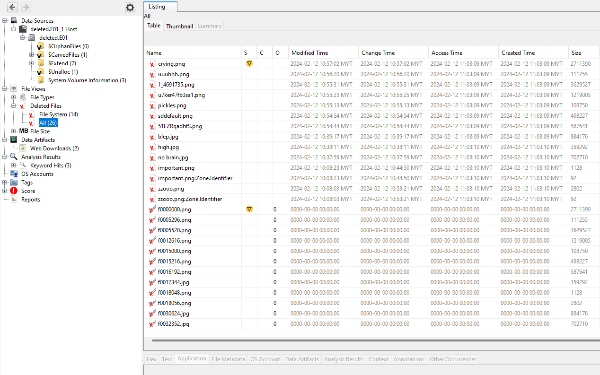
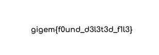

The file we are given is a `.e01` which I loaded with Autopsy.

Once I loaded the file, I checked the 'deleted files' section.

Inside the file `zzooo.png` was the flag.

Flag: `gigem{f0und_d3l3t3d_f1l3}`

**Special Thanks to warlocksmurf, was stuck on a Mac and couldn't grab Autopsy screenshots :<**