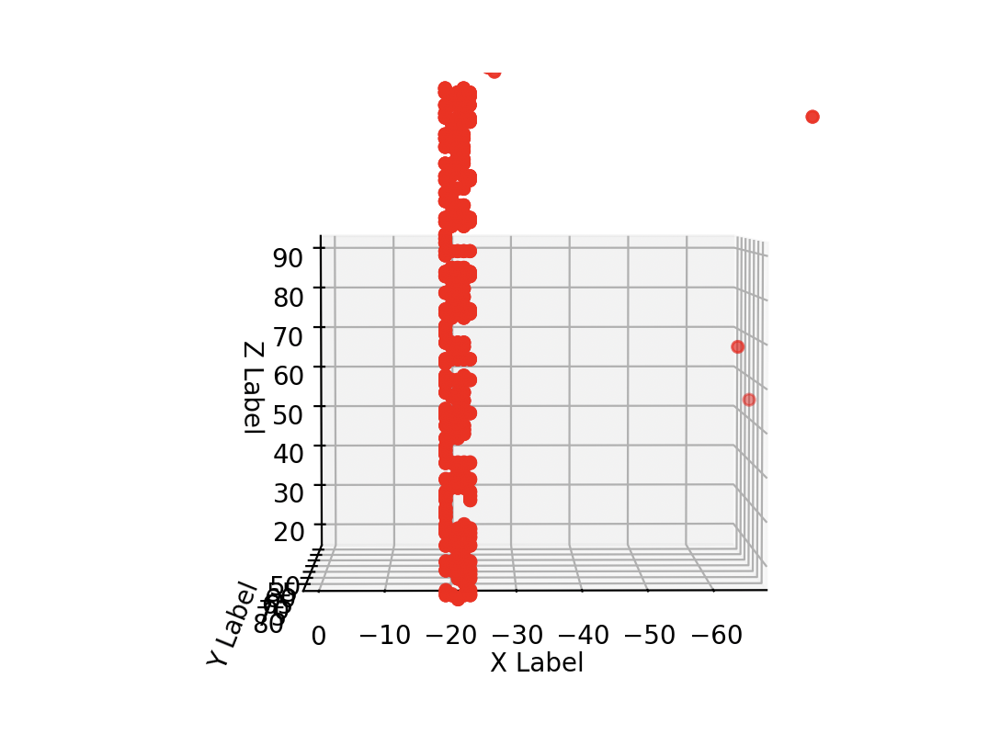

Now this challenge we didn't technically 'solve' during the CTF but we had the flag and didn't think we had a full solve, interpreting it as a partial flag as our code originally cut off the top of the flag.

The file we are given is a `smp.log` which seems to contain logs for a Minecraft server, as hinted at by Bedwars which is referring to Hypixel's Bedwars.

In the summary (sorted by amount), is some block, entity and player updates:
```
Sorted by count:
+======================================================================================+  +==================================================================================+
|                                  Server ---> Client                                  |  |                                Client ---> Server                                |
+======================================================================================+  +==================================================================================+
|                      Name                      |      Count      |     Bandwidth     |  |                      Name                      |     Count     |    Bandwidth    |
+------------------------------------------------+-----------------+-------------------+  +------------------------------------------------+---------------+-----------------+
| Total                                          | 198745 (100.0%) | 10271434 (100.0%) |  | Total                                          | 7308 (100.0%) | 207553 (100.0%) |
| Rotate Head                                    |  58374 (29.37%) |   348161 ( 3.39%) |  | Move Player PosRot                             | 3526 (48.25%) | 126936 (61.16%) |
| Move Entity Pos                                |  42847 (21.56%) |   513082 ( 5.00%) |  | Move Player Pos                                | 2315 (31.68%) |  64820 (31.23%) |
| Set Entity Motion                              |  36968 (18.60%) |   406645 ( 3.96%) |  | Chunk Batch Received                           |  668 ( 9.14%) |   4676 ( 2.25%) |
| Move Entity PosRot                             |  36052 (18.14%) |   504728 ( 4.91%) |  | Swing                                          |  278 ( 3.80%) |   1112 ( 0.54%) |
| Set Entity Data                                |   7374 ( 3.71%) |    79346 ( 0.77%) |  | Use Item On                                    |  274 ( 3.75%) |   7546 ( 3.64%) |
| Teleport Entity                                |   2799 ( 1.41%) |    89514 ( 0.87%) |  | Player Command                                 |   94 ( 1.29%) |    658 ( 0.32%) |
| Bundle                                         |   2190 ( 1.10%) |     6570 ( 0.06%) |  | Move Player Rot                                |   68 ( 0.93%) |    816 ( 0.39%) |
| Level Chunk With Light                         |   1904 ( 0.96%) |  8077926 (78.64%) |  | Set Creative Mode Slot                         |   29 ( 0.40%) |    513 ( 0.25%) |
| Forget Level Chunk                             |   1451 ( 0.73%) |    15961 ( 0.16%) |  | Keep Alive                                     |   21 ( 0.29%) |    231 ( 0.11%) |
| Entity Event                                   |   1432 ( 0.72%) |    11456 ( 0.11%) |  | Set Carried Item                               |   13 ( 0.18%) |     65 ( 0.03%) |
| Add Entity                                     |   1095 ( 0.55%) |    61294 ( 0.60%) |  | Player Abilities                               |    9 ( 0.12%) |     36 ( 0.02%) |
| Update Attributes                              |   1063 ( 0.53%) |    51977 ( 0.51%) |  | Player Action                                  |    2 ( 0.03%) |     29 ( 0.01%) |
| Remove Entities                                |    961 ( 0.48%) |     5751 ( 0.06%) |  | Use Item                                       |    2 ( 0.03%) |     12 ( 0.01%) |
| Block Update                                   |    866 ( 0.44%) |    11027 ( 0.11%) |  | Container Close                                |    2 ( 0.03%) |      8 ( 0.00%) |
| Move Entity Rot                                |    861 ( 0.43%) |     6888 ( 0.07%) |  | Hello                                          |    1 ( 0.01%) |     25 ( 0.01%) |
| Chunk Batch Finished                           |    668 ( 0.34%) |     2672 ( 0.03%) |  | Login Acknowledged                             |    1 ( 0.01%) |      3 ( 0.00%) |
| Chunk Batch Start                              |    668 ( 0.34%) |     2004 ( 0.02%) |  | Client Information (Configuration)             |    1 ( 0.01%) |     16 ( 0.01%) |
| Set Time                                       |    324 ( 0.16%) |     6156 ( 0.06%) |  | Accept Teleportation                           |    1 ( 0.01%) |      4 ( 0.00%) |
| Block Changed Ack                              |    278 ( 0.14%) |     1263 ( 0.01%) |  | Client Intention                               |    1 ( 0.01%) |     17 ( 0.01%) |
| Set Equipment                                  |    275 ( 0.14%) |     6847 ( 0.07%) |  | Finish Configuration                           |    1 ( 0.01%) |      3 ( 0.00%) |
| Sound                                          |    147 ( 0.07%) |     4998 ( 0.05%) |  | Custom Payload (Configuration)|minecraft:brand |    1 ( 0.01%) |     27 ( 0.01%) |
| Set Chunk Cache Center                         |     67 ( 0.03%) |      603 ( 0.01%) |  |                                                |               |                 |
| Keep Alive                                     |     21 ( 0.01%) |      231 ( 0.00%) |  |                                                |               |                 |
| Player Info Update                             |     13 ( 0.01%) |     2039 ( 0.02%) |  |                                                |               |                 |
| Set Passengers                                 |      6 ( 0.00%) |       48 ( 0.00%) |  |                                                |               |                 |
| Level Event                                    |      5 ( 0.00%) |      100 ( 0.00%) |  |                                                |               |                 |
| Container Set Slot                             |      4 ( 0.00%) |       39 ( 0.00%) |  |                                                |               |                 |
| Level Particles                                |      3 ( 0.00%) |      152 ( 0.00%) |  |                                                |               |                 |
| Section Blocks Update                          |      3 ( 0.00%) |       60 ( 0.00%) |  |                                                |               |                 |
| Ticking State                                  |      1 ( 0.00%) |        8 ( 0.00%) |  |                                                |               |                 |
| Ticking Step                                   |      1 ( 0.00%) |        4 ( 0.00%) |  |                                                |               |                 |
| Update Advancements                            |      1 ( 0.00%) |     7834 ( 0.08%) |  |                                                |               |                 |
| Set Health                                     |      1 ( 0.00%) |       12 ( 0.00%) |  |                                                |               |                 |
| Set Experience                                 |      1 ( 0.00%) |        9 ( 0.00%) |  |                                                |               |                 |
| Update Enabled Features                        |      1 ( 0.00%) |       22 ( 0.00%) |  |                                                |               |                 |
| Update Recipes                                 |      1 ( 0.00%) |    22651 ( 0.22%) |  |                                                |               |                 |
| Update Tags (Configuration)                    |      1 ( 0.00%) |     8517 ( 0.08%) |  |                                                |               |                 |
| Set Default Spawn Position                     |      1 ( 0.00%) |       15 ( 0.00%) |  |                                                |               |                 |
| Initialize Border                              |      1 ( 0.00%) |       42 ( 0.00%) |  |                                                |               |                 |
| Change Difficulty                              |      1 ( 0.00%) |        5 ( 0.00%) |  |                                                |               |                 |
| Commands                                       |      1 ( 0.00%) |     7797 ( 0.08%) |  |                                                |               |                 |
| Container Set Content                          |      1 ( 0.00%) |      240 ( 0.00%) |  |                                                |               |                 |
| Custom Payload (Configuration)|minecraft:brand |      1 ( 0.00%) |       27 ( 0.00%) |  |                                                |               |                 |
| Finish Configuration                           |      1 ( 0.00%) |        3 ( 0.00%) |  |                                                |               |                 |
| Game Event                                     |      1 ( 0.00%) |        8 ( 0.00%) |  |                                                |               |                 |
| Game Profile                                   |      1 ( 0.00%) |      935 ( 0.01%) |  |                                                |               |                 |
| Hello                                          |      1 ( 0.00%) |      173 ( 0.00%) |  |                                                |               |                 |
| Set Carried Item                               |      1 ( 0.00%) |        4 ( 0.00%) |  |                                                |               |                 |
| Login                                          |      1 ( 0.00%) |      128 ( 0.00%) |  |                                                |               |                 |
| Login Compression                              |      1 ( 0.00%) |        4 ( 0.00%) |  |                                                |               |                 |
| Player Abilities                               |      1 ( 0.00%) |       12 ( 0.00%) |  |                                                |               |                 |
| Player Position                                |      1 ( 0.00%) |       37 ( 0.00%) |  |                                                |               |                 |
| Recipe                                         |      1 ( 0.00%) |      781 ( 0.01%) |  |                                                |               |                 |
| Registry Data                                  |      1 ( 0.00%) |     4602 ( 0.04%) |  |                                                |               |                 |
| Server Data                                    |      1 ( 0.00%) |       26 ( 0.00%) |  |                                                |               |                 |
+------------------------------------------------+-----------------+-------------------+  +------------------------------------------------+---------------+-----------------+
```

I decide to first look into the blocks, specifically `Block Update`.

Each block update has the following JSON below the log line:
```json
{
    "blockstate": 9,
    "pos": {
        "x": ?,
        "y": ?,
        "z": ?
    }
}
```
The `?` instead being the positions.

I decide to graph out the positions using a 3d scatterplot with `matplotlib` and Python.

```python
import json
import matplotlib.pyplot as plt
import numpy as np
objs=[]
cobj=""
startCapture=False
with open('smp.log') as f:
    for x in f.readlines():
        x=x.replace('\n','').replace('\r','')
        if startCapture:
            cobj+=x
            if x.startswith('}'):
                startCapture=False
                objs.append(cobj)
                cobj=""
                print(len(objs))
        if x.endswith('[S --> C] Block Update'):
            startCapture=True
print('Making figure...')
fig = plt.figure()
ax = fig.add_subplot(projection='3d')
xs=[]
ys=[]
zs=[]
print('Placing coords...')
for x in objs:
    x=json.loads(x)
    xs.append(x['pos']['x'])
    ys.append(x['pos']['y'])
    zs.append(x['pos']['z'])
print('Scattering...')
ax.scatter(xs, ys, zs, c='r', marker='o')
ax.set_xlabel('X Label')
ax.set_ylabel('Y Label')
ax.set_zlabel('Z Label')
print('Showing...')
plt.show()
```

Once plotted we can zoom in on a particular clump and see the flag.



Flag: `gigem{w3_l0v3_pl1y1n_MC_SMP}`