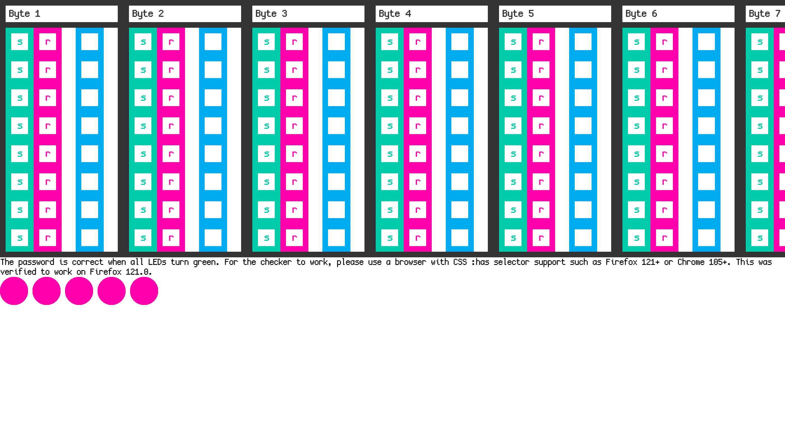

Looking at the file were provided is ALOT of css, the page looks like this: 



It has a total of 19 bytes, each byte 8 bits, looking at the CSS comments we see a format. Let's take this one for example.

`/* b3_8_l1_c6 */`
- b3 = Byte 3
- 8 = 8th Bit
- l1 = LED 1
- c6 = Check 6

Looking at LED2 it seems to take only the 1st bit, and we can see in the CSS content the following for each LED.

```css
.wrapper:has(.byte:nth-child(18) .latch:nth-child(1) .latch__reset:active) .checker:nth-of-type(3) .checker__state:nth-child(18) {
	transform: translateX(-100%);
	transition: transform 0s;
}

.wrapper:has(.byte:nth-child(18) .latch:nth-child(1) .latch__set:active) .checker:nth-of-type(3) .checker__state:nth-child(18) {
	transform: translateX(0%);
	transition: transform 0s;
}
```

When the `latch` is set to reset (0) we get a translation. If we set all the 1st bits for each byte to a 0 we get a green LED! Alphabetical characters tend to start with a 0 in binary so this makes alot of sense! (Thanks skat :3).

So, when the `translateX(-100%)` is set that is the correct option! I now make a script with `css.js` to parse the CSS automatically:

```js
var cssdata = "..."
var cssjs = require("./css.js");
var parser = new cssjs.cssjs();
var parsed = parser.parseCSS(cssdata);
data=Array(19*8)
for (x in parsed) {
    selector=parsed[x].selector
    byte=selector.split('.wrapper:has(.byte:nth-child(')[1].split(').latch:')[0]
    bit=selector.split('.latch:nth-child(')[1].split(').latch__')[0]
    state=selector.split(').latch__')[1].split(':active)')[0] === "set" ? 1 : 0
    val=parsed[x].rules[0].value
    if (val === "translateX(-100%)") {
        data[((byte*8)-1)+bit]=state
    }
}
console.log(data.join(""))
```

```
$ node cssparse.js
01000011011100110101001101011111011011000011000001100111001100010110001101011111011010010111001101011111011001100111010101101110010111110011001101101000
```

The binary decodes to our flag content: `CsS_l0g1c_is_fun_3h`

There we go!

Flag: `uoftctf{CsS_l0g1c_is_fun_3h}`

**Files:** [css-password.html](https://files.seall.dev/ctfs/uoftctf2024/css-password/css-password.html)