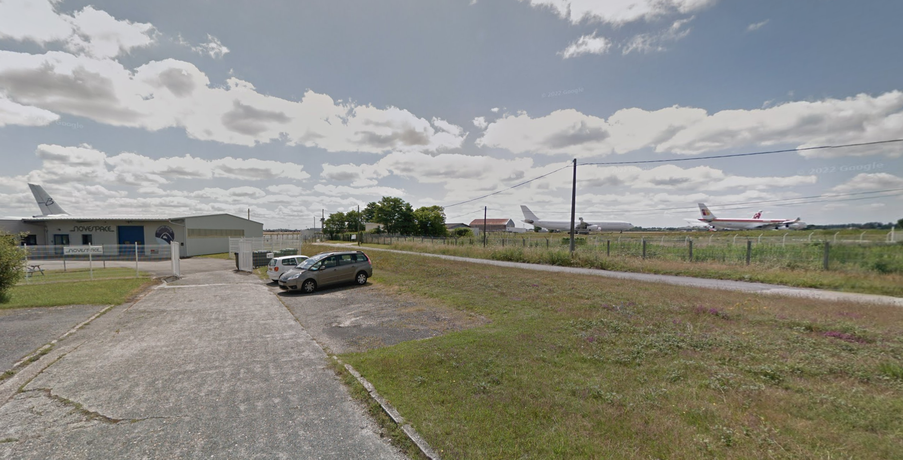
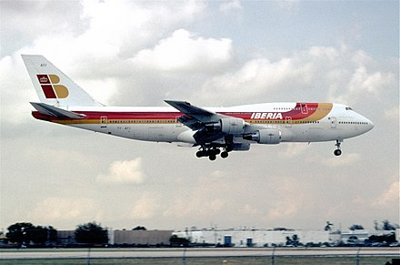
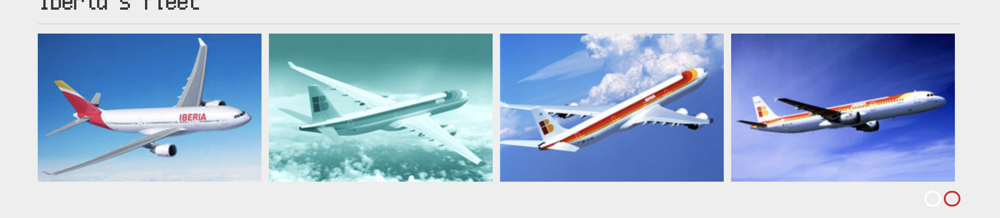

We are given the following image to start with:

The challenge description states we need the 3 letter IATA code for the airport, the airline and the aircraft model and variant.

The building on the left side 'Novespace' seems to have only 1 hit on Google Maps in [France](https://www.google.com.au/maps/@44.8378482,-0.7161052,3a,75y,119.31h,93.15t/data=!3m6!1e1!3m4!1sPLLVOdxxS24c-6eTu1fJ4g!2e0!7i13312!8i6656). More specifically, Bordeaux-Mérignac Airport or BOD.

Looking at the symbols on the plane in the picture and browsing a [Wikipedia Entry](https://en.wikipedia.org/wiki/List_of_airline_liveries_and_logos) for the phrase 'yellow and red', I eventually stumble upon Iberia Airline.

Seem's like the same markings! Now what model do we have?

I look on Iberia's website and find a [current fleet](https://www.iberia.com/iberia-fleet/) list.

After trying a few I spot the 'A340-600' model and get success with the following flag.

Flag: `UofTCTF{BOD_Iberia_A340-600}`