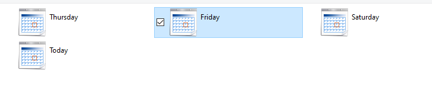
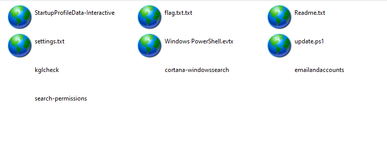

Looking around the files we are given a `.ova` which is a Virtual Machine image, I boot the VM in VirtualBox and we are given a Windows desktop. Looking around the computer there is a README on the desktop which provides very little insight.

Piecing some clues together from the description as well as the name we can construct the following:
- 'Hourglass', probably time related in some way.
- 'No EDR', likely an infection of some sort.
- The next challange being called 'No grep', likely findable somehow.

I ended up looking inside the Powershell History (which comes in handy in No grep), but spotted the execution of something called `time_stomp`, which I correlated with the 'Hourglass' name.

`time_stomp` is a utility used by both attackers to falsify timestamps of files and my blue teams to view the timestamps of files.

I ended up looking into some logless approaches to Windows forensics and learn about `C:\Windows\Prefetch` and learn about PECmd to parse them. Looking at the entries I notice `TIMESTOMP` in there and run PECmd against it.

```
PS> dir 'C:\Windows\Prefetch' | sort LastWriteTime -desc
...
-a----         1/11/2024   3:22 AM           1754 STOMP_TIME.EXE-4A8F4213.pf
...
PS> .\PECmd.exe -f 'C:\Windows\Prefetch\STOMP_TIME.EXE-4A8F4213.pf' --mp
...
Directories referenced: 9
00: \VOLUME{01da447765fe8034-ae6629b1}\USERS
01: \VOLUME{01da447765fe8034-ae6629b1}\USERS\ANALYST
02: \VOLUME{01da447765fe8034-ae6629b1}\USERS\ANALYST\APPDATA
03: \VOLUME{01da447765fe8034-ae6629b1}\USERS\ANALYST\APPDATA\LOCAL
04: \VOLUME{01da447765fe8034-ae6629b1}\USERS\ANALYST\APPDATA\LOCAL\MICROSOFT
05: \VOLUME{01da447765fe8034-ae6629b1}\USERS\ANALYST\DESKTOP
06: \VOLUME{01da447765fe8034-ae6629b1}\WINDOWS
07: \VOLUME{01da447765fe8034-ae6629b1}\WINDOWS\SYSTEM32
08: \VOLUME{01da447765fe8034-ae6629b1}\WINDOWS\SYSWOW64
...
```

Looking inside `C:\USERS\ANALYST\APPDATA\LOCAL\MICROSOFT` as referenced gives me the idea to check the History.

I found `C:\Users\analyst\AppData\Local\Microsoft\Windows\History`.



Contains some entries of files from before we started the VM.

Inside 'Friday' has the following:



Inside the file `settings.txt` is a Base64 string: `Ky0tCiB1b2Z0Y3Rme1Q0c0tfU2NoM0R1bDNyX0ZVTn0KKy0t`

Decoded gives us the flag:

```
+--
 uoftctf{T4sK_Sch3Dul3r_FUN}
+--
```

Flag: `uoftctf{T4sK_Sch3Dul3r_FUN}`

**Files:** [ctf_vm.zip](https://web.archive.org/web/20240115074036/https://storage.googleapis.com/hourglass-uoftctf/ctf_vm.zip)