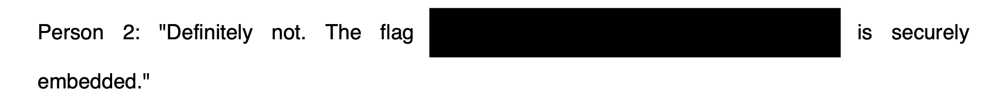

We are given a PDF file, once viewed has a black bar of what seems to be our flag.

If we highlight the black bar, we get some text upon copy-pasting the contents from Firefox's PDF viewer.

Flag: `uoftctf{fired_for_leaking_secrets_in_a_pdf}`

**Files:** [secret.pdf](https://files.seall.dev/ctfs/uoftctf2024/secret-message-1/secret.pdf)
