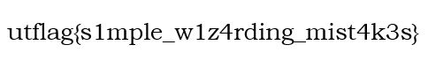

Given a PDF with the context that it was signed with the flag by accident, so looking into PDF extraction I find [pdfly](https://github.com/py-pdf/pdfly) which seems to have capabilities to extract images and other data from a PDF. I install pdfly with pipx to start.

```
$ pipx install pdfly
...
  installed package pdfly 0.3.1, installed using Python 3.9.19
  These apps are now globally available
    - pdfly
done! ✨ 🌟 ✨
```

Afterwards I use the `extract-images` function to pull out the images inside the PDF.

```
$ pdfly extract-images contract.pdf
Extracted 6 images:
- 0-Image5.jpg
- 1-Image5.jpg
- 2-Image5.jpg
- 2-fzImg0.png
- 2-fzImg1.png
- 2-fzImg2.png
```

One of the images, `2-fzImg1.png`, contains the flag!



Flag: `utflag{s1mple_w1z4rding_mist4k3s}`