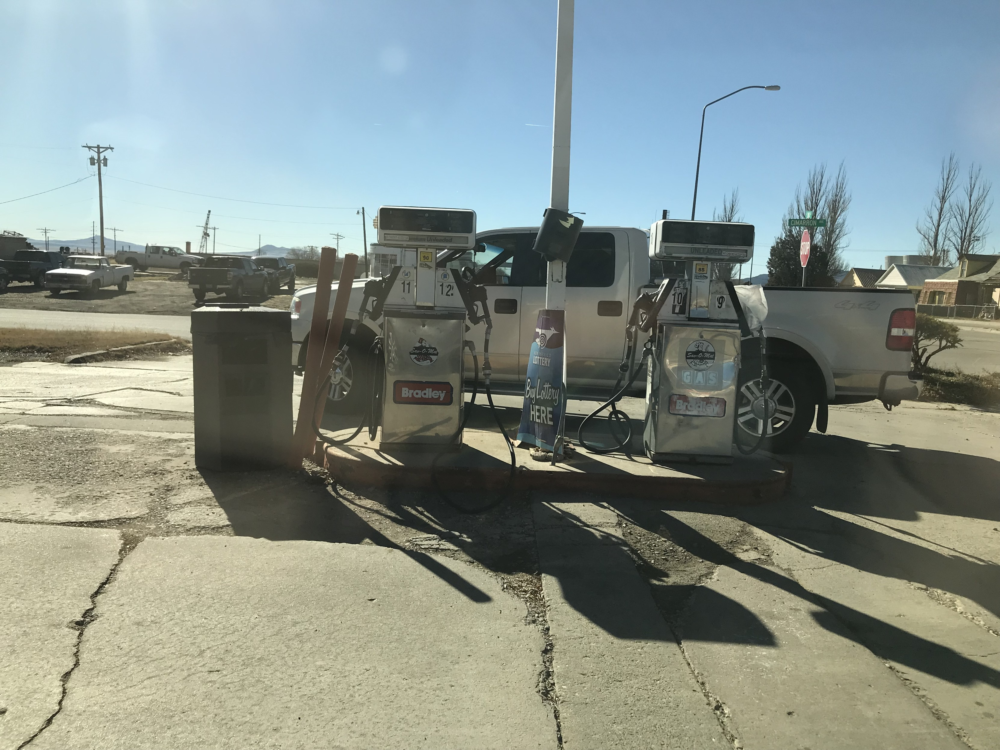

> Note: This is part 2 to [OSINT 1](/writeups/24-utctf-osint-1)

Again going back to the linktr.ee I decide to dig more into the Twitter, which seems to contain a single tweet.

`Won't be posting on here anymore, you can find me on Mastodon now!`

So, let's take a look at that [Mastodon account](https://mastodon.social/@coleminerton).

There's some posts! Including photos... One of which has alot of good information and likely near where he lives.

There is a sign in the middle that says New Mexico Lottery, so thats the state.

There is a street sign in the background that says 'Cimarron Ave', where is that?

Looking for instances of Cimarron Ave in New Mexico I find the [closed down gas station](https://www.google.com.au/maps/@36.8948197,-104.4409946,3a,88.5y,39.12h,83.95t/data=!3m9!1e1!3m7!1sjelWzB99-q42G81gC-oMvA!2e0!7i13312!8i6656!9m2!1b1!2i45?hl=en&entry=ttu) which has the same Bradley and circle insignia of the fuel pumps.

Flag: `Raton,NM,87740`