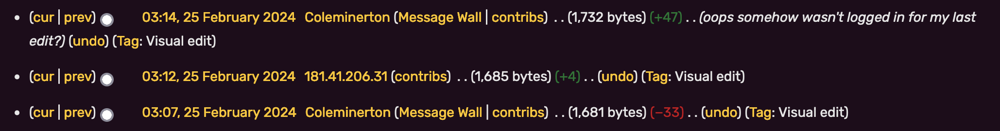

> Note: This is part 3 to [OSINT 1](/writeups/24-utctf-osint-1) and [OSINT 2](/writeups/24-utctf-osint-2)

Now initially this one seems a bit trickier, where would we find an IP aside from something like a data breach?

Let's browse the remaining social media from the linktr.ee. I decide to take a closer look at the remaining social media, [Reddit](https://old.reddit.com/user/coleminerton).

Looking at the Reddit we can see he is a new moderator for the `r/tinyislandsurvival` subreddit, and on his YouTube in his only video, the comments show him mentioning the game as well so it must have some importance.

I look at the `r/tinyislandsurvival` sudreddit and see a wiki page attached, and I have an idea. On alot of Wiki's it is common when you are unauthenticated that commits use your IP address.

On the Fandom page I hover over the three dots in the top left and click 'View history', and ofcourse Cole is there. Scrolling on the commits we can see a particular set.

Flag: `181.41.206.31`