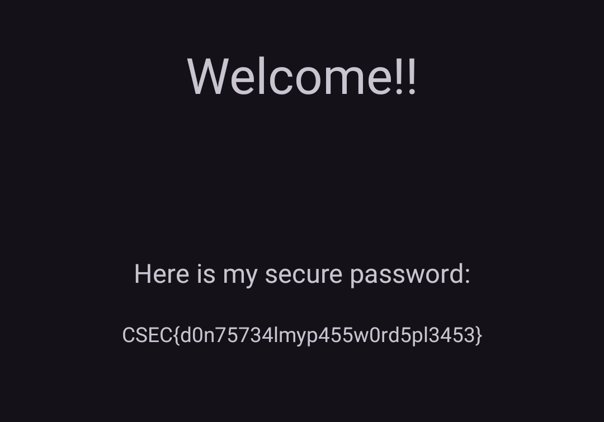

This was an Android reverse engineering challenge, I load it into jadx to start with.

Reading the source, we can see the login is `try harder lmao`.

I then install the Android app, type the login `try harder lmao` and then the flag is displayed.

Flag: `CSEC{d0n75734lmyp455w0rd5pl3453}`