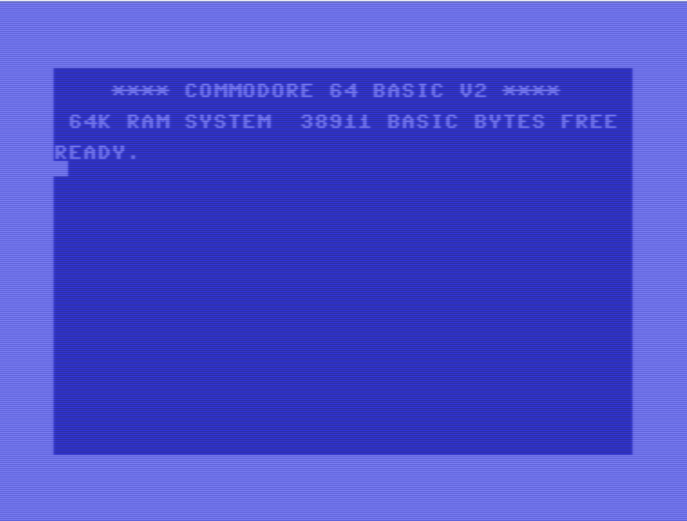
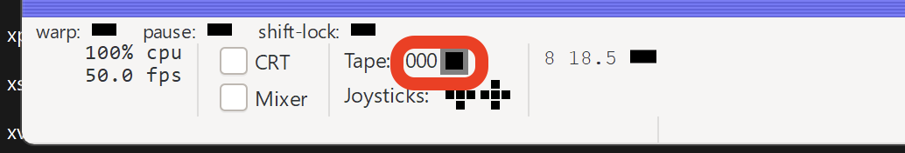
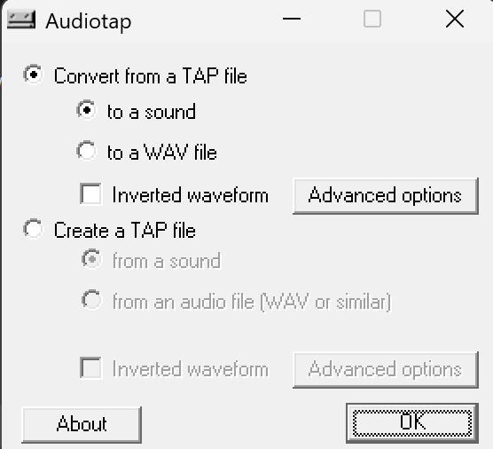
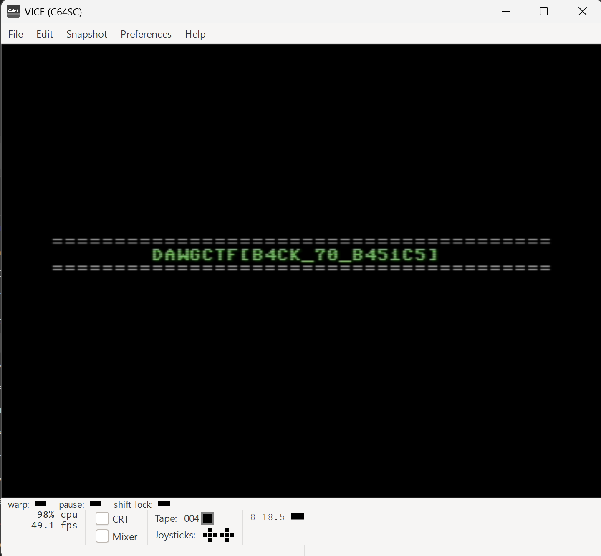

Beginning the challenge, all we are given is a `MysteryTape.wav`.

## What is this?

The challenge description mentions the 80s and 'Basic Programs #1.', let's see if we can identify what that might be!

Considering it's the 80s, it is probably talking about some older computers that used tape. From a quick search these include the Commodore 64, Apple II and BBC Micro. I decided to pursue the Commodore 64 just because a lecturer had talked about it before :p (you know who you are...)

The next step became, how can we emulate this?

## Emulation

The first result is the [Emulation Wiki](https://emulation.gametechwiki.com/index.php/Commodore_64_emulators) where it suggests the 'VICE' emulator.

After installing VICE from [SourceForge](https://vice-emu.sourceforge.io/windows.html) (I used the GTK3 version), the application boots with a delightfully dated UI:

Using the controls down the bottom, we can load tapes:

I try to load the `MysteryTape.wav`, but it doesn't work...

## Converting to `tap`

With some research, I find VICE and most other emulators seem to use `.tap` files for tapes.
A program to convert a WAV to TAP is [WAV-PRG](https://wav-prg.sourceforge.io/audiotap.html).

Opening the program, we are met with another delightfully ancient UI:

I press 'Create a TAP file' and then 'from an audio file (WAV or similar)' and then 'OK'. Then I select the `MysteryTape.wav`.

After that, we get a `MysteryTap.wav`!

## Emulation (again)

I attach the `MysteryTap.tap` with the 'Autostart' option and press Play.

Flag: `DawgCTF{B4CK_70_B451C5}`