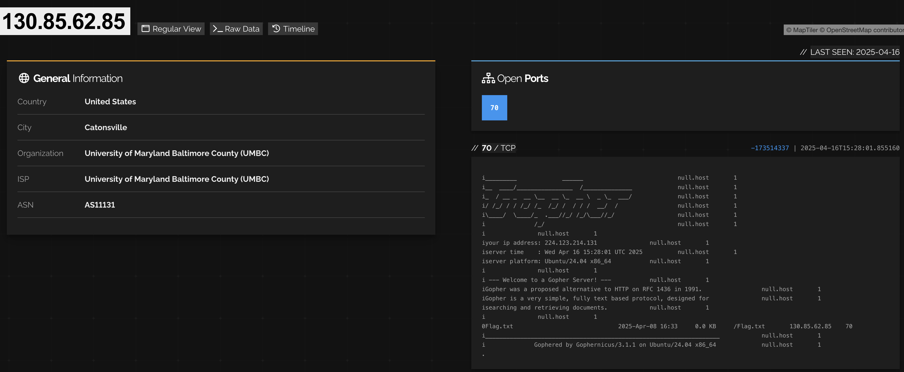

Starting with the hostname, it doesn't respond on 80. So I used Shodan.io to see if it had indexed any port data before I started doing port scans (Passive before Active enum):


We can see the server has an exposed port 70!
```
i_________             ______              		null.host	1
i__  ____/________________  /______________		null.host	1
i_  / __ _  __ \__  __ \_  __ \  _ \_  ___/		null.host	1
i/ /_/ / / /_/ /_  /_/ /  / / /  __/  /    		null.host	1
i\____/  \____/_  .___//_/ /_/\___//_/     		null.host	1
i              /_/                         		null.host	1
i		null.host	1
iyour ip address: xxx.xxx.xx.xxx		null.host	1
iserver time    : Tue Apr 29 02:46:03 UTC 2025		null.host	1
iserver platform: Ubuntu/24.04 x86_64		null.host	1
i		null.host	1
i --- Welcome to a Gopher Server! ---		null.host	1
iGopher was a proposed alternative to HTTP on RFC 1436 in 1991. 		null.host	1
iGopher is a very simple, fully text based protocol, designed for		null.host	1
isearching and retrieving documents. 		null.host	1
i		null.host	1
0Flag.txt                              2025-Apr-08 16:33     0.0 KB	/Flag.txt	130.85.62.85	70
i___________________________________________________________________		null.host	1
i              Gophered by Gophernicus/3.1.1 on Ubuntu/24.04 x86_64		null.host	1
.
```

We can see under the documents a `Flag.txt`!

Visiting `http://caddyshack.umbccd.net:70/Flag.txt` we can get the flag:
```
# Hey look a flag!

DawgCTF{60ph3r_15_n07_d34d!}
```

Flag: `DawgCTF{60ph3r_15_n07_d34d!}`