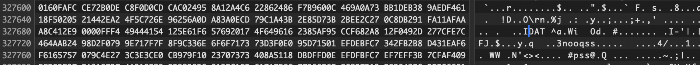
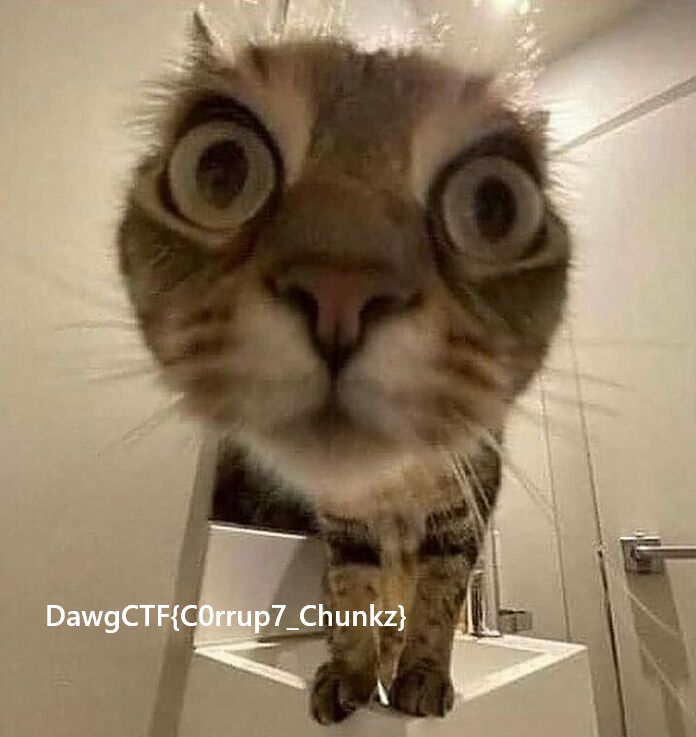

We are given a `funnyCat.png` that has content missing from the bottom, appearing to have been 'cropped' or corrupted.


We can use a `checkpng` utility to check if there are any issues with the image:
```
$ pngcheck ./funnyCat.png
./funnyCat.png  illegal (unless recently approved) unknown, public chunk EDAT
```

Generally the data blocks are `IDAT` not `EDAT`, so let's fix that in a hex editor.


Once modified we can reopen the file and get the flag:


Flag: `DawgCTF{C0rrup7_Chunkz}`