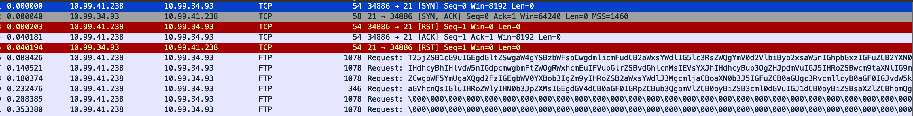

For this challenge, we are given a `traffic.pcap` to use with Wireshark!

Opening the file with Wireshark, there is only 20 packets so not a lot to look through.

Looking at the home screen, there are a few packets with clear Base64 content:


Grabbing the content and decoding, it's a lot of... nothing interesting. It's a story with no flag :<

Arrowing up and down through the packets, I notice that one particular portion is changing every time with readable content, the `tcp.urgent_pointer`!

In packet 6 it is `da`, in packet 7 it is `wg`, in packet 8 it is `CT`...

Let's use tshark to automate this:
```
$ tshark -r traffic.pcap -Y "tcp && frame.number >= 6" -T fields -e tcp.urgent_pointer
25697
30567
17236
18043
30313
27756
24935
25970
29535
25199
28260
29565
10
0
0
```

This works but we don't want to manually decode it... Let's use some bash to do the decoding:
```
$ tshark -r traffic.pcap -Y "tcp && frame.number >= 6" -T fields -e tcp.urgent_pointer |                                                                                                                       130 ↵
while read -r val; do
    high=$((val >> 8 & 0xFF))
    low=$((val & 0xFF))
    printf "\\$(printf '%03o' $high)\\$(printf '%03o' $low)"
done
dawgCTF{villagers_bonds}
```

Flag: `dawgCTF{villagers_bonds}`