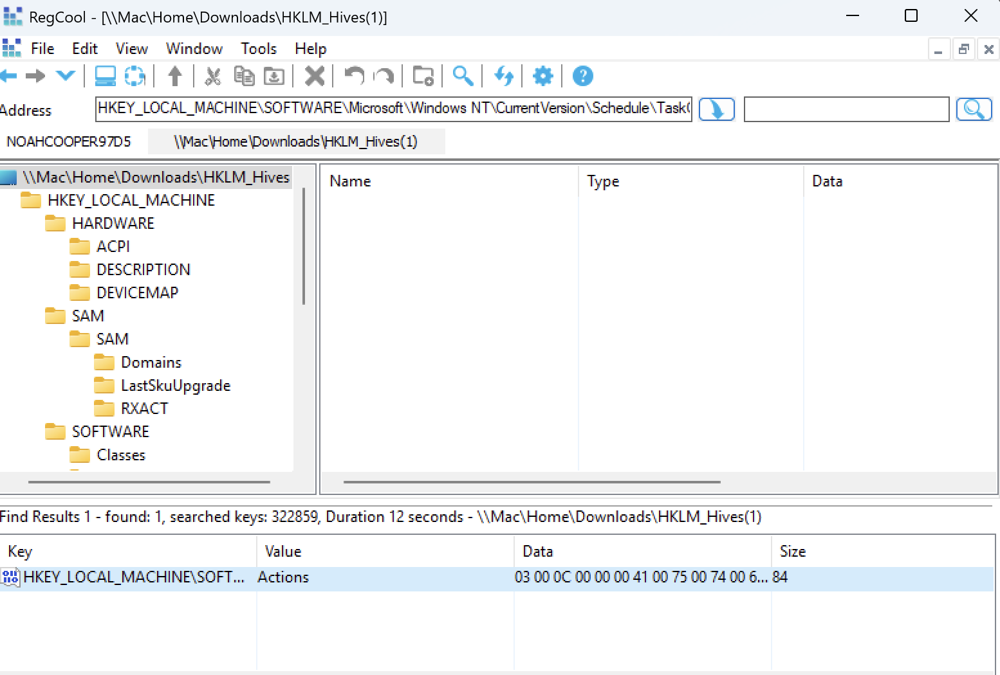
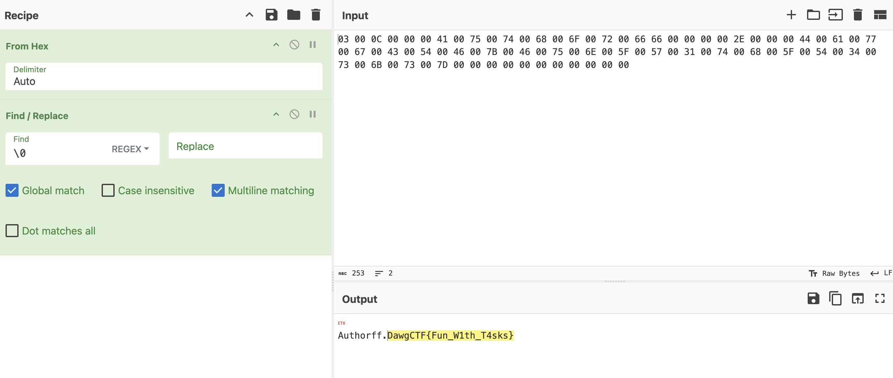

For this challenge we are given a zip file with some registry hives.

We can parse these using RegCool:

RegCool also has a fast search function, I do a search for 'Dawg'.
We get a match at `HKEY_LOCAL_MACHINE\SOFTWARE\Microsoft\Windows NT\CurrentVersion\Schedule\TaskCache\Tasks\{2A31AA14-DFE0-4B02-96F9-6CB9BD69A3F9}`.

We can decode the hex content with CyberChef and find the flag.

Flag: `DawgCTF{Fun_W1th_T4sks}`