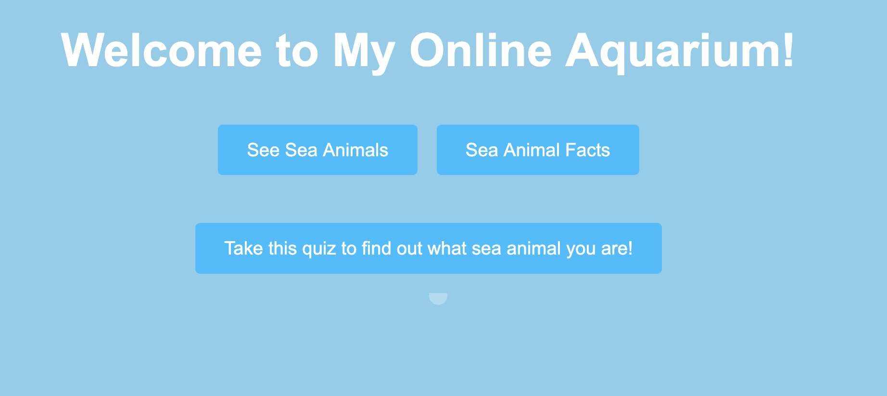
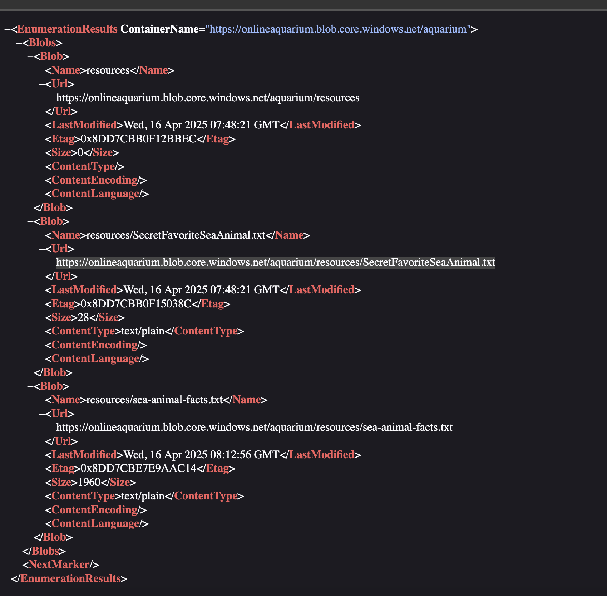

We are given a remote web application that has 3 simple buttons:


Checking the source code, one of the buttons has an interesting URL: https://onlineaquarium.blob.core.windows.net/aquarium/resources/sea-animal-facts.txt

Visiting it, it contains a text file:
```
Sea Animal Facts:
...
- 
Credits to : noaa.gov
```

But this is likely what we need to look at, as the URL implies there are other resources available!

Looking at the [Microsoft Documentation for listing blob storage resources](https://learn.microsoft.com/en-us/rest/api/storageservices/enumerating-blob-resources), the user can query the resources with `/<NAME>?comp=list&include=metadata`.

Let's test that on the target: https://onlineaquarium.blob.core.windows.net/aquarium?comp=list&include=metadata


The highlighted entry in the screenshot has a 'secret' file!

Visiting the file at https://onlineaquarium.blob.core.windows.net/aquarium/resources/SecretFavoriteSeaAnimal.txt contains the flag!

Flag: `DawgCTF{Bl0b_F15h_4re_S1lly}`