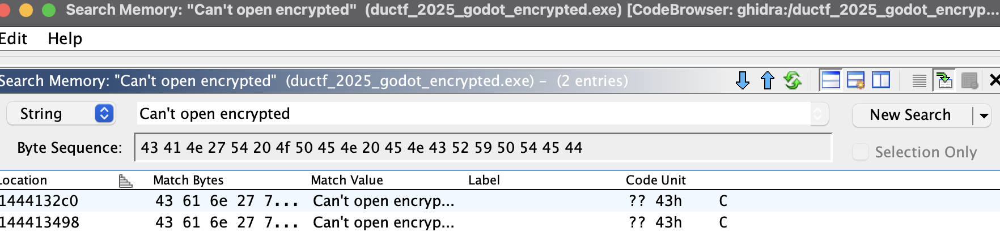
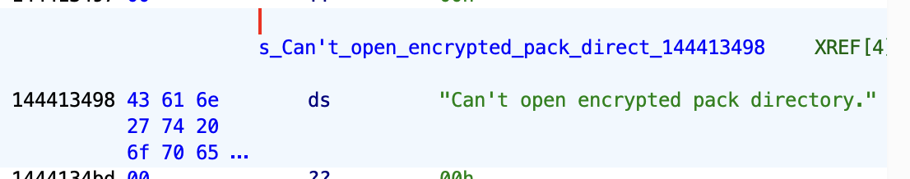
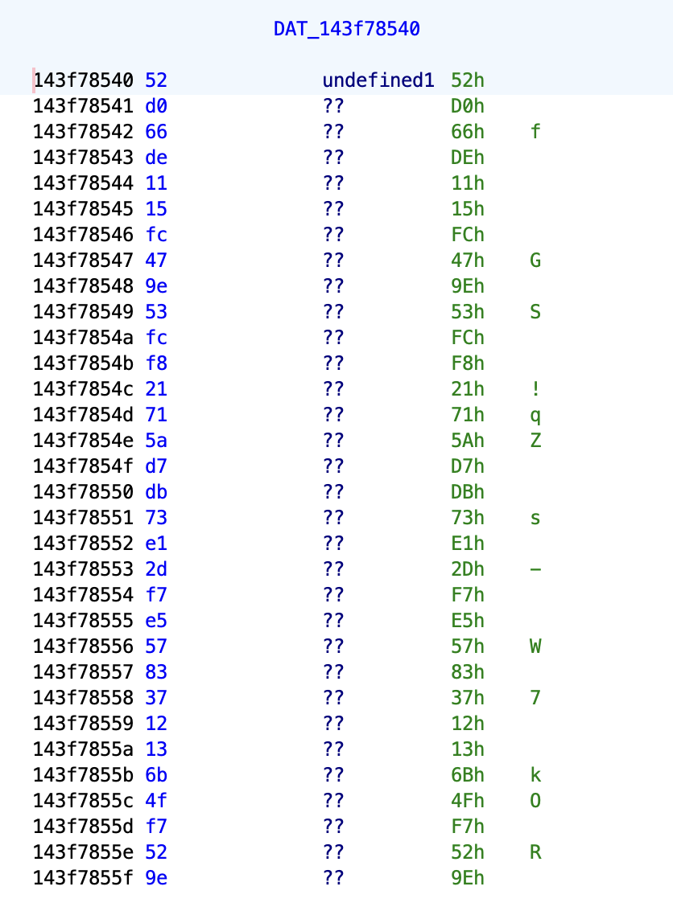
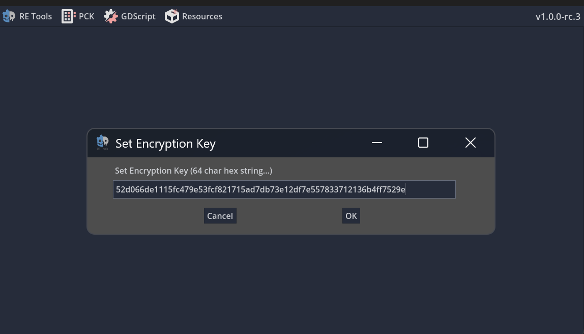
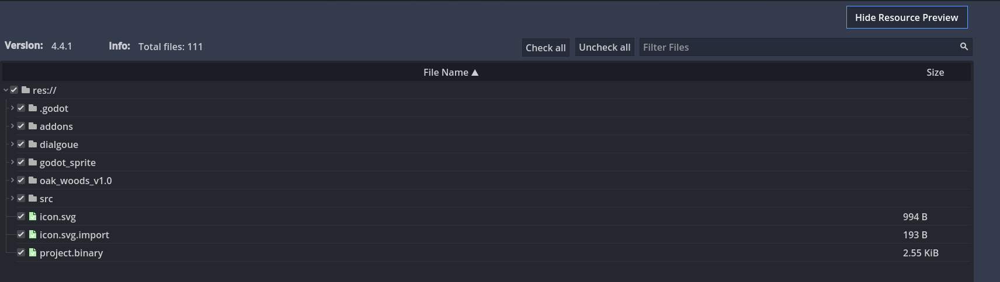
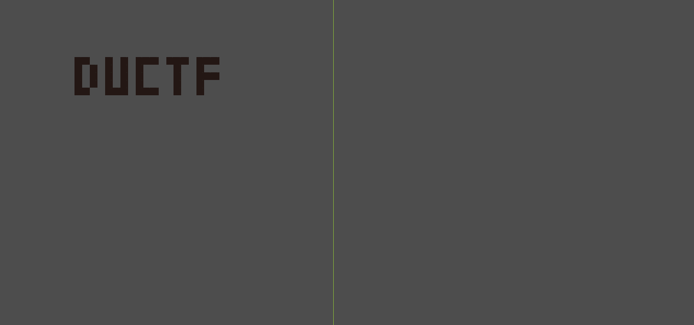
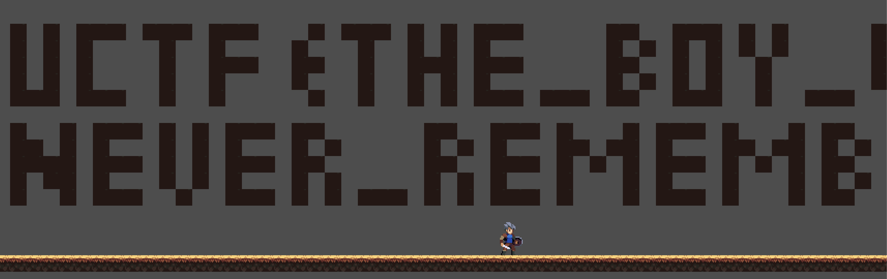

> This is the first writeup I'm trying to write in only vim, it's probably going to take a while but I'll figure it out.

## What are we given?

We are given 2 files from a `godot.tar.gz`:
```bash
$ file *
ductf_2025_godot_encrypted.exe: PE32+ executable (GUI) x86-64 (stripped to external PDB), for MS Windows
ductf_2025_godot_encrypted.pck: data
```

As is visible in the file name, these are encrypted!

To progress we likely want to being with decrypting these godot files, but how do we start?

## Godot Decryption

> During the CTF this [YouTube Video](https://youtu.be/fWjuFmYGoSY) by Giffi was what helped me decrypt this, this next section will mostly just be a written summary of what is done in the video. If you see this Giffi, thank you!

If the binary is encrypted, to execute we must decrypt the contents to run it at some point. So it's very likely the EXE contains the decryption key somewhere. Luckily godot is open source!

I open the binary in Ghidra and let it analyse, in the meanwhile we can look at the source code for the encryption key usages.

Inside the source code, we can see the initial usages of `encryption_key` in [godot/core/SCsub](https://github.com/godotengine/godot/blob/037956dbc953d330d6a4da0f87102a1f82f55d62/core/SCsub#L197) on L197 calling the `encryption_key_builder`.

```python
gen_encrypt = env.CommandNoCache(
    "script_encryption_key.gen.cpp",
    env.Value(encryption_key),
    env.Run(core_builders.encryption_key_builder),
)
```

The `encryption_key_builder` function in [godot/core/core_builders.py](https://github.com/godotengine/godot/blob/037956dbc953d330d6a4da0f87102a1f82f55d62/core/core_builders.py#L49) on L49 defines a CPP global variable `script_encryption_key`:

```python
def encryption_key_builder(target, source, env):
    src = source[0].read() or "0" * 64
    try:
        buffer = bytes.fromhex(src)
        if len(buffer) != 32:
            raise ValueError
    except ValueError:
        methods.print_error(
            f'Invalid AES256 encryption key, not 64 hexadecimal characters: "{src}".\n'
            "Unset `SCRIPT_AES256_ENCRYPTION_KEY` in your environment "
            "or make sure that it contains exactly 64 hexadecimal characters."
        )
        raise

    with methods.generated_wrapper(str(target[0])) as file:
        file.write(
            f"""\
#include "core/config/project_settings.h"

uint8_t script_encryption_key[32] = {{
	{methods.format_buffer(buffer, 1)}
}};"""
        )
```

The `script_encryption_key` is used in [godot/core/io/file_access_pack.cpp](https://github.com/godotengine/godot/blob/037956dbc953d330d6a4da0f87102a1f82f55d62/core/io/file_access_pack.cpp#L300) on L300:
```cpp
if (enc_directory) {
    Ref<FileAccessEncrypted> fae;
    fae.instantiate();
    ERR_FAIL_COND_V_MSG(fae.is_null(), false, "Can't open encrypted pack directory.");

    Vector<uint8_t> key;
    key.resize(32);
    for (int i = 0; i < key.size(); i++) {
        key.write[i] = script_encryption_key[i];
    }

    Error err = fae->open_and_parse(f, key, FileAccessEncrypted::MODE_READ, false);
    ERR_FAIL_COND_V_MSG(err, false, "Can't open encrypted pack directory.");
    f = fae;
}
```

So in our decompilation we are looking for the following:
- One of the dynamic error messages near the usage of `script_encryption_key` can be used to find this functionality.
- Once we find a match, we want a:
    - Global variable (starts with `&DAT_`)
    - Inside a `for` loop
    - Has an index, `[x]` at the end.

I firstly do a search on Ghidra for `Can't open encrypted` in the 'Memory' search.




We get 2 hits, the second one `144413498` is the correct one. 




Now we can select that entry and look at `References > Show References to Address`.

In one of the matches we get the following snippet:
```c
for (lVar9 = 0;
    (lStack_60 != 0 &&
    (uVar5 = (uint)(in_stack_ffffffffffffff38 >> 0x20),
    lVar9 < *(longlong *)(lStack_60 + -8))); lVar9 = lVar9 + 1) {
  uVar1 = (&DAT_143f78540)[lVar9];
  FUN_1435492d0(&lStack_60);
  uVar5 = (uint)(in_stack_ffffffffffffff38 >> 0x20);
  *(undefined1 *)(lStack_60 + lVar9) = uVar1;
}
```

This looks really similar to the `for` loop from earlier in the src being used on a global variable with an index (`&DAT_` is a global variable), lets look what `&DAT_143f78540` is.




This looks like the right variable, 32 bytes long, used appropriately. Let's fix that up and test it.

Encryption key: `52d066de1115fc479e53fcf821715ad7db73e12df7e557833712136b4ff7529e`.

## Extracting the project
We can now use [GDRETools/gdsdecomp](https://github.com/GDRETools/gdsdecomp) to extract the project with the encryption key.







Once extracted, some quick searching for the flag inside the `.gd` files turns up empty, but there is some suspiscious behaviour inside `player.gd`:

```gd
func _physics_process(delta: float) -> void:
	if isAlive:
		if Input.is_action_pressed("interact") and is_on_floor():
			if shop:
				if lucky and godot:
					global_position.x = 0
					global_position.y = -10000
```

If variables `lucky` and `godot` are set, we are teleported super high into the air..?

Using the [Godot Project Editor Online](https://editor.godotengine.org/) we can load the project and have a look in the air.




There is the start of a flag in the air but the rest isn't there, I suspect due to it being loaded once the game starts.

I know that the `player.gd` only teleports us once `lucky` and `godot` are true, and by that time the flag is likely loaded in. I decide to modify the `player.gd` in the editor and play it in my browser. 


```gd
func _physics_process(delta: float) -> void:
	if isAlive:
		if Input.is_action_pressed("interact") and is_on_floor():
			if shop:
                lucky = true
                godot = true
				if lucky and godot:
					global_position.x = 0
					global_position.y = -10000
```

I also had to increase the size of the screen, then I could retrieve the flag!




Flag: `DUCTF{THE_BOY_WILL_NEVER_REMEMBER}`
