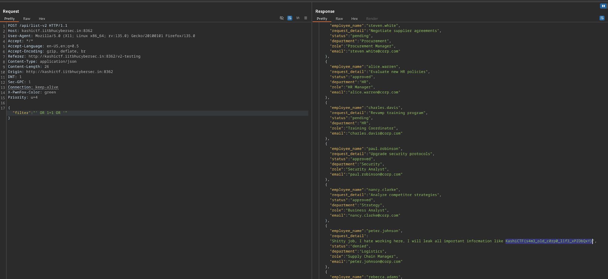

I started by looking for anything interesting on the application initiallty, but could not find any information.

I looked at the network tab and investigated the `_buildManifest.js`

```js
(self.__BUILD_MANIFEST = (function (e, r, s) {
  return {
    __rewrites: { afterFiles: [], beforeFiles: [], fallback: [] },
    __routerFilterStatic: {
      numItems: 0,
      errorRate: 1e-4,
      numBits: 0,
      numHashes: null,
      bitArray: [],
    },
    __routerFilterDynamic: {
      numItems: 0,
      errorRate: 1e-4,
      numBits: e,
      numHashes: null,
      bitArray: [],
    },
    "/": ["static/chunks/pages/index-6413244cd5618b98.js"],
    "/_error": ["static/chunks/pages/_error-fde50cb7f1ab27e0.js"],
    "/v2-testing": ["static/chunks/pages/v2-testing-fb612b495bb99203.js"],
    sortedPages: ["/", "/_app", "/_error", "/v2-testing"],
  };
})(0, 0, 0)),
  self.__BUILD_MANIFEST_CB && self.__BUILD_MANIFEST_CB();
```

Inside is the `/v2-testing` endpoint, which reveals a new page with a filter.

In this 'filter' is an SQLi vulnerability, using `' OR 1=1 OR '` results in printing all entries in the table and reveals the flag.



Flag: `KashiCTF{s4m3_old_c0rp0_l1f3_xPZDbQxY}`
