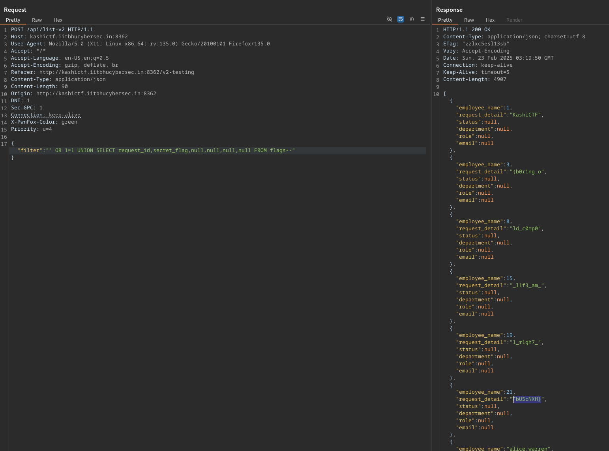

Same process as [Corporate Life 1](25-kashi-corporatelife1) getting to `/v2-testing` but the SQLi requires UNION injection to view the contents of another table.

We can try and list the tables (I did this on the [Corporate Life 1](25-kashi-corporatelife1) instance assuming the flag was stored on both), I identified it was SQLite using a payload from PayloadAllTheThings for [DBMS Identification](https://github.com/swisskyrepo/PayloadsAllTheThings/tree/master/SQL%20Injection#dbms-identification).

Now that we know the table is called `flags` and has columns `request_id` and `secret_flag`, we can dump the contents.

Flag: `KashiCTF{b0r1ng_old_c0rp0_l1f3_am_1_r1gh7_FbU5cNXH}`
