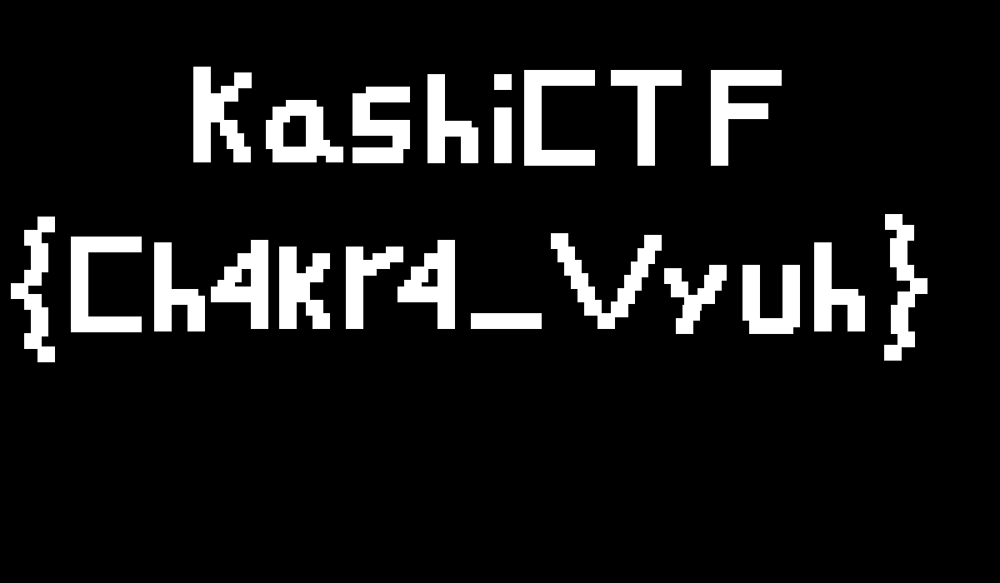

For some reason this was in misc even though it should probably be in rev like the rest of the 'Game' challenges but whatever.

Given another Godot binary (like [Game 1](25-kashi-game1untitledgame)), the logic is that you have to wait for the flag to generate from the points.

We can take the points out of the Godot script and then create the following Python code to generate the flag.

```python
from PIL import Image, ImageDraw
def visualize_positions():
    WIDTH = 1200
    HEIGHT = 700
    image = Image.new('RGB', (WIDTH, HEIGHT), color='black')
    draw = ImageDraw.Draw(image)

    # The positions array from the game (direct coordinates)
    positions = [(232,128),(232,80),(232,96),(232,112),(232,144),(232,160),(232,176),(248,112),(265,103),(281,87),(248,128),(264,144),(272,160),(280,176),(343,120),(327,128),(319,144),(319,160),(327,176),(343,176),(359,176),(367,160),(367,144),(367,128),(359,120),(375,168),(391,176),(343,120),(327,128),(327,176),(343,176),(359,176),(367,160),(367,144),(367,128),(359,120),(375,168),(391,176),(335,376),(335,360),(335,344),(335,328),(335,312),(335,296),(351,328),(367,320),(375,304),(375,376),(415,376),(415,360),(415,344),(415,328),(415,312),(415,296),(431,312),(447,304),(463,296),(367,360),(351,344),(471,104),(455,104),(439,104),(423,112),(423,128),(423,144),(439,144),(455,144),(471,144),(471,160),(463,177),(455,177),(439,177),(423,177),(513,89),(513,121),(513,137),(513,153),(513,169),(513,177),(513,105),(529,145),(545,145),(553,153),(553,169),(553,177),(185,291),(185,323),(185,339),(185,355),(185,371),(185,379),(185,307),(201,347),(217,347),(225,355),(225,371),(225,379),(977,291),(977,323),(977,339),(977,355),(977,371),(977,379),(977,307),(993,347),(1009,347),(1017,355),(1017,371),(1017,379),(593,177),(593,161),(593,145),(593,129),(593,89),(693,84),(677,84),(661,84),(645,84),(629,84),(629,100),(629,116),(629,132),(629,148),(629,164),(629,180),(645,180),(661,180),(677,180),(693,180),(149,284),(133,284),(117,284),(101,284),(85,284),(85,300),(85,316),(85,332),(85,348),(85,364),(85,380),(101,380),(117,380),(133,380),(149,380),(733,84),(749,84),(765,84),(781,84),(797,84),(765,100),(765,116),(765,132),(765,148),(765,164),(765,180),(853,180),(853,164),(853,148),(853,132),(853,116),(853,100),(853,84),(869,84),(885,84),(901,84),(917,84),(869,124),(885,124),(901,124),(45,260),(29,276),(37,292),(37,308),(29,324),(13,340),(29,353),(37,369),(37,385),(29,400),(45,416),(45,416),(1062,257),(1076,270),(1068,286),(1068,302),(1076,318),(1092,334),(1077,350),(1069,366),(1069,382),(1077,398),(1061,414),(29,276),(37,292),(37,308),(29,324),(13,340),(29,353),(37,369),(37,385),(29,400),(45,416),(45,416),(301,336),(301,352),(301,368),(301,376),(301,320),(301,304),(285,344),(269,344),(253,344),(261,336),(269,320),(285,304),(301,288),(525,336),(525,352),(525,368),(525,376),(565,376),(581,376),(597,376),(613,376),(629,376),(717,376),(701,360),(693,344),(685,328),(677,312),(669,296),(661,280),(733,362),(741,346),(749,330),(757,314),(765,298),(773,282),(797,322),(805,338),(821,354),(837,346),(845,330),(851,318),(819,366),(811,382),(891,318),(891,334),(891,350),(891,366),(899,382),(915,382),(931,382),(939,374),(939,358),(939,342),(939,326),(939,318),(525,320),(525,304),(509,344),(493,344),(477,344),(485,336),(493,320),(509,304),(525,288)]

    for x, y in positions:
        draw.rectangle([x, y, x + 20, y + 18], fill='white')

    image.save('flag_final.png')
    print("Image saved as flag_final.png")
if __name__ == "__main__":
    visualize_positions()
```



Flag: `KashiCTF{Ch4kr4_Vyuh}`
