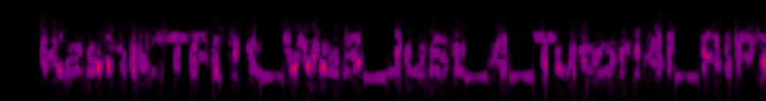

It is a Unity game (seen from booting it) initially tried using CheatEngine to mess with the money but was a dead end.

Use [AssetRipper](https://github.com/AssetRipper/AssetRipper) and find the `flagfile.wav`

Listening to it I identify its likely a spectrogram, I then use an [online spectrogram visualiser](https://calebj0seph.github.io/spectro/) with the file and see the flag.

The flag was incredibly hard to read and we eventually got the flag. The admins were very unhelpful regarding this near illegible spectrogram aswell.

Flag: `KashiCTF{1t_Wa5_Ju5t_4_Tutori4l_RIP}`
