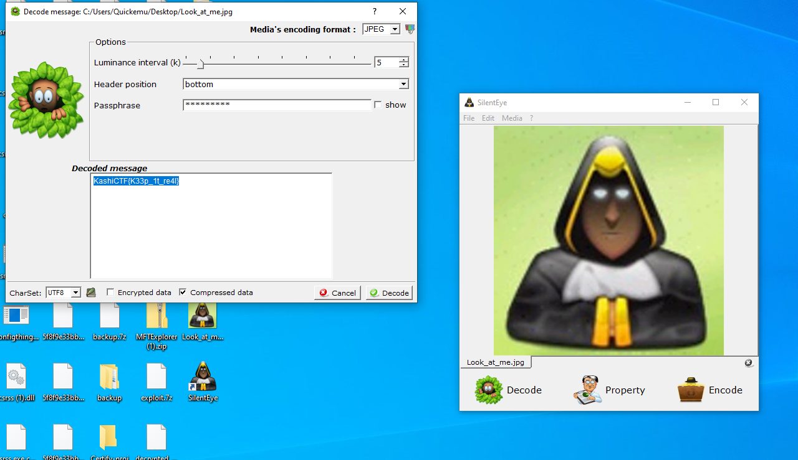

We are given a `Look_at_me.jpg`:

Originally tried _a lot_ of stego techniques and got nowhere...

I decided to reverse image searched the image as the icon looked familiar, was for a stego program 'SilentEye'.

I download the tool onto my Windows box and get the flag.

Flag: `KashiCTF{K33p_1t_re4l}`
